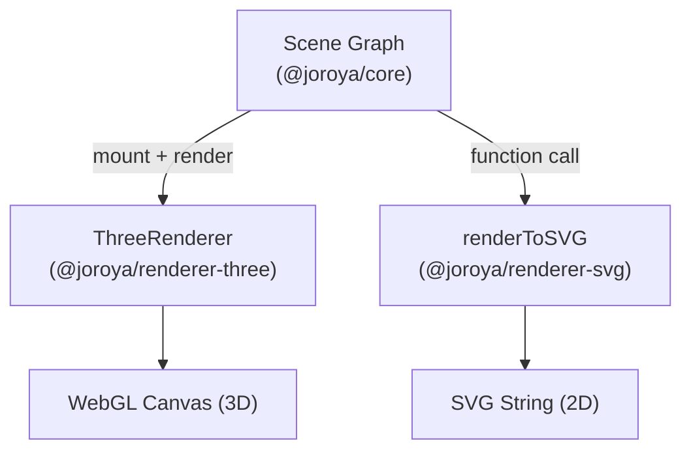
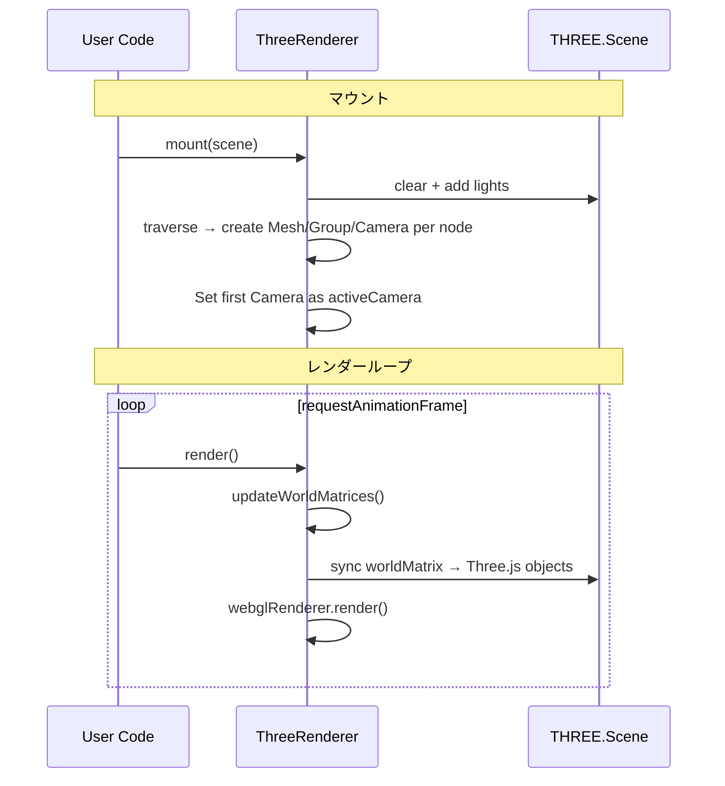
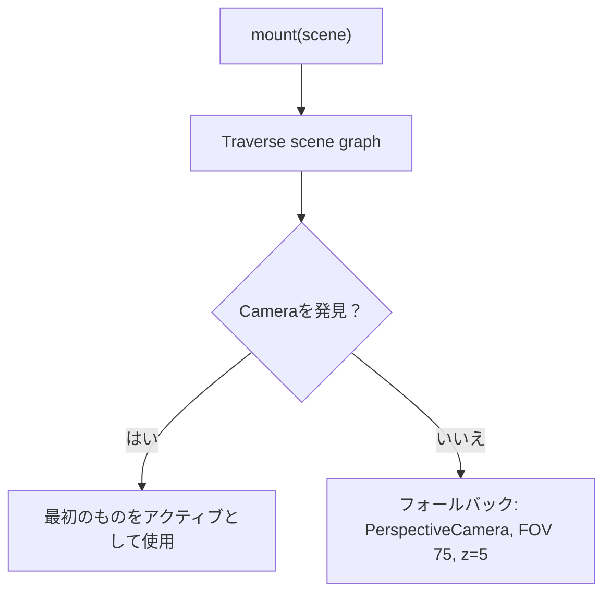
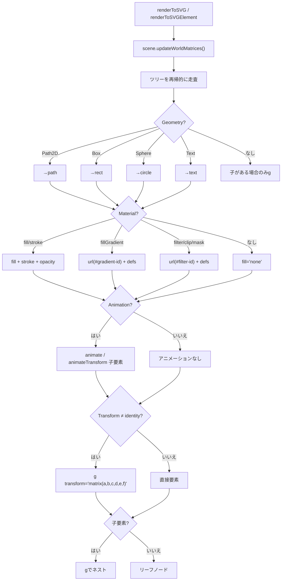

# レンダラー

Oroya Animateのレンダラーは、アグノスティックなシーングラフを視覚出力に変換する**トランスレーター**です。コアはレンダラーを認識しません—各レンダラーはシーングラフを読み取り、独自の表現を生成します。

---

## 概要



| 観点 | `ThreeRenderer` | `renderToSVG` |
|------|-----------------|---------------|
| **パラダイム** | ステートフルなインスタンス（クラス） | 純粋関数（ステートレス） |
| **出力** | `<canvas>` に描画 | SVG `string` を返す |
| **DOM必須** | ✅ はい（`HTMLCanvasElement`） | ❌ いいえ（Node.jsで動作） |
| **3D** | ✅ 透視投影、ライト、シャドウ | ❌ 2Dのみ |
| **ベクター** | ❌ ラスター化 | ✅ 無限にスケーラブル |

---

## `@joroya/renderer-three` — Three.js（WebGL）

インタラクティブな3D可視化のためのメインレンダラー。

### セットアップ

```typescript
import { ThreeRenderer } from '@joroya/renderer-three';

const renderer = new ThreeRenderer({
  canvas: document.getElementById('canvas') as HTMLCanvasElement,
  width: window.innerWidth,
  height: window.innerHeight,
  dpr: window.devicePixelRatio,  // オプション
});
```

### コンストラクタオプション

| オプション | 型 | デフォルト | 説明 |
|------------|-----|------------|------|
| `canvas` | `HTMLCanvasElement` | *（必須）* | 描画先のcanvas要素 |
| `width` | `number` | *（必須）* | ビューポートの幅 |
| `height` | `number` | *（必須）* | ビューポートの高さ |
| `dpr` | `number` | `window.devicePixelRatio` | デバイスピクセル比（HiDPI） |

### メソッド

| メソッド | 説明 |
|----------|------|
| `mount(scene)` | シーンを接続。Three.jsシーンを再構築し、アクティブカメラを検出、ライトを追加 |
| `render()` | トランスフォームを同期し、行列を伝播してフレームを描画 |
| `dispose()` | WebGLリソースを解放 |

### ライフサイクル



### コンポーネントの変換

| Oroyaノード | Three.jsオブジェクト |
|-------------|----------------------|
| Geometry/CameraのないNode | `THREE.Group` |
| Node + `Geometry(Box)` | `THREE.Mesh(BoxGeometry)` |
| Node + `Geometry(Sphere)` | `THREE.Mesh(SphereGeometry)` |
| Node + `Geometry(Path2D)` | ❌ 無視 |
| Node + `Camera(Perspective)` | `THREE.PerspectiveCamera` |
| `color` を持つ `Material` | `MeshStandardMaterial({ color })` |
| `opacity < 1` を持つ `Material` | `MeshStandardMaterial({ transparent: true })` |
| `Material` なし | `MeshStandardMaterial({ color: 0xcccccc })` |

### 自動照明

| タイプ | 設定 |
|--------|------|
| `AmbientLight` | 白、強度 `0.5` |
| `DirectionalLight` | 白、強度 `1.5`、位置 `(2, 5, 3)` |

### カメラの解決



### 完全な例

```typescript
import { Scene, Node, createBox, Material, Camera, CameraType } from '@joroya/core';
import { ThreeRenderer } from '@joroya/renderer-three';

const scene = new Scene();

const cam = new Node('cam');
cam.addComponent(new Camera({
  type: CameraType.Perspective, fov: 75,
  aspect: window.innerWidth / window.innerHeight, near: 0.1, far: 1000,
}));
cam.transform.position.z = 5;
scene.add(cam);

const box = new Node('box');
box.addComponent(createBox(1, 1, 1));
box.addComponent(new Material({ color: { r: 0.2, g: 0.6, b: 1.0 } }));
scene.add(box);

const renderer = new ThreeRenderer({
  canvas: document.getElementById('canvas') as HTMLCanvasElement,
  width: window.innerWidth, height: window.innerHeight,
});
renderer.mount(scene);

function loop() {
  box.transform.rotation.y = performance.now() * 0.001;
  box.transform.updateLocalMatrix();
  renderer.render();
  requestAnimationFrame(loop);
}
requestAnimationFrame(loop);
```

---

## `@joroya/renderer-svg` — SVG（2D）

SVGマークアップを生成する軽量レンダラー。ジェネラティブアート、ベクターエクスポート、サーバーサイドレンダリングに最適。

### `renderToSVG` — 純粋な文字列（サーバーセーフ）

純粋関数でステートレス、SVG文字列を返します。DOMなしでNode.jsで動作します。

```typescript
import { renderToSVG } from '@joroya/renderer-svg';

const svg: string = renderToSVG(scene, { width: 400, height: 300 });
```

#### オプション（`SvgRenderOptions`）

| オプション | 型 | デフォルト | 説明 |
|------------|-----|------------|------|
| `width` | `number` | *（必須）* | SVGの幅 |
| `height` | `number` | *（必須）* | SVGの高さ |
| `viewBox` | `string` | `"0 0 {width} {height}"` | カスタムviewBox |

### `renderToSVGElement` — インタラクティブなDOM

イベント委譲付きの実際の `SVGSVGElement` を作成。`Interactive` コンポーネントを持つノードは pointer/click/wheel のリスナーを受け取ります。

```typescript
import { renderToSVGElement } from '@joroya/renderer-svg';

const { svg, dispose } = renderToSVGElement(scene, {
  width: 800,
  height: 600,
  container: document.getElementById('app')!,
});

// 不要になったら:
dispose(); // リスナーをクリアし、SVGをDOMから削除
```

#### オプション（`SvgElementRenderOptions`）

`SvgRenderOptions` を拡張:

| オプション | 型 | 説明 |
|------------|-----|------|
| `container` | `HTMLElement` | *（オプション）* SVGを自動的にアタッチする親要素 |

#### 戻り値

| フィールド | 型 | 説明 |
|------------|-----|------|
| `svg` | `SVGSVGElement` | 作成されたSVG要素 |
| `dispose` | `() => void` | イベントリスナーをクリアし、SVGをDOMから削除 |

#### サポートされるインタラクティブイベント

| DOMイベント | `InteractionEventType` |
|-------------|------------------------|
| `click` | `Click` |
| `pointerdown` | `PointerDown` |
| `pointerup` | `PointerUp` |
| `pointermove` | `PointerMove` |
| `pointerenter` | `PointerEnter` |
| `pointerleave` | `PointerLeave` |
| `wheel` | `Wheel` |

### パイプライン



### ジオメトリのサポート

| ジオメトリ | 生成されるSVG要素 |
|------------|-------------------|
| `Path2D` | `<path d="...">` |
| `Box` | `<rect>`（width × height、depthは無視） |
| `Sphere` | `<circle>`（半径） |
| `Text` | font-size、font-family、font-weight、text-anchor、dominant-baseline を持つ `<text>` |

### SVG用マテリアルプロパティ

| フィールド | 型 | SVG効果 | 未指定時 |
|------------|-----|---------|----------|
| `fill` | `ColorRGB` | `fill="rgb(R,G,B)"` | `fill="none"` |
| `stroke` | `ColorRGB` | `stroke="rgb(R,G,B)"` | ストロークなし |
| `strokeWidth` | `number` | `stroke-width="N"` | `1` |
| `opacity` | `number` | `opacity="N"` | 属性なし（不透明） |
| `fillGradient` | `GradientDef` | `fill="url(#id)"` + `<defs>` | 通常の `fill` を使用 |
| `strokeGradient` | `GradientDef` | `stroke="url(#id)"` + `<defs>` | 通常の `stroke` を使用 |
| `filter` | `SvgFilterDef` | `filter="url(#id)"` + `<defs>` 内の `<filter>` | フィルターなし |
| `clipPath` | `SvgClipPathDef` | `clip-path="url(#id)"` + `<defs>` 内の `<clipPath>` | クリップなし |
| `mask` | `SvgMaskDef` | `mask="url(#id)"` + `<defs>` 内の `<mask>` | マスクなし |

### トランスフォームと階層

SVGレンダラーは各ノードの `localMatrix` を `transform="matrix(a,b,c,d,e,f)"` 属性として適用し、シーングラフの親子階層を表す `<g>` を生成します。

```typescript
const parent = new Node('group');
parent.transform.position = { x: 100, y: 50, z: 0 };

const child = new Node('square');
child.addComponent(createBox(30, 30, 0));
child.addComponent(new Material({ fill: { r: 1, g: 0, b: 0 } }));

parent.add(child);
scene.add(parent);
```

生成結果:
```xml
<g transform="matrix(1,0,0,1,100,50)">
  <rect x="-15" y="-15" width="30" height="30" fill="rgb(255, 0, 0)" />
</g>
```

### グラデーション

```typescript
const circle = new Node('sun');
circle.addComponent(createSphere(80));
circle.addComponent(new Material({
  fillGradient: {
    type: 'radial',
    cx: 0.5, cy: 0.5, r: 0.5,
    stops: [
      { offset: 0, color: { r: 1, g: 1, b: 0 } },
      { offset: 1, color: { r: 1, g: 0.3, b: 0 }, opacity: 0.8 },
    ],
  },
}));
```

グラデーションのタイプ:

| タイプ | 定義 | SVG要素 |
|--------|------|---------|
| `linear` | `LinearGradientDef`（x1, y1, x2, y2） | `<linearGradient>` |
| `radial` | `RadialGradientDef`（cx, cy, r, fx, fy） | `<radialGradient>` |

### テキスト

```typescript
const label = new Node('title');
label.addComponent(createText('Oroya Animate', {
  fontSize: 24,
  fontFamily: 'Inter',
  fontWeight: 'bold',
  textAnchor: 'middle',
}));
label.addComponent(new Material({ fill: { r: 0, g: 0, b: 0 } }));
label.transform.position = { x: 200, y: 30, z: 0 };
scene.add(label);
```

### CSSクラスとセマンティックID

各ノードは `cssClass` および/または `cssId` を持て、生成されるSVG要素の `class` および `id` 属性として出力されます。

```typescript
const node = new Node('highlight-box');
node.addComponent(createBox(100, 60, 0));
node.addComponent(new Material({ fill: { r: 1, g: 0.9, b: 0 } }));
node.cssClass = 'highlight animated';
node.cssId = 'main-callout';
scene.add(node);
```

生成結果:
```xml
<rect id="main-callout" class="highlight animated" x="-50" y="-30" width="100" height="60" fill="rgb(255, 230, 0)" />
```

ノードに子要素やトランスフォームがある場合、属性はコンテナの `<g>` に適用されます:
```xml
<g id="main-callout" class="highlight animated" transform="matrix(1,0,0,1,50,25)">
  <rect x="-50" y="-30" width="100" height="60" fill="rgb(255, 230, 0)" />
</g>
```

> **シリアライゼーション:** `cssClass` と `cssId` は `serialize()` / `deserialize()` で保持されます。

### 正射影カメラとviewBox

シーンに `OrthographicCameraDef` を持つノードが含まれる場合、SVGレンダラーはカメラのフラスタムから自動的に `viewBox` を計算します。オプションで明示的な `viewBox` を指定した場合はそちらが優先されます。

```typescript
const cam = new Node('ortho-cam');
cam.addComponent(new Camera({
  type: CameraType.Orthographic,
  left: -400, right: 400,
  top: -300, bottom: 300,
  near: 0.1, far: 1000,
}));
scene.add(cam);

// viewBox は "-400 -300 800 600" として計算される
const svg = renderToSVG(scene, { width: 800, height: 600 });
```

カメラの位置はviewBoxのオフセットとして適用されます:
```typescript
cam.transform.position = { x: 50, y: 25, z: 0 };
// viewBox は "-350 -275 800 600" として計算される
```

### SVGフィルター、クリップパス、マスク

レンダラーは `MaterialDef` のフィールドを通じてネイティブSVGフィルター、クリップパス、マスクをサポートします。

#### ブラー

```typescript
const blurred = new Node('soft');
blurred.addComponent(createSphere(40));
blurred.addComponent(new Material({
  fill: { r: 0.5, g: 0.8, b: 1 },
  filter: { effects: [{ type: 'blur', stdDeviation: 3 }] },
}));
```

生成結果:
```xml
<defs>
  <filter id="oroya-filter-0">
    <feGaussianBlur stdDeviation="3" />
  </filter>
</defs>
<circle cx="0" cy="0" r="40" fill="rgb(128, 204, 255)" filter="url(#oroya-filter-0)" />
```

#### ドロップシャドウ

```typescript
new Material({
  fill: { r: 1, g: 0, b: 0 },
  filter: {
    effects: [{
      type: 'dropShadow', dx: 4, dy: 4,
      stdDeviation: 2, floodColor: '#333', floodOpacity: 0.6,
    }],
  },
});
```

#### クリップパス

```typescript
new Material({
  fill: { r: 0, g: 1, b: 0 },
  clipPath: {
    path: [
      { command: 'M', args: [0, 0] },
      { command: 'L', args: [100, 0] },
      { command: 'L', args: [50, 100] },
      { command: 'Z', args: [] },
    ],
  },
});
```

#### マスク

```typescript
new Material({
  fill: { r: 0, g: 0, b: 1 },
  mask: {
    path: [
      { command: 'M', args: [0, 0] },
      { command: 'L', args: [80, 0] },
      { command: 'L', args: [80, 80] },
      { command: 'Z', args: [] },
    ],
    fill: 'white',
    opacity: 0.8,
  },
});
```

### ネイティブSVGアニメーション

`Animation` コンポーネントにより、JavaScriptなしでブラウザで実行される宣言的SVGアニメーション（`<animate>` と `<animateTransform>`）を追加できます。

```typescript
import { Animation } from '@joroya/core';

const circle = new Node('pulse');
circle.addComponent(createSphere(30));
circle.addComponent(new Material({ fill: { r: 1, g: 0, b: 0 } }));
circle.addComponent(new Animation([
  {
    type: 'animate',
    attributeName: 'opacity',
    values: '1;0.3;1',
    dur: '2s',
    repeatCount: 'indefinite',
  },
]));
```

生成結果:
```xml
<circle cx="0" cy="0" r="30" fill="rgb(255, 0, 0)">
  <animate attributeName="opacity" values="1;0.3;1" dur="2s" repeatCount="indefinite" />
</circle>
```

トランスフォームアニメーション:
```typescript
new Animation([
  {
    type: 'animateTransform',
    transformType: 'rotate',
    from: '0 50 50',
    to: '360 50 50',
    dur: '4s',
    repeatCount: 'indefinite',
  },
]);
```

生成結果:
```xml
<animateTransform attributeName="transform" type="rotate"
  from="0 50 50" to="360 50 50" dur="4s" repeatCount="indefinite" />
```

> **fill="freeze"** はアニメーション終了後に最終値を維持し、元に戻しません。

> **注意:** ネイティブアニメーションはSVGレンダラーにのみ適用されます。Three.jsレンダラーは無視します。

### 完全な例

```typescript
const triangle = new Node('triangle');
triangle.addComponent(createPath2D([
  { command: 'M', args: [200, 50] },
  { command: 'L', args: [350, 250] },
  { command: 'L', args: [50, 250] },
  { command: 'Z', args: [] },
]));
triangle.addComponent(new Material({
  fill: { r: 0.2, g: 0.8, b: 0.4 },
  stroke: { r: 0, g: 0, b: 0 },
  strokeWidth: 2,
  opacity: 0.9,
}));
scene.add(triangle);

const svg = renderToSVG(scene, { width: 400, height: 300 });
```

### ユースケース

| ケース | 利点 |
|--------|------|
| .svgへのエクスポート | Figma、Illustrator、Inkscapeで開く |
| サーバーサイドレンダリング | DOMなしでNode.js |
| ジェネラティブアート | ベクターとしてのプロシージャルパターン |
| 印刷 | 劣化なしでスケーラブル |
| SVGインタラクティビティ | イベント委譲付き `renderToSVGElement` |

---

## レンダラーの比較

### ジオメトリのサポート

| ジオメトリ | Three.js | SVG |
|------------|----------|-----|
| `Box` | ✅ | ✅ `<rect>` |
| `Sphere` | ✅ | ✅ `<circle>` |
| `Path2D` | ❌ | ✅ `<path>` |
| `Text` | ❌ | ✅ `<text>` |

### マテリアルのサポート

| プロパティ | Three.js | SVG |
|------------|----------|-----|
| `color` | ✅ | ❌ |
| `opacity` | ✅ | ✅ |
| `fill` | ❌ | ✅ |
| `stroke` | ❌ | ✅ |
| `strokeWidth` | ❌ | ✅ |
| `fillGradient` | ❌ | ✅ |
| `strokeGradient` | ❌ | ✅ |
| `filter` | ❌ | ✅ |
| `clipPath` | ❌ | ✅ |
| `mask` | ❌ | ✅ |

### トランスフォームのサポート

| 機能 | Three.js | SVG |
|------|----------|-----|
| Position（translate） | ✅ | ✅ `matrix()` |
| Rotation | ✅ | ✅ `matrix()` |
| Scale | ✅ | ✅ `matrix()` |
| 階層（`<g>`） | ✅ Groups | ✅ `<g>` |

### 特殊コンポーネントのサポート

| 機能 | Three.js | SVG |
|------|----------|-----|
| `Camera`（Perspective） | ✅ | ❌ |
| `Camera`（Orthographic） | ❌ | ✅ viewBox |
| `Interactive`（イベント） | ✅ Raycaster | ✅ イベント委譲 |
| `Animation`（ネイティブSVG） | ❌ | ✅ `<animate>` / `<animateTransform>` |
| `cssClass` / `cssId` | ❌ | ✅ `class` / `id` 属性 |

---

## カスタムレンダラーの作成

契約はシンプル—`mount`、`render`、`dispose` を実装するだけです:

```typescript
import { Scene, ComponentType, Geometry, Material, GeometryPrimitive } from '@joroya/core';

export class Canvas2DRenderer {
  private ctx: CanvasRenderingContext2D;
  private scene: Scene | null = null;

  constructor(canvas: HTMLCanvasElement) {
    this.ctx = canvas.getContext('2d')!;
  }

  mount(scene: Scene): void { this.scene = scene; }

  render(): void {
    if (!this.scene) return;
    this.scene.updateWorldMatrices();
    this.ctx.clearRect(0, 0, this.ctx.canvas.width, this.ctx.canvas.height);

    this.scene.traverse(node => {
      const geo = node.getComponent<Geometry>(ComponentType.Geometry);
      if (!geo) return;
      const mat = node.getComponent<Material>(ComponentType.Material);
      const wm = node.transform.worldMatrix;

      this.ctx.save();
      this.ctx.translate(wm[12], wm[13]);

      if (geo.definition.type === GeometryPrimitive.Box) {
        const { width, height } = geo.definition;
        if (mat?.definition.color) {
          const c = mat.definition.color;
          this.ctx.fillStyle = `rgb(${c.r*255},${c.g*255},${c.b*255})`;
        }
        this.ctx.fillRect(-width/2, -height/2, width, height);
      }
      this.ctx.restore();
    });
  }

  dispose(): void { this.scene = null; }
}
```

### チェックリスト

| ステップ | 説明 |
|----------|------|
| 1 | `packages/renderer-xxx/` にパッケージを作成 |
| 2 | `@joroya/core` を依存関係に追加 |
| 3 | `mount()` を実装 — ツリーを走査してオブジェクトを作成 |
| 4 | `render()` を実装 — トランスフォームを同期して描画 |
| 5 | `dispose()` を実装 — リソースを解放 |
| 6 | サポートするジオメトリとマテリアルを文書化 |
