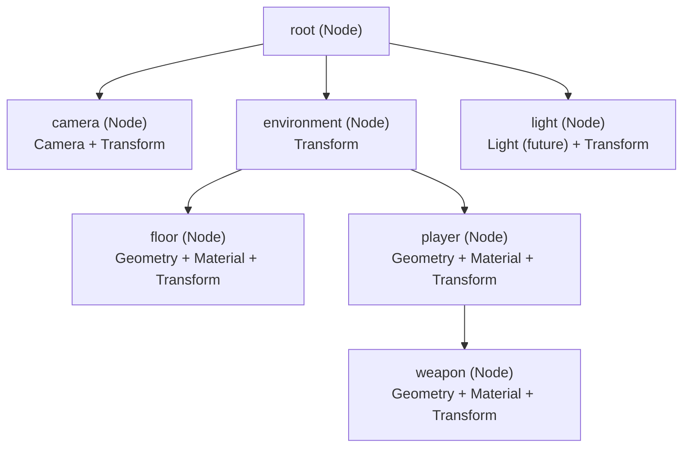
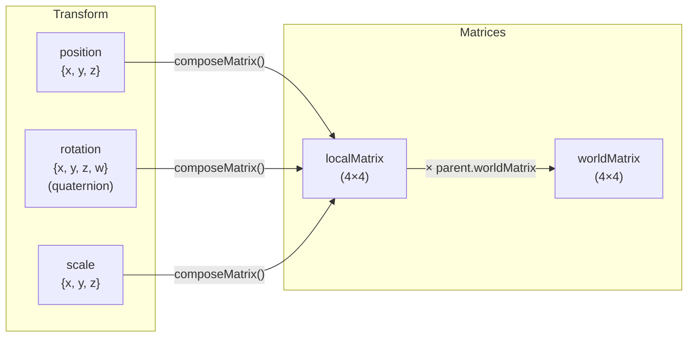
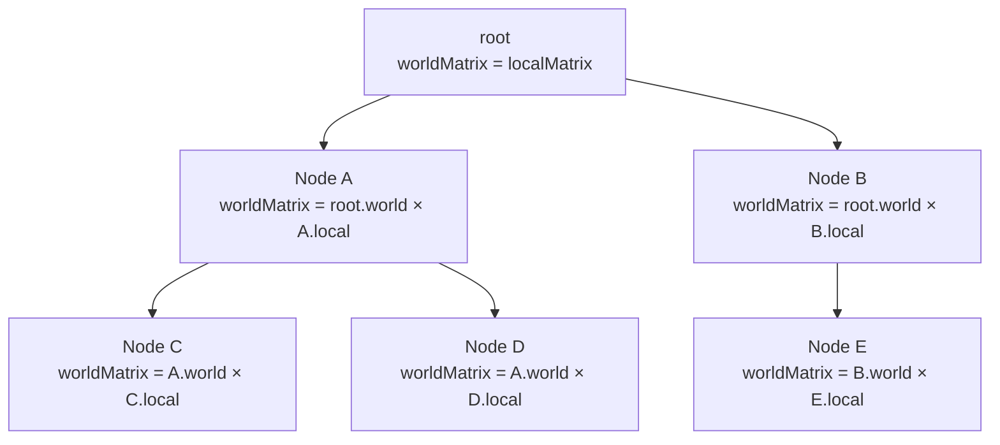
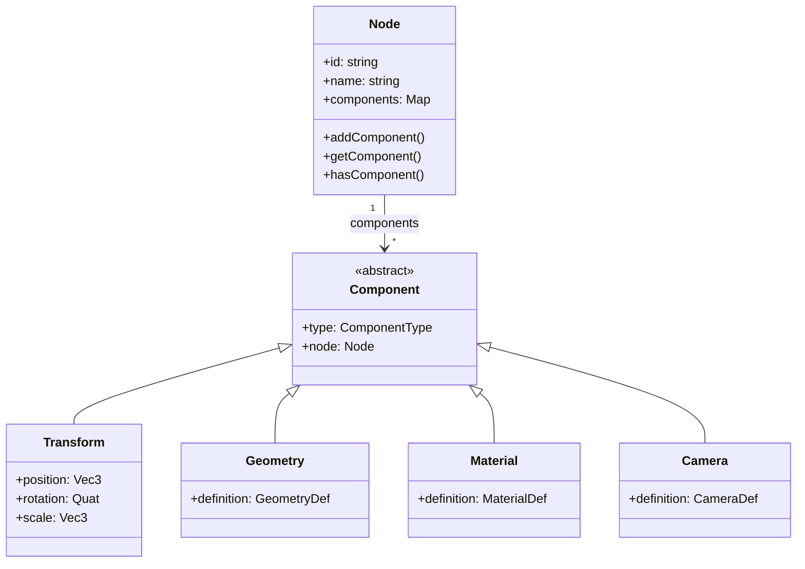

# シーングラフとトランスフォーム

シーングラフはOroya Animateの中心的なデータ構造です。シーン内のすべてのオブジェクト間の空間的な関係を管理する階層ツリーです。

---

## 目次

- [ツリー構造](#ツリー構造)
- [親子階層](#親子階層)
- [トランスフォームシステム](#トランスフォームシステム)
- [行列の伝播](#行列の伝播)
- [コンポーネント（ECS）](#コンポーネント-ecs)
- [ツリー操作](#ツリー操作)
- [高度なパターン](#高度なパターン)

---

## ツリー構造

すべての`Scene`には、ツリーのルートとして機能する`root`ノードがあります。他のすべてのノードはこのルートの子または子孫です。



### ツリーのルール

| ルール | 説明 |
|------|-------------|
| **単一ルート** | シーンには常に正確に1つの`root`ノードがある |
| **1ノード1親** | ノードは同時に1つの親しか持てない |
| **自動再親付け** | 親を持つノードを別の親に追加すると、自動的に前の親から削除される |
| **必須トランスフォーム** | すべてのノードには`Transform`が自動的に作成される |
| **空ノード可** | ノードはGeometryやMaterialなしで存在できる — コンテナやピボットとして有用 |

---

## 親子階層

### ノードの追加

```typescript
const scene = new Scene();

// ルートに直接追加
const parent = new Node('parent');
scene.add(parent);

// 別のノードの子として追加
const child = new Node('child');
scene.add(child, parent);  // parent.add(child) と同等

// ノードに対して直接呼び出しても可
const grandchild = new Node('grandchild');
child.add(grandchild);
```

### ノードの削除

```typescript
scene.remove(child);           // 親から削除（どこにあっても）
parent.remove(child);          // 直接の子の場合のみ削除
```

### 再親付け

すでに親を持つノードを別の親に追加すると、自動的に前の親から削除されます：

```typescript
const groupA = new Node('group-a');
const groupB = new Node('group-b');
const box = new Node('box');

groupA.add(box);
console.log(box.parent?.name); // 'group-a'

groupB.add(box);  // groupAから自動的に削除される
console.log(box.parent?.name); // 'group-b'
console.log(groupA.children.length); // 0
```

---

## トランスフォームシステム

各ノードには、ローカル空間での位置を定義する3つのプロパティを持つ`Transform`コンポーネントがあります：



### トランスフォームのプロパティ

| プロパティ | 型 | デフォルト | 説明 |
|----------|------|---------|-------------|
| `position` | `Vec3 {x, y, z}` | `{0, 0, 0}` | 親に対するオフセット |
| `rotation` | `Quat {x, y, z, w}` | `{0, 0, 0, 1}` | クォータニオンによる回転 |
| `scale` | `Vec3 {x, y, z}` | `{1, 1, 1}` | スケール係数 |
| `localMatrix` | `Matrix4 (16数値)` | 単位行列 | position + rotation + scale から計算 |
| `worldMatrix` | `Matrix4 (16数値)` | 単位行列 | 計算式: parent.worldMatrix × localMatrix |
| `isDirty` | `boolean` | `true` | 再計算最適化用フラグ |

### ローカル空間とワールド空間

| 概念 | 定義 | 例 |
|---------|-----------|---------|
| **ローカル空間** | 親に対する相対座標 | `position = {x: 2, y: 0, z: 0}` → 親の右に2単位 |
| **ワールド空間** | シーン内の絶対座標 | 親が`{x: 5, ...}`の場合、子のワールド位置は`{x: 7, ...}` |

```
Scene:
  root (world: 0,0,0)
  └── car (local: 10,0,0 → world: 10,0,0)
      └── wheel (local: -1,-0.5,0 → world: 9,-0.5,0)
          └── hubcap (local: 0,0,0.1 → world: 9,-0.5,0.1)
```

### トランスフォームの更新

`position`、`rotation`、または`scale`を変更した後、**必ず**`updateLocalMatrix()`を呼び出す必要があります：

```typescript
// 誤り — ローカル行列に変更が反映されない
node.transform.position.x = 5;

// 正しい — ローカル行列を再計算する
node.transform.position.x = 5;
node.transform.updateLocalMatrix();
```

ワールド行列は`renderer.render()`によって自動的に再計算されるか、次のように手動で再計算できます：

```typescript
scene.updateWorldMatrices();
```

---

## 行列の伝播

伝播アルゴリズムはツリーを**DFS先行順**で走査し、各ノードのワールド行列を計算します：



### アルゴリズムの疑似コード

```typescript
function updateWorldMatrix(node: Node, parentWorldMatrix?: Matrix4): void {
  // 1. トランスフォームが変更されていたら、ローカル行列を再計算
  if (node.transform.isDirty) {
    node.transform.updateLocalMatrix();
  }

  // 2. ワールド行列を計算
  if (parentWorldMatrix) {
    node.transform.worldMatrix = multiplyMatrices(parentWorldMatrix, node.transform.localMatrix);
  } else {
    node.transform.worldMatrix = node.transform.localMatrix;
  }

  node.transform.isDirty = false;

  // 3. すべての子に伝播
  for (const child of node.children) {
    updateWorldMatrix(child, node.transform.worldMatrix);
  }
}
```

### 数値例

```
Parent: position = {x: 3, y: 0, z: 0}
Child:  position = {x: 2, y: 1, z: 0}

localMatrix(parent) → translation (3, 0, 0)
localMatrix(child)  → translation (2, 1, 0)

worldMatrix(parent) = localMatrix(parent)       → (3, 0, 0) in world
worldMatrix(child)  = worldMatrix(parent) × localMatrix(child)
                    = translation(3,0,0) × translation(2,1,0)
                    → (5, 1, 0) in world
```

---

## コンポーネント（ECS）

ノードはコンポーネントが追加されるまで空のコンテナです。これは**簡略化されたEntity-Component System（ECS）**パターンに従います。



### コンポーネントの種類

| コンポーネント | `ComponentType` | 自動作成 | 説明 |
|-----------|-----------------|--------------|-------------|
| `Transform` | `Transform` | はい | 位置、回転、スケール、行列 |
| `Geometry` | `Geometry` | いいえ | 幾何形状（Box、Sphere、Path2D） |
| `Material` | `Material` | いいえ | 見た目（色、不透明度、fill、stroke） |
| `Camera` | `Camera` | いいえ | 視点（Perspective；Orthographicは予定） |

### コンポーネント操作

```typescript
const node = new Node('player');

// 追加
node.addComponent(createBox(1, 2, 1));
node.addComponent(new Material({ color: { r: 0, g: 0.8, b: 0.5 } }));

// 取得
const geo = node.getComponent<Geometry>(ComponentType.Geometry);
console.log(geo?.definition.type); // 'Box'

// 確認
if (node.hasComponent(ComponentType.Camera)) {
  console.log('カメラです');
}

// 置換（同じタイプ = 上書き）
node.addComponent(createSphere(1, 32, 32)); // BoxをSphereに置き換え
```

> **ルール：** ノードあたり**1タイプにつき最大1コンポーネント**。同じタイプの2つ目のコンポーネントを追加すると、前のものは黙って置き換えられます。

---

## ツリー操作

### 走査

ツリー全体をDFS先行順で走査します：

```typescript
// シーン全体を走査
scene.traverse(node => {
  console.log(node.name, node.children.length);
});

// 特定のノードから走査開始
someNode.traverse(descendant => {
  // someNodeとその子孫のみを訪問
});
```

### 検索

```typescript
// UUIDで検索（一意、保証あり）
const node = scene.findNodeById('550e8400-e29b-41d4-a716-446655440000');

// 名前で検索（最初に一致したものを返す）
const camera = scene.findNodeByName('main-camera');
```

### ノード数

```typescript
let count = 0;
scene.traverse(() => count++);
console.log(`シーンには${count}個のノードがあります`);
```

---

## 高度なパターン

### ピボットノード（軌道用）

回転によって子の軌道を生成する空ノード：

```
Sun (sphere)
└── earthPivot (empty, rotates on Y)
    └── Earth (sphere, offset on X)
        └── moonPivot (empty, rotates faster)
            └── Moon (sphere, offset on X)
```

```typescript
const earthPivot = new Node('earth-pivot'); // ジオメトリなし
sun.add(earthPivot);

const earth = new Node('earth');
earth.transform.position = { x: 5, y: 0, z: 0 }; // 軌道距離
earthPivot.add(earth);

// ピボットを回転させると地球が太陽の周りを公転する
earthPivot.transform.rotation = rotateY(angle);
earthPivot.transform.updateLocalMatrix();
```

### グループノード（整理用）

```typescript
const ui = new Node('ui-layer');
const world = new Node('world-layer');

scene.add(ui);
scene.add(world);

// ワールド要素を1つのグループにまとめる
world.add(terrain);
world.add(buildings);
world.add(characters);

// ワールド全体を一括で非表示（将来: visibilityコンポーネント）
scene.remove(world); // グループ全体が消える
```

### ノードにアタッチしたカメラ

カメラは親のトランスフォームを継承します：

```typescript
const character = new Node('character');
scene.add(character);

const followCam = new Node('follow-cam');
followCam.addComponent(new Camera({...}));
followCam.transform.position = { x: 0, y: 3, z: 8 }; // 相対オフセット
character.add(followCam);

// キャラクターが動くと、カメラは自動的に追従する
```

### 状態スナップショット

すべてのノードのワールド位置をキャプチャします：

```typescript
const snapshot = new Map<string, Vec3>();

scene.traverse(node => {
  const wm = node.transform.worldMatrix;
  snapshot.set(node.id, {
    x: wm[12], // ワールドX位置
    y: wm[13], // ワールドY位置
    z: wm[14], // ワールドZ位置
  });
});
```
