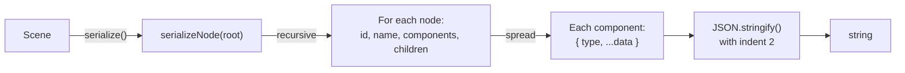
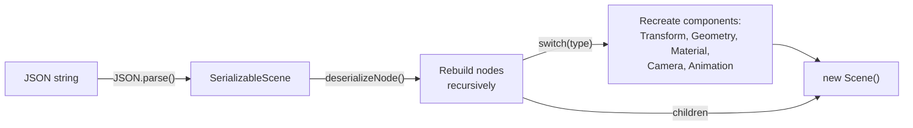
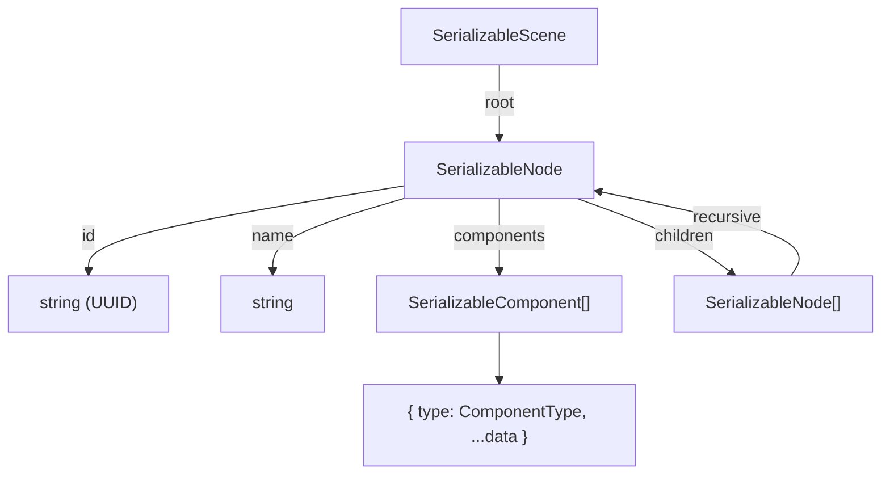

# シリアライゼーション

Oroya Animateには、シーン全体を保存・読み込みできるJSONシリアライゼーションシステムが含まれています。ビジュアルエディター、コラボレーション、シーンのバージョン管理の基盤となります。

---

## 目次

- [シーンをシリアライズする](#シーンをシリアライズする)
- [シーンをデシリアライズする](#シーンをデシリアライズする)
- [JSON形式](#json形式)
- [サポートされているコンポーネント](#サポートされているコンポーネント)
- [ユースケース](#ユースケース)
- [制限事項](#制限事項)

---

## シーンをシリアライズする

`serialize`関数は、シーングラフ全体をフォーマットされたJSON文字列に変換します：

```typescript
import { Scene, Node, createBox, Material, serialize } from '@joroya/core';

const scene = new Scene();

const cube = new Node('hero-cube');
cube.addComponent(createBox(2, 2, 2));
cube.addComponent(new Material({ color: { r: 1, g: 0.5, b: 0 } }));
cube.transform.position = { x: 3, y: 0, z: -1 };
scene.add(cube);

const json = serialize(scene);
console.log(json);
```

### シリアライゼーションフロー



---

## シーンをデシリアライズする

`deserialize`関数は、JSON文字列から機能する`Scene`を再構築します：

```typescript
import { deserialize } from '@joroya/core';

const restoredScene = deserialize(json);

const found = restoredScene.findNodeByName('hero-cube');
console.log(found?.transform.position); // { x: 3, y: 0, z: -1 }
```

復元されたシーンは完全に機能し、任意のレンダラーにマウントできます：

```typescript
import { ThreeRenderer } from '@joroya/renderer-three';

const renderer = new ThreeRenderer({ canvas, width, height });
renderer.mount(restoredScene);
renderer.render();
```

### デシリアライゼーションフロー



---

## JSON形式

### 一般的な構造



### 完全な出力例

```json
{
  "root": {
    "id": "550e8400-e29b-41d4-a716-446655440000",
    "name": "root",
    "components": [
      {
        "type": "Transform",
        "position": { "x": 0, "y": 0, "z": 0 },
        "rotation": { "x": 0, "y": 0, "z": 0, "w": 1 },
        "scale": { "x": 1, "y": 1, "z": 1 },
        "localMatrix": [1,0,0,0, 0,1,0,0, 0,0,1,0, 0,0,0,1],
        "worldMatrix": [1,0,0,0, 0,1,0,0, 0,0,1,0, 0,0,0,1],
        "isDirty": true
      }
    ],
    "children": [
      {
        "id": "6ba7b810-9dad-11d1-80b4-00c04fd430c8",
        "name": "hero-cube",
        "components": [
          {
            "type": "Transform",
            "position": { "x": 3, "y": 0, "z": -1 },
            "rotation": { "x": 0, "y": 0, "z": 0, "w": 1 },
            "scale": { "x": 1, "y": 1, "z": 1 },
            "localMatrix": [1,0,0,0, 0,1,0,0, 0,0,1,0, 3,0,-1,1],
            "worldMatrix": [1,0,0,0, 0,1,0,0, 0,0,1,0, 3,0,-1,1],
            "isDirty": false
          },
          {
            "type": "Geometry",
            "definition": {
              "type": "Box",
              "width": 2,
              "height": 2,
              "depth": 2
            }
          },
          {
            "type": "Material",
            "definition": {
              "color": { "r": 1, "g": 0.5, "b": 0 }
            }
          }
        ],
        "children": []
      }
    ]
  }
}
```

### 内部インターフェース

| インターフェース | フィールド | 説明 |
|------------------|------------|------|
| `SerializableScene` | `root: SerializableNode` | トップレベルコンテナ |
| `SerializableNode` | `id`, `name`, `cssClass?`, `cssId?`, `components[]`, `children[]` | ノードのフラット表現 |
| `SerializableComponent` | `type: ComponentType`, `+ ...data` | タイプとデータを持つ各コンポーネント |

---

## サポートされているコンポーネント

### シリアライズ時（`serialize`）

すべてのコンポーネントはスプレッド（`{ ...component }`）を使用してシリアライズされます：

| コンポーネント | シリアライズされるデータ |
|----------------|--------------------------|
| `Transform` | `position`, `rotation`, `scale`, `localMatrix`, `worldMatrix`, `isDirty` |
| `Geometry` | 完全な`definition`（タイプ + ジオメトリパラメータ） |
| `Material` | 完全な`definition`（color, opacity, fill, stroke, strokeWidth, fillGradient, strokeGradient, filter, clipPath, mask） |
| `Camera` | 完全な`definition`（Perspective: type, fov, aspect, near, far; Orthographic: type, left, right, top, bottom, near, far） |
| `Animation` | `animations[]` — `SvgAnimationDef`（animate / animateTransform）の配列 |

### デシリアライズ時（`deserialize`）

| コンポーネント | 復元? | メソッド |
|----------------|-------|---------|
| `Transform` | ✅ | `Object.assign(new Transform(), data)` |
| `Geometry` | ✅ | `new Geometry(data.definition)` |
| `Material` | ✅ | `new Material(data.definition)` |
| `Camera` | ✅ | `new Camera(data.definition)` |
| `Animation` | ✅ | `new Animation(data.animations)` |

> **注意:** `Camera`と`Animation`を含むすべてのコンポーネントが正しくシリアライズおよびデシリアライズされます。

### データの保持

| データ | 保持? |
|--------|-------|
| ノードUUID | ✅ 完全一致 |
| ノード名 | ✅ |
| 親子階層 | ✅ |
| 位置 | ✅ |
| 回転（クォータニオン） | ✅ |
| スケール | ✅ |
| 行列（ローカル + ワールド） | ✅ |
| ジオメトリタイプ | ✅ |
| ジオメトリパラメータ | ✅ |
| マテリアルカラー | ✅ |
| 不透明度 | ✅ |
| 塗り/線（SVG） | ✅ |
| グラデーション（塗り/線） | ✅ |
| フィルター / ClipPath / Mask | ✅ |
| カメラ（Perspective + Orthographic） | ✅ |
| SVGアニメーション | ✅ |
| `cssClass` / `cssId` | ✅ |

---

## ユースケース

### localStorageでの永続化

```typescript
function saveScene(scene: Scene): void {
  const json = serialize(scene);
  localStorage.setItem('oroya-scene', json);
}

function loadScene(): Scene | null {
  const json = localStorage.getItem('oroya-scene');
  if (!json) return null;
  return deserialize(json);
}
```

### ダウンロード可能なファイルとしてエクスポート

```typescript
function downloadScene(scene: Scene, filename: string): void {
  const json = serialize(scene);
  const blob = new Blob([json], { type: 'application/json' });
  const url = URL.createObjectURL(blob);

  const a = document.createElement('a');
  a.href = url;
  a.download = filename;
  a.click();

  URL.revokeObjectURL(url);
}

downloadScene(scene, 'my-scene.json');
```

### ファイルからインポート

```typescript
async function importScene(file: File): Promise<Scene> {
  const text = await file.text();
  return deserialize(text);
}

// input[type=file] の場合
input.addEventListener('change', async (e) => {
  const file = (e.target as HTMLInputElement).files?.[0];
  if (file) {
    const scene = await importScene(file);
    renderer.mount(scene);
  }
});
```

### サーバーサイドレンダリング

```typescript
// シリアライズされたシーンを受け取り、サーバーでSVGにレンダリング
import { deserialize } from '@joroya/core';
import { renderToSVG } from '@joroya/renderer-svg';

function handleRequest(jsonBody: string): string {
  const scene = deserialize(jsonBody);
  return renderToSVG(scene, { width: 800, height: 600 });
}
```

### Gitでのバージョン管理

シーンを`.json`として保存すると、以下が可能になります：

```
scenes/
├── level-01.json    → gitでバージョン管理
├── level-02.json
└── hub-world.json
```

Gitの差分で変更内容が正確に表示されます：

```diff
 "name": "hero-cube",
 "components": [
   {
     "type": "Transform",
-    "position": { "x": 3, "y": 0, "z": -1 },
+    "position": { "x": 5, "y": 2, "z": -1 },
```

---

## 制限事項

| 制限 | 影響 | 回避策 |
|------|------|--------|
| UUIDは保持される | 同じJSONから作成した2つのシーンは、同一のIDを持つノードを持つ | 独立したシーンが必要な場合は、デシリアライズ後にIDを再生成する |
| ~~復元時にシーンがカメラを失う~~ | ✅ **解決済み** — CameraとAnimationは正しくデシリアライズされます | — |
| 未知のコンポーネント | カスタムタイプが追加され、`switch`に登録されていない場合は無視される | `deserializeNode()`に新しいタイプを追加して拡張する |
| JSONテキスト形式 | 多数のノードを持つシーンのファイルが大きくなる | 将来: バイナリシリアライゼーション（MessagePack） |
| `component.node`への参照なし | 循環参照`component → node`は失われる | `addComponent()`によって自動的に再構築される |
