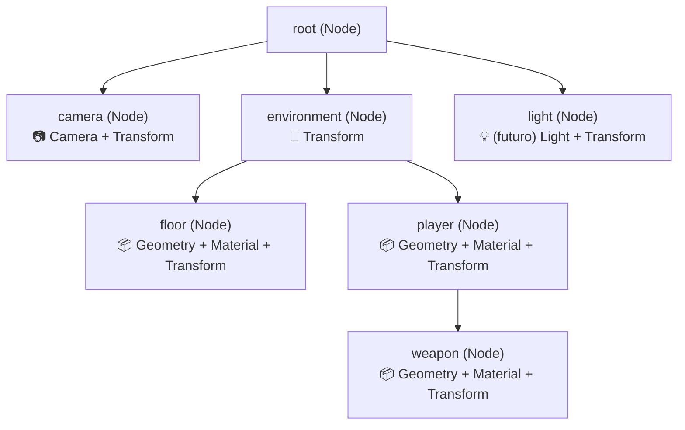
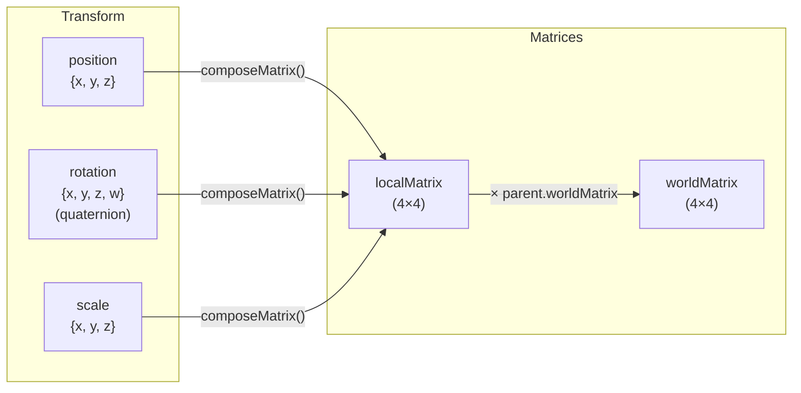
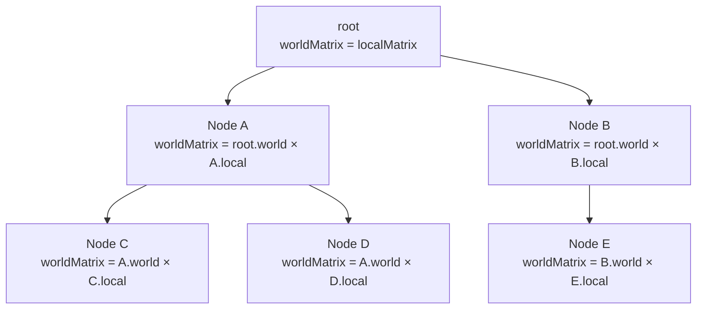
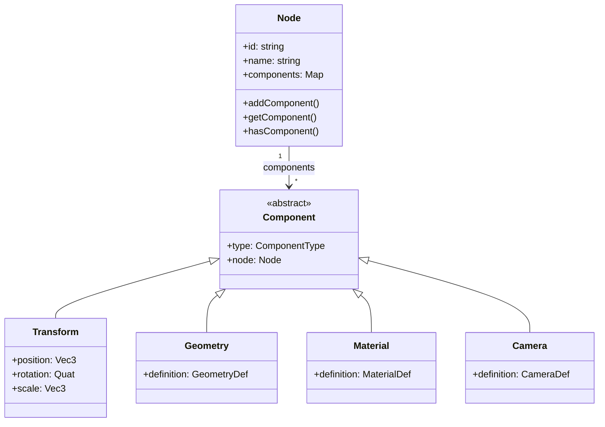

# Scene Graph & Transformaciones

El Scene Graph es la estructura de datos central de Oroya Animate. Es un árbol jerárquico que gestiona las relaciones espaciales entre todos los objetos de la escena.

---

## Tabla de contenidos

- [Estructura del árbol](#estructura-del-árbol)
- [Jerarquía padre-hijo](#jerarquía-padre-hijo)
- [Sistema de transformaciones](#sistema-de-transformaciones)
- [Propagación de matrices](#propagación-de-matrices)
- [Componentes (ECS)](#componentes-ecs)
- [Operaciones sobre el árbol](#operaciones-sobre-el-árbol)
- [Patrones avanzados](#patrones-avanzados)

---

## Estructura del árbol

Toda `Scene` tiene un nodo `root` que es la raíz del árbol. Todos los demás nodos son hijos o descendientes de este root.



### Reglas del árbol

| Regla | Descripción |
|-------|-------------|
| **Raíz única** | La escena siempre tiene exactamente un nodo `root` |
| **Un padre por nodo** | Un nodo solo puede tener un padre a la vez |
| **Re-parenting automático** | Si un nodo con padre se agrega a otro padre, se remueve del anterior automáticamente |
| **Transform obligatorio** | Todos los nodos tienen un `Transform` creado automáticamente |
| **Nodos vacíos permitidos** | Un nodo puede existir sin Geometry ni Material — útil como contenedor/pivote |

---

## Jerarquía padre-hijo

### Agregar nodos

```typescript
const scene = new Scene();

// Agregar directamente al root
const parent = new Node('parent');
scene.add(parent);

// Agregar como hijo de otro nodo
const child = new Node('child');
scene.add(child, parent);  // Equivalente a: parent.add(child)

// También funciona directo sobre el nodo
const grandchild = new Node('grandchild');
child.add(grandchild);
```

### Remover nodos

```typescript
scene.remove(child);           // Remueve del padre (dondequiera que esté)
parent.remove(child);          // Remueve solo si es hijo directo
```

### Re-parenting

Cuando agregas un nodo que ya tiene padre a otro padre, se remueve del anterior automáticamente:

```typescript
const groupA = new Node('group-a');
const groupB = new Node('group-b');
const box = new Node('box');

groupA.add(box);
console.log(box.parent?.name); // 'group-a'

groupB.add(box);  // Se remueve de groupA automáticamente
console.log(box.parent?.name); // 'group-b'
console.log(groupA.children.length); // 0
```

---

## Sistema de transformaciones

Cada nodo tiene un componente `Transform` con tres propiedades que definen su posición en espacio local:



### Propiedades del Transform

| Propiedad | Tipo | Default | Descripción |
|-----------|------|---------|-------------|
| `position` | `Vec3 {x, y, z}` | `{0, 0, 0}` | Desplazamiento relativo al padre |
| `rotation` | `Quat {x, y, z, w}` | `{0, 0, 0, 1}` | Rotación como quaternion |
| `scale` | `Vec3 {x, y, z}` | `{1, 1, 1}` | Factor de escala |
| `localMatrix` | `Matrix4 (16 números)` | Identidad | Calculada de position + rotation + scale |
| `worldMatrix` | `Matrix4 (16 números)` | Identidad | Calculada: parent.worldMatrix × localMatrix |
| `isDirty` | `boolean` | `true` | Flag para optimización de recálculo |

### Espacio local vs espacio del mundo

| Concepto | Definición | Ejemplo |
|----------|-----------|---------|
| **Espacio local** | Coordenadas relativas al padre | `position = {x: 2, y: 0, z: 0}` → 2 unidades a la derecha del padre |
| **Espacio del mundo** | Coordenadas absolutas en la escena | Si el padre está en `{x: 5, ...}`, la posición mundo del hijo es `{x: 7, ...}` |

```
Escena:
  root (world: 0,0,0)
  └── car (local: 10,0,0 → world: 10,0,0)
      └── wheel (local: -1,-0.5,0 → world: 9,-0.5,0)
          └── hubcap (local: 0,0,0.1 → world: 9,-0.5,0.1)
```

### Actualizar transforms

Después de modificar `position`, `rotation` o `scale`, **debes** llamar a `updateLocalMatrix()`:

```typescript
// ❌ Incorrecto — la matriz local no refleja el cambio
node.transform.position.x = 5;

// ✅ Correcto — recalcula la matriz local
node.transform.position.x = 5;
node.transform.updateLocalMatrix();
```

La world matrix se recalcula automáticamente por `renderer.render()` o manualmente con:

```typescript
scene.updateWorldMatrices();
```

---

## Propagación de matrices

El algoritmo de propagación recorre el árbol en **DFS pre-order** y calcula la world matrix de cada nodo:



### Pseudocódigo del algoritmo

```typescript
function updateWorldMatrix(node: Node, parentWorldMatrix?: Matrix4): void {
  // 1. Si el transform fue modificado, recalcular la matriz local
  if (node.transform.isDirty) {
    node.transform.updateLocalMatrix();
  }

  // 2. Calcular la world matrix
  if (parentWorldMatrix) {
    node.transform.worldMatrix = multiplyMatrices(parentWorldMatrix, node.transform.localMatrix);
  } else {
    node.transform.worldMatrix = node.transform.localMatrix;
  }

  node.transform.isDirty = false;

  // 3. Propagar a todos los hijos
  for (const child of node.children) {
    updateWorldMatrix(child, node.transform.worldMatrix);
  }
}
```

### Ejemplo numérico

```
Padre: position = {x: 3, y: 0, z: 0}
Hijo:  position = {x: 2, y: 1, z: 0}

localMatrix(padre)  → traslación (3, 0, 0)
localMatrix(hijo)   → traslación (2, 1, 0)

worldMatrix(padre)  = localMatrix(padre)       → (3, 0, 0) en mundo
worldMatrix(hijo)   = worldMatrix(padre) × localMatrix(hijo)
                    = traslación(3,0,0) × traslación(2,1,0)
                    → (5, 1, 0) en mundo  ✅
```

---

## Componentes (ECS)

Los nodos son contenedores vacíos hasta que se les agregan componentes. Esto sigue un patrón **Entity-Component System (ECS) simplificado**.



### Tipos de componentes

| Componente | `ComponentType` | Auto-creado | Descripción |
|------------|-----------------|-------------|-------------|
| `Transform` | `Transform` | ✅ Sí | Posición, rotación, escala, matrices |
| `Geometry` | `Geometry` | ❌ No | Forma geométrica (Box, Sphere, Path2D) |
| `Material` | `Material` | ❌ No | Apariencia visual (color, opacidad, fill, stroke) |
| `Camera` | `Camera` | ❌ No | Punto de vista (Perspective; Orthographic planned) |

### Operaciones con componentes

```typescript
const node = new Node('player');

// Agregar
node.addComponent(createBox(1, 2, 1));
node.addComponent(new Material({ color: { r: 0, g: 0.8, b: 0.5 } }));

// Consultar
const geo = node.getComponent<Geometry>(ComponentType.Geometry);
console.log(geo?.definition.type); // 'Box'

// Verificar
if (node.hasComponent(ComponentType.Camera)) {
  console.log('Es una cámara');
}

// Reemplazar (mismo tipo = sobreescribe)
node.addComponent(createSphere(1, 32, 32)); // Reemplaza el Box por una Sphere
```

> **Regla:** Máximo **un componente por tipo** por nodo. Agregar un segundo componente del mismo tipo reemplaza al anterior silenciosamente.

---

## Operaciones sobre el árbol

### Traversal (recorrido)

Recorre el árbol completo en DFS pre-order:

```typescript
// Recorrer toda la escena
scene.traverse(node => {
  console.log(node.name, node.children.length);
});

// Recorrer solo a partir de un nodo
someNode.traverse(descendant => {
  // Solo visita someNode y sus descendientes
});
```

### Búsqueda

```typescript
// Por UUID (único, garantizado)
const node = scene.findNodeById('550e8400-e29b-41d4-a716-446655440000');

// Por nombre (retorna el primero encontrado)
const camera = scene.findNodeByName('main-camera');
```

### Conteo de nodos

```typescript
let count = 0;
scene.traverse(() => count++);
console.log(`La escena tiene ${count} nodos`);
```

---

## Patrones avanzados

### Nodo pivote (para órbitas)

Un nodo vacío cuya rotación genera una órbita para sus hijos:

```
Sol (esfera)
└── earthPivot (vacío, rota en Y)
    └── Tierra (esfera, desplazada en X)
        └── moonPivot (vacío, rota más rápido)
            └── Luna (esfera, desplazada en X)
```

```typescript
const earthPivot = new Node('earth-pivot'); // Sin geometría
sun.add(earthPivot);

const earth = new Node('earth');
earth.transform.position = { x: 5, y: 0, z: 0 }; // Distancia orbital
earthPivot.add(earth);

// Al rotar el pivot, la Tierra orbita el Sol
earthPivot.transform.rotation = rotateY(angle);
earthPivot.transform.updateLocalMatrix();
```

### Nodo grupo (para organización)

```typescript
const ui = new Node('ui-layer');
const world = new Node('world-layer');

scene.add(ui);
scene.add(world);

// Todos los elementos del mundo bajo un grupo
world.add(terrain);
world.add(buildings);
world.add(characters);

// Esconder todo el mundo de golpe (futuro: visibility component)
scene.remove(world); // Todo el grupo desaparece
```

### Cámara adjunta a un nodo

La cámara hereda el transform de su padre:

```typescript
const character = new Node('character');
scene.add(character);

const followCam = new Node('follow-cam');
followCam.addComponent(new Camera({...}));
followCam.transform.position = { x: 0, y: 3, z: 8 }; // Offset relativo
character.add(followCam);

// Cuando el personaje se mueve, la cámara lo sigue automáticamente
```

### Snapshot del estado

Capturar posiciones de todos los nodos:

```typescript
const snapshot = new Map<string, Vec3>();

scene.traverse(node => {
  const wm = node.transform.worldMatrix;
  snapshot.set(node.id, {
    x: wm[12], // posición X del mundo
    y: wm[13], // posición Y del mundo
    z: wm[14], // posición Z del mundo
  });
});
```
