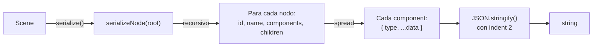
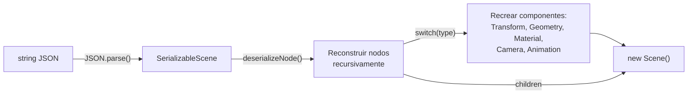
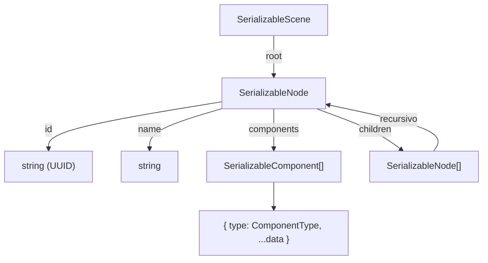

# Serialización

Oroya Animate incluye un sistema de serialización JSON que permite guardar y cargar escenas completas. Es la base para editores visuales, colaboración y versionado de escenas.

---

## Tabla de contenidos

- [Serializar una escena](#serializar-una-escena)
- [Deserializar una escena](#deserializar-una-escena)
- [Formato del JSON](#formato-del-json)
- [Componentes soportados](#componentes-soportados)
- [Casos de uso](#casos-de-uso)
- [Limitaciones](#limitaciones)

---

## Serializar una escena

La función `serialize` convierte todo el scene graph a un string JSON formateado:

```typescript
import { Scene, Node, createBox, Material, serialize } from '@oroya/core';

const scene = new Scene();

const cube = new Node('hero-cube');
cube.addComponent(createBox(2, 2, 2));
cube.addComponent(new Material({ color: { r: 1, g: 0.5, b: 0 } }));
cube.transform.position = { x: 3, y: 0, z: -1 };
scene.add(cube);

const json = serialize(scene);
console.log(json);
```

### Flujo de serialización



---

## Deserializar una escena

La función `deserialize` reconstruye una `Scene` funcional desde un string JSON:

```typescript
import { deserialize } from '@oroya/core';

const restoredScene = deserialize(json);

const found = restoredScene.findNodeByName('hero-cube');
console.log(found?.transform.position); // { x: 3, y: 0, z: -1 }
```

La escena restaurada es completamente funcional — puede montarse en cualquier renderer:

```typescript
import { ThreeRenderer } from '@oroya/renderer-three';

const renderer = new ThreeRenderer({ canvas, width, height });
renderer.mount(restoredScene);
renderer.render();
```

### Flujo de deserialización



---

## Formato del JSON

### Estructura general



### Ejemplo completo de output

```json
{
  "root": {
    "id": "550e8400-e29b-41d4-a716-446655440000",
    "name": "root",
    "components": [
      {
        "type": "Transform",
        "position": { "x": 0, "y": 0, "z": 0 },
        "rotation": { "x": 0, "y": 0, "z": 0, "w": 1 },
        "scale": { "x": 1, "y": 1, "z": 1 },
        "localMatrix": [1,0,0,0, 0,1,0,0, 0,0,1,0, 0,0,0,1],
        "worldMatrix": [1,0,0,0, 0,1,0,0, 0,0,1,0, 0,0,0,1],
        "isDirty": true
      }
    ],
    "children": [
      {
        "id": "6ba7b810-9dad-11d1-80b4-00c04fd430c8",
        "name": "hero-cube",
        "components": [
          {
            "type": "Transform",
            "position": { "x": 3, "y": 0, "z": -1 },
            "rotation": { "x": 0, "y": 0, "z": 0, "w": 1 },
            "scale": { "x": 1, "y": 1, "z": 1 },
            "localMatrix": [1,0,0,0, 0,1,0,0, 0,0,1,0, 3,0,-1,1],
            "worldMatrix": [1,0,0,0, 0,1,0,0, 0,0,1,0, 3,0,-1,1],
            "isDirty": false
          },
          {
            "type": "Geometry",
            "definition": {
              "type": "Box",
              "width": 2,
              "height": 2,
              "depth": 2
            }
          },
          {
            "type": "Material",
            "definition": {
              "color": { "r": 1, "g": 0.5, "b": 0 }
            }
          }
        ],
        "children": []
      }
    ]
  }
}
```

### Interfaces internas

| Interface | Campos | Descripción |
|-----------|--------|-------------|
| `SerializableScene` | `root: SerializableNode` | Contenedor de nivel superior |
| `SerializableNode` | `id`, `name`, `cssClass?`, `cssId?`, `components[]`, `children[]` | Representación plana de un nodo |
| `SerializableComponent` | `type: ComponentType`, `+ ...data` | Cada componente con su tipo y datos |

---

## Componentes soportados

### En serialización (`serialize`)

Todos los componentes se serializan usando spread (`{ ...component }`):

| Componente | Datos serializados |
|------------|-------------------|
| `Transform` | `position`, `rotation`, `scale`, `localMatrix`, `worldMatrix`, `isDirty` |
| `Geometry` | `definition` completo (tipo + parámetros de geometría) |
| `Material` | `definition` completo (color, opacity, fill, stroke, strokeWidth, fillGradient, strokeGradient, filter, clipPath, mask) |
| `Camera` | `definition` completo (Perspective: type, fov, aspect, near, far; Orthographic: type, left, right, top, bottom, near, far) |
| `Animation` | `animations[]` — array de `SvgAnimationDef` (animate / animateTransform) |

### En deserialización (`deserialize`)

| Componente | ¿Se restaura? | Método |
|------------|----------------|--------|
| `Transform` | ✅ | `Object.assign(new Transform(), data)` |
| `Geometry` | ✅ | `new Geometry(data.definition)` |
| `Material` | ✅ | `new Material(data.definition)` |
| `Camera` | ✅ | `new Camera(data.definition)` |
| `Animation` | ✅ | `new Animation(data.animations)` |

> **Nota:** Todos los componentes se serializan y deserializan correctamente, incluyendo `Camera` y `Animation`.

### Preservación de datos

| Dato | ¿Se preserva? |
|------|----------------|
| UUID del nodo | ✅ Exacto |
| Nombre del nodo | ✅ |
| Jerarquía padre-hijo | ✅ |
| Posición | ✅ |
| Rotación (quaternion) | ✅ |
| Escala | ✅ |
| Matrices (local + world) | ✅ |
| Tipo de geometría | ✅ |
| Parámetros de geometría | ✅ |
| Color del material | ✅ |
| Opacidad | ✅ |
| Fill/Stroke (SVG) | ✅ |
| Gradientes (fill/stroke) | ✅ |
| Filter / ClipPath / Mask | ✅ |
| Cámara (Perspective + Orthographic) | ✅ |
| Animaciones SVG | ✅ |
| `cssClass` / `cssId` | ✅ |

---

## Casos de uso

### Persistencia en localStorage

```typescript
function saveScene(scene: Scene): void {
  const json = serialize(scene);
  localStorage.setItem('oroya-scene', json);
}

function loadScene(): Scene | null {
  const json = localStorage.getItem('oroya-scene');
  if (!json) return null;
  return deserialize(json);
}
```

### Exportar como archivo descargable

```typescript
function downloadScene(scene: Scene, filename: string): void {
  const json = serialize(scene);
  const blob = new Blob([json], { type: 'application/json' });
  const url = URL.createObjectURL(blob);

  const a = document.createElement('a');
  a.href = url;
  a.download = filename;
  a.click();

  URL.revokeObjectURL(url);
}

downloadScene(scene, 'my-scene.json');
```

### Importar desde archivo

```typescript
async function importScene(file: File): Promise<Scene> {
  const text = await file.text();
  return deserialize(text);
}

// Con input[type=file]
input.addEventListener('change', async (e) => {
  const file = (e.target as HTMLInputElement).files?.[0];
  if (file) {
    const scene = await importScene(file);
    renderer.mount(scene);
  }
});
```

### Server-side rendering

```typescript
// Recibir la escena serializada, renderizar a SVG en el servidor
import { deserialize } from '@oroya/core';
import { renderToSVG } from '@oroya/renderer-svg';

function handleRequest(jsonBody: string): string {
  const scene = deserialize(jsonBody);
  return renderToSVG(scene, { width: 800, height: 600 });
}
```

### Versionado en Git

Guardar escenas como `.json` permite:

```
scenes/
├── level-01.json    ← Versionado con git
├── level-02.json
└── hub-world.json
```

Los diffs de Git muestran exactamente qué cambió:

```diff
 "name": "hero-cube",
 "components": [
   {
     "type": "Transform",
-    "position": { "x": 3, "y": 0, "z": -1 },
+    "position": { "x": 5, "y": 2, "z": -1 },
```

---

## Limitaciones

| Limitación | Impacto | Workaround |
|------------|---------|------------|
| UUIDs se preservan | Dos escenas del mismo JSON tendrán nodos con IDs idénticos | Regenerar IDs post-deserialización si se necesitan escenas independientes |
| Camera no se deserializa | ~~La escena pierde su cámara al restaurar~~ | ✅ **Resuelto** — Camera y Animation se deserializan correctamente |
| Componentes desconocidos | Si se agrega un tipo custom y no se registra en el `switch`, se ignora | Extender `deserializeNode()` con nuevos tipos |
| xxxxxxxxxx const snapshot = new Map<string, Vec3>();​scene.traverse(node => {  const wm = node.transform.worldMatrix;  snapshot.set(node.id, {    x: wm[12], // posición X del mundo    y: wm[13], // posición Y del mundo    z: wm[14], // posición Z del mundo  });});typescript | Archivos grandes para escenas con muchos nodos | Futuro: serialización binaria (MessagePack) |
| Sin referencia a `component.node` | La referencia circular `component → node` se pierde | Se reconstruye automáticamente por `addComponent()` |
