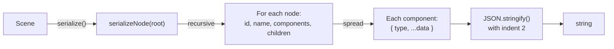
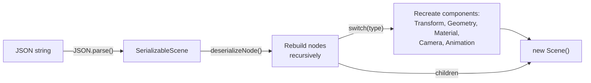
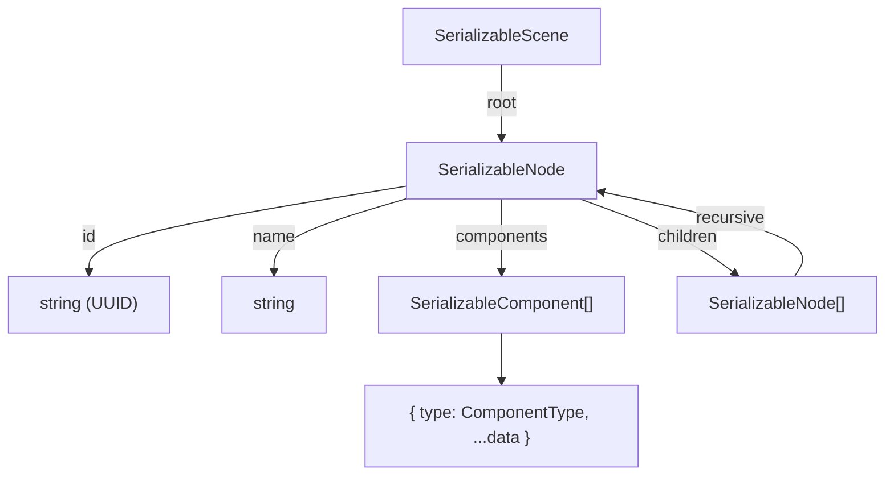

# Serialization

Oroya Animate includes a JSON serialization system that allows saving and loading complete scenes. It is the foundation for visual editors, collaboration, and scene versioning.

---

## Table of contents

- [Serialize a scene](#serialize-a-scene)
- [Deserialize a scene](#deserialize-a-scene)
- [JSON format](#json-format)
- [Supported components](#supported-components)
- [Use cases](#use-cases)
- [Limitations](#limitations)

---

## Serialize a scene

The `serialize` function converts the entire scene graph to a formatted JSON string:

```typescript
import { Scene, Node, createBox, Material, serialize } from '@joroya/core';

const scene = new Scene();

const cube = new Node('hero-cube');
cube.addComponent(createBox(2, 2, 2));
cube.addComponent(new Material({ color: { r: 1, g: 0.5, b: 0 } }));
cube.transform.position = { x: 3, y: 0, z: -1 };
scene.add(cube);

const json = serialize(scene);
console.log(json);
```

### Serialization flow


```mermaid
flowchart LR
    S["Scene"] -->|"serialize()"| SR["serializeNode(root)"]
    SR -->|"recursive"| SN["For each node:\nid, name, components, children"]
    SN -->|"spread"| SC["Each component:\n{ type, ...data }"]
    SC --> JSON["JSON.stringify()\nwith indent 2"]
    JSON --> STR["string"]
```

---

## Deserialize a scene

The `deserialize` function reconstructs a functional `Scene` from a JSON string:

```typescript
import { deserialize } from '@joroya/core';

const restoredScene = deserialize(json);

const found = restoredScene.findNodeByName('hero-cube');
console.log(found?.transform.position); // { x: 3, y: 0, z: -1 }
```

The restored scene is fully functional and can be mounted on any renderer:

```typescript
import { ThreeRenderer } from '@joroya/renderer-three';

const renderer = new ThreeRenderer({ canvas, width, height });
renderer.mount(restoredScene);
renderer.render();
```

### Deserialization flow


```mermaid
flowchart LR
    STR["JSON string"] -->|"JSON.parse()"| OBJ["SerializableScene"]
    OBJ -->|"deserializeNode()"| RN["Rebuild nodes\nrecursively"]
    RN -->|"switch(type)"| COMP["Recreate components:\nTransform, Geometry, Material,\nCamera, Animation"]
    COMP --> SCENE["new Scene()"]
    RN -->|"children"| SCENE
```

---

## JSON format

### General structure


```mermaid
graph TD
    SS["SerializableScene"] -->|"root"| SN["SerializableNode"]
    SN -->|"id"| ID["string (UUID)"]
    SN -->|"name"| NAME["string"]
    SN -->|"components"| COMPS["SerializableComponent[]"]
    SN -->|"children"| CHILDREN["SerializableNode[]"]
    CHILDREN -->|"recursive"| SN
    COMPS --> SC["{ type: ComponentType, ...data }"]
```

### Complete output example

```json
{
  "root": {
    "id": "550e8400-e29b-41d4-a716-446655440000",
    "name": "root",
    "components": [
      {
        "type": "Transform",
        "position": { "x": 0, "y": 0, "z": 0 },
        "rotation": { "x": 0, "y": 0, "z": 0, "w": 1 },
        "scale": { "x": 1, "y": 1, "z": 1 },
        "localMatrix": [1,0,0,0, 0,1,0,0, 0,0,1,0, 0,0,0,1],
        "worldMatrix": [1,0,0,0, 0,1,0,0, 0,0,1,0, 0,0,0,1],
        "isDirty": true
      }
    ],
    "children": [
      {
        "id": "6ba7b810-9dad-11d1-80b4-00c04fd430c8",
        "name": "hero-cube",
        "components": [
          {
            "type": "Transform",
            "position": { "x": 3, "y": 0, "z": -1 },
            "rotation": { "x": 0, "y": 0, "z": 0, "w": 1 },
            "scale": { "x": 1, "y": 1, "z": 1 },
            "localMatrix": [1,0,0,0, 0,1,0,0, 0,0,1,0, 3,0,-1,1],
            "worldMatrix": [1,0,0,0, 0,1,0,0, 0,0,1,0, 3,0,-1,1],
            "isDirty": false
          },
          {
            "type": "Geometry",
            "definition": {
              "type": "Box",
              "width": 2,
              "height": 2,
              "depth": 2
            }
          },
          {
            "type": "Material",
            "definition": {
              "color": { "r": 1, "g": 0.5, "b": 0 }
            }
          }
        ],
        "children": []
      }
    ]
  }
}
```

### Internal interfaces

| Interface | Fields | Description |
|-----------|--------|-------------|
| `SerializableScene` | `root: SerializableNode` | Top-level container |
| `SerializableNode` | `id`, `name`, `cssClass?`, `cssId?`, `components[]`, `children[]` | Flat representation of a node |
| `SerializableComponent` | `type: ComponentType`, `+ ...data` | Each component with its type and data |

---

## Supported components

### In serialization (`serialize`)

All components are serialized using spread (`{ ...component }`):

| Component | Serialized data |
|-----------|-----------------|
| `Transform` | `position`, `rotation`, `scale`, `localMatrix`, `worldMatrix`, `isDirty` |
| `Geometry` | Full `definition` (type + geometry parameters) |
| `Material` | Full `definition` (color, opacity, fill, stroke, strokeWidth, fillGradient, strokeGradient, filter, clipPath, mask) |
| `Camera` | Full `definition` (Perspective: type, fov, aspect, near, far; Orthographic: type, left, right, top, bottom, near, far) |
| `Animation` | `animations[]` — array of `SvgAnimationDef` (animate / animateTransform) |

### In deserialization (`deserialize`)

| Component | Restored? | Method |
|-----------|-----------|--------|
| `Transform` | ✅ | `Object.assign(new Transform(), data)` |
| `Geometry` | ✅ | `new Geometry(data.definition)` |
| `Material` | ✅ | `new Material(data.definition)` |
| `Camera` | ✅ | `new Camera(data.definition)` |
| `Animation` | ✅ | `new Animation(data.animations)` |

> **Note:** All components serialize and deserialize correctly, including `Camera` and `Animation`.

### Data preservation

| Data | Preserved? |
|------|------------|
| Node UUID | ✅ Exact |
| Node name | ✅ |
| Parent-child hierarchy | ✅ |
| Position | ✅ |
| Rotation (quaternion) | ✅ |
| Scale | ✅ |
| Matrices (local + world) | ✅ |
| Geometry type | ✅ |
| Geometry parameters | ✅ |
| Material color | ✅ |
| Opacity | ✅ |
| Fill/Stroke (SVG) | ✅ |
| Gradients (fill/stroke) | ✅ |
| Filter / ClipPath / Mask | ✅ |
| Camera (Perspective + Orthographic) | ✅ |
| SVG animations | ✅ |
| `cssClass` / `cssId` | ✅ |

---

## Use cases

### localStorage persistence

```typescript
function saveScene(scene: Scene): void {
  const json = serialize(scene);
  localStorage.setItem('oroya-scene', json);
}

function loadScene(): Scene | null {
  const json = localStorage.getItem('oroya-scene');
  if (!json) return null;
  return deserialize(json);
}
```

### Export as downloadable file

```typescript
function downloadScene(scene: Scene, filename: string): void {
  const json = serialize(scene);
  const blob = new Blob([json], { type: 'application/json' });
  const url = URL.createObjectURL(blob);

  const a = document.createElement('a');
  a.href = url;
  a.download = filename;
  a.click();

  URL.revokeObjectURL(url);
}

downloadScene(scene, 'my-scene.json');
```

### Import from file

```typescript
async function importScene(file: File): Promise<Scene> {
  const text = await file.text();
  return deserialize(text);
}

// With input[type=file]
input.addEventListener('change', async (e) => {
  const file = (e.target as HTMLInputElement).files?.[0];
  if (file) {
    const scene = await importScene(file);
    renderer.mount(scene);
  }
});
```

### Server-side rendering

```typescript
// Receive serialized scene, render to SVG on server
import { deserialize } from '@joroya/core';
import { renderToSVG } from '@joroya/renderer-svg';

function handleRequest(jsonBody: string): string {
  const scene = deserialize(jsonBody);
  return renderToSVG(scene, { width: 800, height: 600 });
}
```

### Git versioning

Saving scenes as `.json` allows:

```
scenes/
├── level-01.json    → Versioned with git
├── level-02.json
└── hub-world.json
```

Git diffs show exactly what changed:

```diff
 "name": "hero-cube",
 "components": [
   {
     "type": "Transform",
-    "position": { "x": 3, "y": 0, "z": -1 },
+    "position": { "x": 5, "y": 2, "z": -1 },
```

---

## Limitations

| Limitation | Impact | Workaround |
|------------|--------|------------|
| UUIDs are preserved | Two scenes from the same JSON will have nodes with identical IDs | Regenerate IDs after deserialization if independent scenes are needed |
| ~~Scene loses its camera when restored~~ | ✅ **Resolved** — Camera and Animation are deserialized correctly | — |
| Unknown components | If a custom type is added and not registered in the `switch`, it is ignored | Extend `deserializeNode()` with new types |
| JSON text format | Large files for scenes with many nodes | Future: binary serialization (MessagePack) |
| No reference to `component.node` | The circular reference `component → node` is lost | Automatically rebuilt by `addComponent()` |
