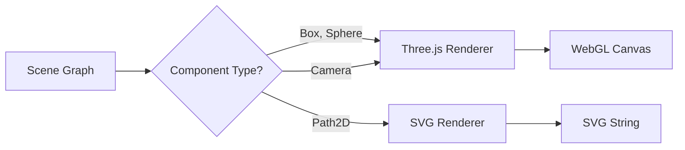

# Tutorial 8: Multi-Renderer 🔴

> **Nivel:** Avanzado  
> **Tiempo estimado:** 25 minutos  
> **Qué aprenderás:** Renderizar la **misma escena** con múltiples backends (Three.js y SVG) simultáneamente, demostrando la arquitectura engine-agnostic de Oroya Animate.

---

## Concepto: Una escena, múltiples representaciones

Esta es la propuesta de valor central de Oroya Animate:

```
         ┌─────────────────┐
         │   @oroya/core    │
         │    Scene Graph   │
         └────────┬────────┘
                  │
        ┌─────────┴─────────┐
        │                   │
   Three.js (3D)       SVG (2D)
   WebGL canvas      SVG markup
```

La escena se define **una sola vez**. Cada renderer la interpreta según sus capacidades.

---

## Paso 1: Setup del HTML

Necesitamos dos áreas: un canvas para Three.js y un contenedor para SVG:

```html
<!DOCTYPE html>
<html lang="en">
<head>
  <meta charset="UTF-8" />
  <title>Multi-Renderer — Oroya Animate</title>
  <style>
    body {
      margin: 0;
      background: #0f0f1a;
      color: #fff;
      font-family: system-ui, sans-serif;
      display: flex;
      flex-direction: column;
      align-items: center;
      gap: 20px;
      padding: 20px;
    }
    .renderers {
      display: flex;
      gap: 20px;
      flex-wrap: wrap;
      justify-content: center;
    }
    .renderer-panel {
      border: 1px solid #333;
      border-radius: 8px;
      overflow: hidden;
    }
    .renderer-panel h3 {
      margin: 0;
      padding: 8px 16px;
      background: #1a1a2e;
      font-size: 14px;
      text-align: center;
    }
    canvas { display: block; }
    .svg-container { background: #fff; }
  </style>
</head>
<body>
  <h1>🔀 Multi-Renderer Demo</h1>
  <div class="renderers">
    <div class="renderer-panel">
      <h3>Three.js (WebGL 3D)</h3>
      <canvas id="three-canvas" width="400" height="400"></canvas>
    </div>
    <div class="renderer-panel">
      <h3>SVG (Vector 2D)</h3>
      <div id="svg-container" class="svg-container" style="width:400px;height:400px"></div>
    </div>
  </div>
  <script type="module" src="./main.ts"></script>
</body>
</html>
```

---

## Paso 2: Crear la escena compartida

```typescript
import { Scene, Node, createBox, createSphere, createPath2D, Material, Camera, CameraType } from '@oroya/core';
import { ThreeRenderer } from '@oroya/renderer-three';
import { renderToSVG } from '@oroya/renderer-svg';

// ═══════════════════════════════════════════
// ESCENA COMPARTIDA — definida una sola vez
// ═══════════════════════════════════════════
const scene = new Scene();

// Objetos 3D (para Three.js)
const cube = new Node('cube');
cube.addComponent(createBox(1.5, 1.5, 1.5));
cube.addComponent(new Material({ color: { r: 0.3, g: 0.6, b: 1.0 } }));
cube.transform.position = { x: -2, y: 0, z: 0 };
scene.add(cube);

const sphere = new Node('sphere');
sphere.addComponent(createSphere(1, 32, 32));
sphere.addComponent(new Material({ color: { r: 1.0, g: 0.4, b: 0.2 } }));
sphere.transform.position = { x: 2, y: 0, z: 0 };
scene.add(sphere);

// Objetos 2D (para SVG)
const star = new Node('star');
star.addComponent(createPath2D(createStarPath(200, 200, 5, 80, 35)));
star.addComponent(new Material({
  fill: { r: 1.0, g: 0.85, b: 0.0 },
  stroke: { r: 0.8, g: 0.6, b: 0.0 },
  strokeWidth: 2,
}));
scene.add(star);

// Cámara (solo la usa Three.js)
const cam = new Node('camera');
cam.addComponent(new Camera({
  type: CameraType.Perspective,
  fov: 60,
  aspect: 1,      // Canvas cuadrado 400x400
  near: 0.1,
  far: 100,
}));
cam.transform.position = { x: 0, y: 2, z: 6 };
scene.add(cam);
```

---

## Paso 3: Helper para crear estrellas SVG

```typescript
function createStarPath(
  cx: number, cy: number, 
  points: number, outerR: number, innerR: number,
) {
  const commands: { command: string; args: number[] }[] = [];

  for (let i = 0; i < points * 2; i++) {
    const angle = (i * Math.PI) / points - Math.PI / 2;
    const r = i % 2 === 0 ? outerR : innerR;
    const x = cx + Math.cos(angle) * r;
    const y = cy + Math.sin(angle) * r;

    commands.push({
      command: i === 0 ? 'M' : 'L',
      args: [Math.round(x * 10) / 10, Math.round(y * 10) / 10],
    });
  }

  commands.push({ command: 'Z', args: [] });
  return commands;
}
```

---

## Paso 4: Renderizar con ambos backends

```typescript
// ═══════════════════════════════════════════
// RENDERER THREE.JS — renderizado 3D 
// ═══════════════════════════════════════════
const threeRenderer = new ThreeRenderer({
  canvas: document.getElementById('three-canvas') as HTMLCanvasElement,
  width: 400,
  height: 400,
});
threeRenderer.mount(scene);

// ═══════════════════════════════════════════
// RENDERER SVG — renderizado 2D
// ═══════════════════════════════════════════
function updateSVG() {
  const svgString = renderToSVG(scene, {
    width: 400,
    height: 400,
    viewBox: '0 0 400 400',
  });
  document.getElementById('svg-container')!.innerHTML = svgString;
}

// ═══════════════════════════════════════════
// ANIMACIÓN — ambos renderers leen la misma escena
// ═══════════════════════════════════════════
let time = 0;
let lastSvgUpdate = 0;

function animate() {
  time += 0.01;

  // Animar los objetos 3D
  cube.transform.rotation = {
    x: Math.sin(time * 0.7 / 2) * 0.5,
    y: Math.sin(time / 2),
    z: 0,
    w: Math.cos(time / 2),
  };
  cube.transform.updateLocalMatrix();

  sphere.transform.position = {
    x: 2,
    y: Math.sin(time * 2) * 0.5,
    z: 0,
  };
  sphere.transform.updateLocalMatrix();

  // Three.js: renderizar cada frame
  threeRenderer.render();

  // SVG: actualizar cada 100ms (no necesita 60fps)
  if (time - lastSvgUpdate > 0.1) {
    updateSVG();
    lastSvgUpdate = time;
  }

  requestAnimationFrame(animate);
}

updateSVG();  // Render inicial SVG
animate();
```

---

## ¿Qué renderiza cada backend?

| Elemento | Three.js | SVG |
|----------|----------|-----|
| `cube` (Box) | ✅ Cubo 3D con sombras | ❌ Sin soporte para Box |
| `sphere` (Sphere) | ✅ Esfera 3D | ❌ Sin soporte para Sphere |
| `star` (Path2D) | ❌ Sin soporte para Path2D | ✅ Estrella vectorial |
| `camera` | ✅ Define el punto de vista | ❌ No aplica |

Cada renderer ignora los componentes que no sabe manejar. Esto es **intencional** — permite que la misma escena tenga contenido para diferentes backends.

---

## Arquitectura del patrón



### Beneficios de este patrón

1. **Código DRY** — La escena se define una vez.
2. **Testeable** — Se puede verificar la escena sin renderer.
3. **Extensible** — Agregar un nuevo renderer (Canvas2D, WebGPU) no requiere cambiar el core.
4. **Server-side** — El SVG renderer funciona en Node.js sin browser.

---

## Caso de uso innovador: Preview 2D + Export 3D

```typescript
// En el editor (rápido, ligero)
const preview = renderToSVG(scene, { width: 800, height: 600 });
document.getElementById('preview')!.innerHTML = preview;

// Al exportar (full quality)
const renderer = new ThreeRenderer({ canvas, width: 1920, height: 1080 });
renderer.mount(scene);
renderer.render();
// → Capturar canvas como imagen para export
```

---

## Resultado

Una ventana dividida mostrando la misma escena renderizada simultáneamente en WebGL 3D y SVG 2D, demostrando que el scene graph es verdaderamente agnóstico del backend. 🔀

---

## ¿Qué sigue?

Has completado todos los tutoriales. Ahora puedes:

- 🏗️ Construir tus propias escenas combinando las técnicas aprendidas.
- 🔌 Crear un nuevo renderer (Canvas2D, WebGPU) siguiendo el patrón de `@oroya/renderer-three`.
- 📦 Contribuir al proyecto — revisa la [guía de contribución](../contributing.md).

➡️ [Volver al índice de tutoriales](./README.md)
