# Tutorial 9: Gradientes, Filtros y Efectos SVG 🟡

> **Nivel:** Intermedio  
> **Tiempo estimado:** 25 minutos  
> **Qué aprenderás:** Aplicar gradientes lineales/radiales, filtros (blur, drop-shadow), clip-paths y masks usando el renderer SVG.

---

## Concepto: Efectos visuales SVG

```mermaid
graph LR
    MD["MaterialDef"] --> R["renderToSVG"]
    R -->|"fillGradient"| D1["defs → linearGradient / radialGradient"]
    R -->|"filter"| D2["defs → filter → feGaussianBlur / feDropShadow"]
    R -->|"clipPath"| D3["defs → clipPath → path"]
    R -->|"mask"| D4["defs → mask → path"]
```

El renderer SVG de Oroya genera automáticamente bloques `<defs>` con gradientes, filtros, clip-paths y masks cuando los defines en el `MaterialDef` de un nodo. No necesitas escribir SVG a mano — el renderer traduce la API declarativa a markup válido.



---

## Paso 1: Setup base

```typescript
import {
  Scene, Node, Camera, CameraType, Material,
  createBox, createSphere, createPath2D, createText,
} from '@oroya/core';
import { renderToSVG } from '@oroya/renderer-svg';

const scene = new Scene();

// Cámara ortográfica define el viewBox automáticamente
const cam = new Node('cam');
cam.addComponent(new Camera({
  type: CameraType.Orthographic,
  left: 0, right: 600,
  top: 0, bottom: 400,
  near: 0.1, far: 100,
}));
scene.add(cam);
```

---

## Paso 2: Gradiente lineal

Un gradiente lineal define un degradé de color entre dos puntos. Las coordenadas `x1, y1, x2, y2` van de 0 a 1 (relativas al bounding box del elemento).

```typescript
const gradientBox = new Node('gradient-box');
gradientBox.addComponent(createBox(200, 120, 0));
gradientBox.addComponent(new Material({
  fillGradient: {
    type: 'linear',
    x1: 0, y1: 0, x2: 1, y2: 1, // diagonal
    stops: [
      { offset: 0, color: { r: 0.2, g: 0.5, b: 1.0 } },
      { offset: 0.5, color: { r: 1, g: 1, b: 1 } },
      { offset: 1, color: { r: 0.8, g: 0.2, b: 0.6 } },
    ],
  },
  stroke: { r: 0.3, g: 0.3, b: 0.4 },
  strokeWidth: 2,
}));
gradientBox.transform.position = { x: 150, y: 100, z: 0 };
gradientBox.transform.updateLocalMatrix();
scene.add(gradientBox);
```

Genera:
```xml
<defs>
  <linearGradient id="oroya-grad-0" x1="0" y1="0" x2="1" y2="1">
    <stop offset="0" stop-color="rgb(51, 128, 255)" />
    <stop offset="0.5" stop-color="rgb(255, 255, 255)" />
    <stop offset="1" stop-color="rgb(204, 51, 153)" />
  </linearGradient>
</defs>
<g transform="matrix(1,0,0,1,150,100)">
  <rect x="-100" y="-60" width="200" height="120"
        fill="url(#oroya-grad-0)" stroke="rgb(77, 77, 102)" stroke-width="2" />
</g>
```

---

## Paso 3: Gradiente radial

Ideal para crear efectos de brillo o esferas estilizadas:

```typescript
const sun = new Node('sun');
sun.addComponent(createSphere(60));
sun.addComponent(new Material({
  fillGradient: {
    type: 'radial',
    cx: 0.4, cy: 0.4, r: 0.6,  // Centro desplazado → efecto 3D
    stops: [
      { offset: 0, color: { r: 1, g: 1, b: 0.8 } },       // Centro brillante
      { offset: 0.6, color: { r: 1, g: 0.8, b: 0 } },     // Amarillo medio
      { offset: 1, color: { r: 0.9, g: 0.3, b: 0 }, opacity: 0.8 }, // Borde oscuro
    ],
  },
}));
sun.transform.position = { x: 450, y: 100, z: 0 };
sun.transform.updateLocalMatrix();
scene.add(sun);
```

> **Tip:** Desplazar `cx/cy` del centro (0.5, 0.5) crea un efecto de iluminación lateral muy convincente.

---

## Paso 4: Filtro Blur

El efecto `blur` aplica un desenfoque gaussiano al elemento completo:

```typescript
const blurred = new Node('blurred-circle');
blurred.addComponent(createSphere(50));
blurred.addComponent(new Material({
  fill: { r: 0.5, g: 0.8, b: 1.0 },
  filter: {
    effects: [{ type: 'blur', stdDeviation: 4 }],
  },
}));
blurred.transform.position = { x: 150, y: 280, z: 0 };
blurred.transform.updateLocalMatrix();
scene.add(blurred);
```

Genera:
```xml
<defs>
  <filter id="oroya-filter-0">
    <feGaussianBlur stdDeviation="4" />
  </filter>
</defs>
<circle cx="0" cy="0" r="50" fill="rgb(128, 204, 255)"
        filter="url(#oroya-filter-0)" />
```

---

## Paso 5: Drop Shadow

Combina desplazamiento y desenfoque para crear una sombra proyectada:

```typescript
const card = new Node('shadow-card');
card.addComponent(createBox(160, 100, 0));
card.addComponent(new Material({
  fill: { r: 1.0, g: 0.95, b: 0.9 },
  stroke: { r: 0.8, g: 0.7, b: 0.6 },
  strokeWidth: 1,
  filter: {
    effects: [{
      type: 'dropShadow',
      dx: 5, dy: 5,            // Desplazamiento de la sombra
      stdDeviation: 3,          // Desenfoque de la sombra
      floodColor: '#333',       // Color de la sombra
      floodOpacity: 0.4,        // Transparencia de la sombra
    }],
  },
}));
card.transform.position = { x: 320, y: 280, z: 0 };
card.transform.updateLocalMatrix();
scene.add(card);
```

---

## Paso 6: Clip Path

Recorta un nodo a una forma vectorial arbitraria. Solo se muestra la intersección entre la geometría original y el path de recorte:

```typescript
// Un círculo recortado con forma de estrella
const clipped = new Node('star-clipped');
clipped.addComponent(createSphere(55));
clipped.addComponent(new Material({
  fillGradient: {
    type: 'radial',
    stops: [
      { offset: 0, color: { r: 1, g: 1, b: 0.3 } },
      { offset: 1, color: { r: 1, g: 0.4, b: 0 } },
    ],
  },
  clipPath: {
    path: createStarPath(0, 0, 5, 55, 22),
  },
}));
clipped.transform.position = { x: 500, y: 280, z: 0 };
clipped.transform.updateLocalMatrix();
scene.add(clipped);

// Helper: genera un path de estrella
function createStarPath(cx, cy, points, outerR, innerR) {
  const cmds = [];
  for (let i = 0; i < points * 2; i++) {
    const angle = (i * Math.PI) / points - Math.PI / 2;
    const r = i % 2 === 0 ? outerR : innerR;
    cmds.push({
      command: i === 0 ? 'M' : 'L',
      args: [cx + Math.cos(angle) * r, cy + Math.sin(angle) * r],
    });
  }
  cmds.push({ command: 'Z', args: [] });
  return cmds;
}
```

---

## Paso 7: Mask

Similar al clip-path, pero usa **luminancia** en lugar de forma vectorial binaria. Las áreas blancas son visibles, las negras son transparentes:

```typescript
const masked = new Node('masked-rect');
masked.addComponent(createBox(140, 100, 0));
masked.addComponent(new Material({
  fillGradient: {
    type: 'linear', x1: 0, y1: 0, x2: 1, y2: 0,
    stops: [
      { offset: 0, color: { r: 0.9, g: 0.1, b: 0.5 } },
      { offset: 1, color: { r: 0.2, g: 0.1, b: 0.9 } },
    ],
  },
  mask: {
    path: [
      { command: 'M', args: [-70, -50] },
      { command: 'L', args: [70, -50] },
      { command: 'L', args: [70, 50] },
      { command: 'L', args: [-70, 50] },
      { command: 'Z', args: [] },
    ],
    fill: 'white',     // Área visible
    opacity: 0.85,      // Semitransparente
  },
}));
```

---

## Paso 8: Stroke Gradient

Los gradientes también se pueden aplicar al trazo de un path:

```typescript
const line = new Node('rainbow-line');
line.addComponent(createPath2D([
  { command: 'M', args: [50, 370] },
  { command: 'C', args: [200, 330, 400, 410, 550, 370] },
]));
line.addComponent(new Material({
  strokeGradient: {
    type: 'linear',
    x1: 0, y1: 0.5, x2: 1, y2: 0.5,
    stops: [
      { offset: 0, color: { r: 1, g: 0, b: 0 } },
      { offset: 0.33, color: { r: 0, g: 1, b: 0 } },
      { offset: 0.66, color: { r: 0, g: 0, b: 1 } },
      { offset: 1, color: { r: 1, g: 0, b: 1 } },
    ],
  },
  strokeWidth: 4,
}));
scene.add(line);
```

---

## Paso 9: Renderizar

```typescript
const svg = renderToSVG(scene, { width: 600, height: 400 });
document.body.innerHTML = svg;
```

---

## Combinando múltiples efectos

Un nodo puede tener gradiente + filtro + clip-path simultáneamente:

```typescript
const fancy = new Node('fancy');
fancy.addComponent(createBox(120, 120, 0));
fancy.addComponent(new Material({
  fillGradient: {
    type: 'radial',
    stops: [
      { offset: 0, color: { r: 1, g: 0.9, b: 0.3 } },
      { offset: 1, color: { r: 1, g: 0.3, b: 0 } },
    ],
  },
  filter: {
    effects: [{ type: 'dropShadow', dx: 3, dy: 3, stdDeviation: 2, floodOpacity: 0.3 }],
  },
  clipPath: {
    path: createStarPath(0, 0, 6, 60, 30),
  },
}));
```

---

## Resumen de propiedades SVG del Material

| Propiedad | Genera | Prioridad |
|-----------|--------|-----------|
| `fill` | `fill="rgb(...)"` | Baja |
| `fillGradient` | `fill="url(#id)"` + `<defs>` | **Sobre** `fill` |
| `stroke` | `stroke="rgb(...)"` | Baja |
| `strokeGradient` | `stroke="url(#id)"` + `<defs>` | **Sobre** `stroke` |
| `filter` | `filter="url(#id)"` + `<filter>` | Acumulable |
| `clipPath` | `clip-path="url(#id)"` + `<clipPath>` | Acumulable |
| `mask` | `mask="url(#id)"` + `<mask>` | Acumulable |

---

## Demo interactiva

Puedes explorar todos estos efectos en la demo **"SVG Showcase"** del demo-react.

---

## Siguiente tutorial

➡️ [Tutorial 10: Animaciones SVG Nativas](./10-svg-animations.md) — animaciones declarativas sin JavaScript.
