# Tutorial 11: SVG Interactivo 🔴

> **Nivel:** Avanzado  
> **Tiempo estimado:** 25 minutos  
> **Qué aprenderás:** Crear interfaces SVG interactivas con `renderToSVGElement`, el componente `Interactive` y event delegation sobre nodos del scene graph.

---

## Concepto: `renderToSVG` vs `renderToSVGElement`

| Función | Retorno | Interactividad | DOM requerido |
|---------|---------|---------------|---------------|
| `renderToSVG` | `string` | No | No (server-safe) |
| `renderToSVGElement` | `SVGSVGElement` + `dispose()` | Si | Si |

`renderToSVGElement` crea un elemento SVG real en el DOM y adjunta event listeners a los nodos que tienen el componente `Interactive`. Los eventos se traducen al sistema de `InteractionEvent` de Oroya, con soporte para bubbling y `stopPropagation()`.

```mermaid
sequenceDiagram
    participant User as Usuario
    participant SVG as SVGElement
    participant Oroya as Scene Graph
    participant Handler as Event Handler

    User->>SVG: click / hover / wheel
    SVG->>Oroya: dispatch InteractionEvent
    Oroya->>Handler: node.on('click', handler)
    Note over Oroya: Event bubbling (hijo → padre)
```



---

## Paso 1: Setup con renderToSVGElement

```typescript
import {
  Scene, Node, Camera, CameraType,
  Material, Interactive,
  createBox, createSphere, createPath2D,
} from '@oroya/core';
import { renderToSVGElement } from '@oroya/renderer-svg';
```

---

## Paso 2: Crear nodos interactivos

El componente `Interactive` marca un nodo como receptivo a eventos. Configura el cursor CSS y habilita la detección:

```typescript
const scene = new Scene();

// Cámara ortográfica
const cam = new Node('cam');
cam.addComponent(new Camera({
  type: CameraType.Orthographic,
  left: 0, right: 600,
  top: 0, bottom: 400,
  near: 0.1, far: 100,
}));
scene.add(cam);

// Botón interactivo
const button = new Node('my-button');
button.addComponent(createBox(160, 50, 0));
button.addComponent(new Material({
  fill: { r: 0.2, g: 0.6, b: 1.0 },
  stroke: { r: 0.1, g: 0.3, b: 0.8 },
  strokeWidth: 2,
}));
button.addComponent(new Interactive({ cursor: 'pointer' }));
button.transform.position = { x: 300, y: 100, z: 0 };
button.transform.updateLocalMatrix();
scene.add(button);
```

---

## Paso 3: Registrar event handlers

Los handlers se registran en el nodo usando `node.on()`, igual que con Three.js:

```typescript
let clickCount = 0;

button.on('click', (e) => {
  clickCount++;
  console.log(`Clicked ${clickCount} times!`);
  console.log('Screen position:', e.screenPosition);
});

button.on('pointerenter', () => {
  console.log('Mouse entered the button');
});

button.on('pointerleave', () => {
  console.log('Mouse left the button');
});
```

---

## Paso 4: Montar el SVG interactivo

```typescript
const { svg, dispose } = renderToSVGElement(scene, {
  width: 600,
  height: 400,
  container: document.getElementById('app')!, // Se adjunta automáticamente
});

// El SVG ya está en el DOM y responde a eventos
```

---

## Paso 5: Eventos soportados

| Evento DOM | InteractionEventType | Caso de uso |
|-----------|---------------------|-------------|
| `click` | `Click` | Botones, selección |
| `pointerdown` | `PointerDown` | Inicio de drag, efecto press |
| `pointerup` | `PointerUp` | Fin de drag |
| `pointermove` | `PointerMove` | Tracking del puntero |
| `pointerenter` | `PointerEnter` | Hover in |
| `pointerleave` | `PointerLeave` | Hover out |
| `wheel` | `Wheel` | Zoom, scroll |

---

## Paso 6: Event bubbling

Los eventos se propagan de hijo a padre, igual que en el DOM:

```typescript
const group = new Node('group');
group.addComponent(new Interactive({ cursor: 'default' }));
scene.add(group);

const child = new Node('child');
child.addComponent(createSphere(30));
child.addComponent(new Material({ fill: { r: 1, g: 0.5, b: 0 } }));
child.addComponent(new Interactive({ cursor: 'pointer' }));
child.transform.position = { x: 300, y: 250, z: 0 };
child.transform.updateLocalMatrix();
group.add(child); // child es hijo de group

// El click en child primero llama al handler de child, luego el de group
child.on('click', (e) => {
  console.log('Child clicked!', e.target.name);  // "child"
  // e.stopPropagation(); // Descomenta para detener el bubbling
});

group.on('click', (e) => {
  console.log('Group received click!', e.target.name);      // "child"
  console.log('Current target:', e.currentTarget.name); // "group"
});
```

---

## Paso 7: Grilla interactiva — ejemplo completo

Un ejemplo práctico con múltiples elementos interactivos:

```typescript
const scene = new Scene();

const cam = new Node('cam');
cam.addComponent(new Camera({
  type: CameraType.Orthographic,
  left: 0, right: 600, top: 0, bottom: 400,
  near: 0.1, far: 100,
}));
scene.add(cam);

const colors = [
  { r: 0.95, g: 0.3, b: 0.3 },
  { r: 0.3, g: 0.65, b: 1.0 },
  { r: 0.2, g: 0.85, b: 0.5 },
  { r: 1.0, g: 0.75, b: 0.15 },
  { r: 0.7, g: 0.3, b: 0.9 },
  { r: 1.0, g: 0.5, b: 0.2 },
];

const cols = 3;
const rows = 2;
const cellW = 600 / cols;
const cellH = 400 / rows;

for (let r = 0; r < rows; r++) {
  for (let c = 0; c < cols; c++) {
    const idx = r * cols + c;
    const cx = cellW * (c + 0.5);
    const cy = cellH * (r + 0.5);
    const color = colors[idx % colors.length];

    const tile = new Node(`tile-${r}-${c}`);
    tile.addComponent(createBox(cellW * 0.7, cellH * 0.6, 0));
    tile.addComponent(new Material({
      fill: color,
      stroke: { r: color.r * 0.5, g: color.g * 0.5, b: color.b * 0.5 },
      strokeWidth: 2,
    }));
    tile.addComponent(new Interactive({ cursor: 'pointer' }));
    tile.cssClass = 'tile';
    tile.cssId = `tile-${idx}`;
    tile.transform.position = { x: cx, y: cy, z: 0 };
    tile.transform.updateLocalMatrix();

    // Click handler
    tile.on('click', () => {
      console.log(`Tile ${tile.name} clicked!`);
    });

    // Hover handler
    tile.on('pointerenter', () => {
      console.log(`Hovering ${tile.name}`);
    });

    scene.add(tile);
  }
}

// Montar SVG interactivo
const { svg, dispose } = renderToSVGElement(scene, {
  width: 600,
  height: 400,
  container: document.body,
});
```

---

## Paso 8: CSS classes y IDs

Los nodos pueden tener `cssClass` y `cssId` que se emiten como atributos HTML en el SVG generado. Esto permite estilizar con CSS externo:

```typescript
tile.cssClass = 'interactive-tile highlight';
tile.cssId = 'main-tile';
```

Genera:
```xml
<rect id="main-tile" class="interactive-tile highlight" ... />
```

Esto permite usar CSS para agregar efectos de hover sin JavaScript adicional:

```css
.interactive-tile:hover {
  filter: brightness(1.2);
  transition: filter 0.2s;
}
```

---

## Paso 9: Cleanup

Siempre llama a `dispose()` cuando ya no necesites el SVG interactivo:

```typescript
// Al desmontar el componente o cambiar de vista:
dispose();
// - Remueve todos los event listeners (via AbortController)
// - Remueve el SVG element del DOM
// - Limpia el mapa interno de elementos
```

---

## Re-rendering

Si necesitas actualizar el SVG después de mutar la escena, debes llamar nuevamente a `renderToSVGElement`:

```typescript
// 1. Dispose del anterior
dispose();

// 2. Mutar la escena
someNode.transform.position.x += 50;
someNode.transform.updateLocalMatrix();

// 3. Re-render
const result = renderToSVGElement(scene, {
  width: 600, height: 400,
  container: document.body,
});
// Actualizar la referencia de dispose
```

> **Nota:** A diferencia de Three.js (que re-renderiza en un loop), el SVG renderer es funcional — cada llamada genera un SVG nuevo. Para animaciones, usa el componente `Animation` (SVG nativo) o re-renderiza periódicamente.

---

## Arquitectura del event system

```mermaid
graph TD
    A["Pointer event en SVGElement"] --> B["attachInteractiveListeners"]
    B --> C["createInteractionEvent"]
    C --> D["node.dispatchInteraction"]
    D --> E["node.emit('click', event)"]
    E --> F{"¿propagationStopped?"}
    F -->|"No"| G["parent.emit('click', event)"]
    F -->|"Sí"| H["Stop"]
    G --> F
```



---

## Demo interactiva

Explora la interactividad SVG en la demo **"SVG Interactive"** del demo-react.

---

## ¿Qué sigue?

Has completado todos los tutoriales de SVG. Ahora puedes:

- Combinar gradientes + animaciones + interactividad en una sola escena.
- Exportar SVG animados como archivos `.svg` auto-contenidos.
- Crear dashboards interactivos SVG con event delegation.
- Usar `renderToSVG` en Node.js para server-side rendering.

➡️ [Volver al índice de tutoriales](./README.md)
