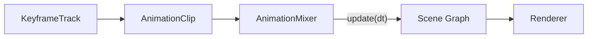

# Tutorial 12: Sistema de Animación por Keyframes

> **Nivel:** Intermedio  
> **Tiempo estimado:** 25 minutos  
> **Qué aprenderás:** Animar nodos 3D usando `AnimationMixer`, `AnimationClip` y `KeyframeTrack` con los tres modos de interpolación: linear, step y cubicspline.

---

## Concepto: Animación declarativa vs procedural

Hasta ahora hemos animado nodos manualmente en el render loop (procedural). El sistema de keyframes permite **declarar** la animación como datos y dejar que el `AnimationMixer` la ejecute:



| Procedural | Keyframes |
|-----------|-----------|
| `node.transform.position.y = Math.sin(t)` | Datos: times + values + interpolation |
| Lógica en el render loop | Separación datos / ejecución |
| Difícil de serializar | Serializable (glTF compatible) |
| Control total | Reproducible y reutilizable |

---

## Paso 1: Setup

```typescript
import {
  Scene, Node, Camera, CameraType,
  Material, createBox, createSphere,
  AnimationMixer,
  type AnimationClip,
  type KeyframeTrack,
} from '@joroya/core';
import { ThreeRenderer } from '@joroya/renderer-three';

const scene = new Scene();

const cam = new Node('camera');
cam.addComponent(new Camera({
  type: CameraType.Perspective,
  fov: 60,
  aspect: window.innerWidth / window.innerHeight,
  near: 0.1,
  far: 100,
}));
cam.transform.position = { x: 0, y: 2, z: 8 };
scene.add(cam);

// Un cubo que vamos a animar
const cube = new Node('cube');
cube.addComponent(createBox(1.5, 1.5, 1.5));
cube.addComponent(new Material({ color: { r: 0.3, g: 0.6, b: 1.0 } }));
scene.add(cube);
```

---

## Paso 2: Definir un KeyframeTrack

Un `KeyframeTrack` define la animación de **una propiedad** de **un nodo**:

```typescript
const bounceTrack: KeyframeTrack = {
  targetNodeName: 'cube',       // Nombre del nodo en la escena
  property: 'position',         // 'position' | 'rotation' | 'scale'
  times: new Float32Array([0, 1, 2]),  // Tiempos en segundos
  values: new Float32Array([
    0, 0, 0,     // t=0s: posición (0, 0, 0)
    0, 3, 0,     // t=1s: posición (0, 3, 0)
    0, 0, 0,     // t=2s: posición (0, 0, 0)
  ]),
  interpolation: 'linear',      // 'linear' | 'step' | 'cubicspline'
};
```

### ¿Qué está pasando?

- `targetNodeName` busca el nodo por nombre con `findNodeByName()`.
- `times` son los momentos clave (keyframes) en segundos.
- `values` son los valores en cada keyframe. Para `position` y `scale`: 3 floats (x, y, z) por keyframe. Para `rotation`: 4 floats (x, y, z, w) como quaternion.
- `interpolation` define cómo se interpolan los valores entre keyframes.

---

## Paso 3: Crear un AnimationClip

Un clip agrupa uno o más tracks y define la duración total:

```typescript
const clip: AnimationClip = {
  name: 'bounce',
  duration: 2.0,       // Duración total en segundos
  tracks: [bounceTrack],
};
```

Puedes animar múltiples propiedades y nodos en un solo clip:

```typescript
const complexClip: AnimationClip = {
  name: 'bounce-and-spin',
  duration: 2.0,
  tracks: [
    bounceTrack,     // Posición del cubo
    {
      targetNodeName: 'cube',
      property: 'rotation',
      times: new Float32Array([0, 2]),
      values: new Float32Array([
        0, 0, 0, 1,           // t=0s: quaternion identidad
        0, 0.707, 0, 0.707,   // t=2s: 90° en Y
      ]),
      interpolation: 'linear',
    },
  ],
};
```

---

## Paso 4: Reproducir con AnimationMixer

```typescript
const mixer = new AnimationMixer(scene);
mixer.play(clip, true); // true = loop

// En el render loop:
let lastTime = performance.now();

function loop() {
  const now = performance.now();
  const delta = (now - lastTime) / 1000; // Convertir a segundos
  lastTime = now;

  mixer.update(delta); // Avanza la animación
  renderer.render();
  requestAnimationFrame(loop);
}

requestAnimationFrame(loop);
```

### API del AnimationMixer

| Método | Descripción |
|--------|-------------|
| `play(clip, loop?)` | Inicia la reproducción. `loop` default: `true` |
| `stop()` | Detiene y resetea a t=0 |
| `pause()` | Pausa sin resetear |
| `resume()` | Reanuda desde donde se pausó |
| `update(deltaTime)` | Avanza la animación `deltaTime` segundos |
| `time` (getter) | Tiempo actual de reproducción |
| `playing` (getter) | `true` si está reproduciendo |

---

## Paso 5: Modos de interpolación

### Linear

Interpolación lineal entre keyframes. El valor cambia a velocidad constante:

```typescript
const linearTrack: KeyframeTrack = {
  targetNodeName: 'sphere-a',
  property: 'position',
  times: new Float32Array([0, 1, 2]),
  values: new Float32Array([0, 0, 0, 0, 3, 0, 0, 0, 0]),
  interpolation: 'linear',
};
```

Para rotaciones, usa **SLERP** (Spherical Linear Interpolation) automáticamente.

### Step

El valor salta directamente al siguiente keyframe sin transición. Ideal para cambios discretos:

```typescript
const stepTrack: KeyframeTrack = {
  targetNodeName: 'sphere-b',
  property: 'position',
  times: new Float32Array([0, 0.5, 1.0, 1.5, 2.0]),
  values: new Float32Array([
    0, 0, 0,
    0, 1.5, 0,
    0, 3, 0,
    0, 1.5, 0,
    0, 0, 0,
  ]),
  interpolation: 'step',
};
```

### CubicSpline

Interpolación cúbica con tangentes. Produce curvas suaves tipo ease-in/ease-out. Usa el formato glTF: **[in-tangent, value, out-tangent]** por cada keyframe:

```typescript
const cubicTrack: KeyframeTrack = {
  targetNodeName: 'sphere-c',
  property: 'position',
  times: new Float32Array([0, 1, 2]),
  values: new Float32Array([
    // Keyframe 0: in-tangent, value, out-tangent
    0, 0, 0,   0, 0, 0,   0, 5, 0,
    // Keyframe 1: in-tangent, value, out-tangent
    0, 0, 0,   0, 3, 0,   0, 0, 0,
    // Keyframe 2: in-tangent, value, out-tangent
    0, -5, 0,  0, 0, 0,   0, 0, 0,
  ]),
  interpolation: 'cubicspline',
};
```

> **Nota:** Para `cubicspline`, el array de `values` tiene **3× más datos** que linear/step porque cada keyframe incluye tangente de entrada, valor, y tangente de salida.

---

## Paso 6: Comparación visual

Creemos una escena que muestre los 3 modos lado a lado:

```typescript
const scene = new Scene();

// ... (cámara setup)

// 3 esferas en pivots separados
const modes = [
  { name: 'linear', color: { r: 0.3, g: 0.6, b: 1.0 }, x: -3 },
  { name: 'step',   color: { r: 1.0, g: 0.4, b: 0.3 }, x: 0 },
  { name: 'cubic',  color: { r: 0.3, g: 0.9, b: 0.5 }, x: 3 },
];

for (const mode of modes) {
  const pivot = new Node(`pivot-${mode.name}`);
  pivot.transform.position = { x: mode.x, y: 0, z: 0 };
  scene.add(pivot);

  const sphere = new Node(`sphere-${mode.name}`);
  sphere.addComponent(createSphere(0.5, 32, 32));
  sphere.addComponent(new Material({ color: mode.color }));
  pivot.add(sphere);
}

// Un solo clip con 3 tracks, cada uno con distinta interpolación
const clip: AnimationClip = {
  name: 'comparison',
  duration: 2.0,
  tracks: [
    {
      targetNodeName: 'sphere-linear',
      property: 'position',
      times: new Float32Array([0, 1, 2]),
      values: new Float32Array([0,0,0, 0,2.5,0, 0,0,0]),
      interpolation: 'linear',
    },
    {
      targetNodeName: 'sphere-step',
      property: 'position',
      times: new Float32Array([0, 0.5, 1, 1.5, 2]),
      values: new Float32Array([0,0,0, 0,1.25,0, 0,2.5,0, 0,1.25,0, 0,0,0]),
      interpolation: 'step',
    },
    {
      targetNodeName: 'sphere-cubic',
      property: 'position',
      times: new Float32Array([0, 1, 2]),
      values: new Float32Array([
        0,0,0,  0,0,0,  0,5,0,     // KF0
        0,0,0,  0,2.5,0, 0,0,0,    // KF1
        0,-5,0, 0,0,0,  0,0,0,     // KF2
      ]),
      interpolation: 'cubicspline',
    },
  ],
};

const mixer = new AnimationMixer(scene);
mixer.play(clip, true);
```

---

## Paso 7: Animaciones desde glTF

El loader glTF convierte automáticamente las animaciones del archivo `.glb`/`.gltf` a `AnimationClip[]`:

```typescript
import { loadGLTF } from '@joroya/loader-gltf';

const { scene: gltfScene, animations } = await loadGLTF('/models/character.glb');

// Agregar el modelo a nuestra escena
scene.root.add(gltfScene.root);

// Reproducir la primera animación
const mixer = new AnimationMixer(scene);
if (animations.length > 0) {
  mixer.play(animations[0], true);
}
```

Los clips de glTF ya vienen con los tracks configurados, incluyendo nombres de nodos, propiedades y modo de interpolación.

---

## Referencia rápida

### KeyframeTrack

| Campo | Tipo | Descripción |
|-------|------|-------------|
| `targetNodeName` | `string` | Nombre del nodo objetivo |
| `property` | `'position' \| 'rotation' \| 'scale'` | Propiedad a animar |
| `times` | `Float32Array` | Tiempos de cada keyframe (segundos) |
| `values` | `Float32Array` | Valores por keyframe (ver stride abajo) |
| `interpolation` | `'linear' \| 'step' \| 'cubicspline'` | Modo de interpolación |

### Stride de values por propiedad

| Propiedad | Componentes | linear/step | cubicspline |
|-----------|------------|-------------|-------------|
| `position` | x, y, z | 3 por KF | 9 por KF (3×3) |
| `scale` | x, y, z | 3 por KF | 9 por KF (3×3) |
| `rotation` | x, y, z, w | 4 por KF | 12 por KF (3×4) |

---

## Experimenta

- Cambia la duración del clip para acelerar o ralentizar la animación.
- Agrega más keyframes para crear movimientos complejos.
- Combina tracks de `position` y `rotation` en un mismo clip.
- Usa `mixer.pause()` y `mixer.resume()` para controlar la reproducción.

---

## Demo interactiva

Explora la comparación de interpolaciones en la demo **"Interpolation Modes"** de la galería de ejemplos.

---

## Siguiente tutorial

→ [Tutorial 13: Interactividad 3D](./13-3d-interactivity.md) — raycasting y eventos de puntero en Three.js.
