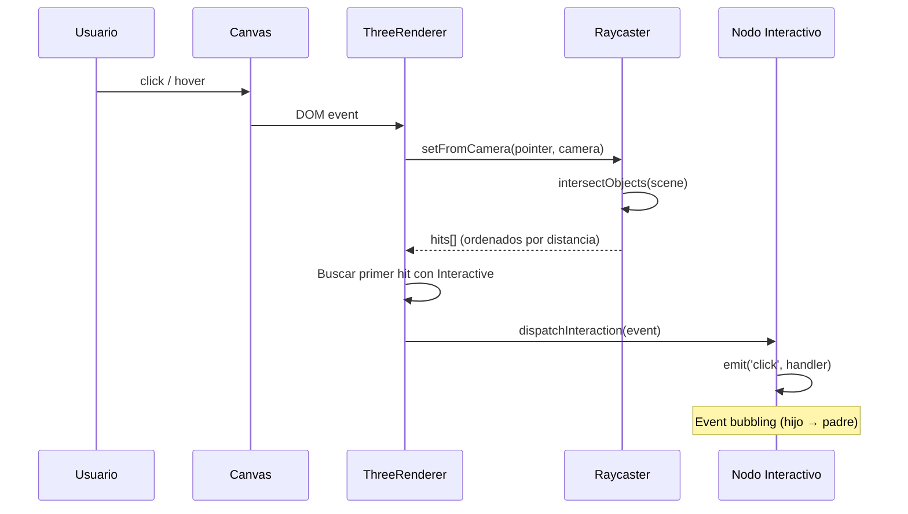

# Tutorial 13: Interactividad 3D con Raycasting

> **Nivel:** Avanzado  
> **Tiempo estimado:** 25 minutos  
> **Qué aprenderás:** Habilitar interactividad en escenas 3D usando el componente `Interactive`, raycasting con `ThreeRenderer.enableInteraction()`, y manejar eventos de click, hover y drag.

---

## Concepto: Raycasting en 3D

A diferencia del SVG donde los eventos DOM se delegan directamente, en 3D necesitamos **raycasting**: lanzar un rayo desde la cámara a través del punto del cursor y detectar qué objetos intersecta.



---

## Paso 1: Setup

```typescript
import {
  Scene, Node, Camera, CameraType,
  Material, Interactive,
  createBox, createSphere,
} from '@joroya/core';
import { ThreeRenderer } from '@joroya/renderer-three';

const canvas = document.getElementById('canvas') as HTMLCanvasElement;

const scene = new Scene();

const cam = new Node('camera');
cam.addComponent(new Camera({
  type: CameraType.Perspective,
  fov: 60,
  aspect: canvas.clientWidth / canvas.clientHeight,
  near: 0.1,
  far: 100,
}));
cam.transform.position = { x: 0, y: 2, z: 6 };
scene.add(cam);

const renderer = new ThreeRenderer({
  canvas,
  width: canvas.clientWidth,
  height: canvas.clientHeight,
});
renderer.mount(scene);
```

---

## Paso 2: Crear nodos interactivos

El componente `Interactive` marca un nodo como receptivo a eventos de puntero:

```typescript
const cube = new Node('my-cube');
cube.addComponent(createBox(1.5, 1.5, 1.5));
cube.addComponent(new Material({
  color: { r: 0.3, g: 0.6, b: 1.0 },
  metalness: 0.3,
  roughness: 0.5,
}));
cube.addComponent(new Interactive({
  cursor: 'pointer',       // CSS cursor al hacer hover
  enabled: true,           // Activar/desactivar sin remover
  blocksRaycast: true,     // Bloquea hits a objetos detrás
}));
scene.add(cube);
```

### InteractiveDef

| Propiedad | Default | Descripción |
|-----------|---------|-------------|
| `enabled` | `true` | Si `false`, ignora el nodo en raycasting |
| `cursor` | `'pointer'` | Cursor CSS al pasar el mouse |
| `blocksRaycast` | `true` | Si bloquea raycasts a nodos detrás |

---

## Paso 3: Habilitar el sistema de interacción

```typescript
// IMPORTANTE: llamar después de mount()
renderer.enableInteraction();
```

Esto registra event listeners en el canvas y activa el raycaster. El renderer:

1. Escucha eventos `pointermove`, `pointerdown`, `pointerup`, `click`, `pointerleave`, `wheel`.
2. En cada evento, lanza un raycast contra la escena.
3. Busca el primer objeto intersectado que tenga un componente `Interactive` habilitado.
4. Dispara un `InteractionEvent` en el nodo correspondiente.
5. Gestiona hover tracking (enter/leave) y actualiza el cursor CSS.

---

## Paso 4: Registrar event handlers

Los handlers se registran con `node.on()`:

```typescript
// Click
cube.on('click', (e) => {
  console.log('¡Click!', e.target.name);
  console.log('Punto 3D:', e.point);           // Coordenadas world-space
  console.log('Pantalla:', e.screenPosition);   // { x, y } en pixels
});

// Hover
cube.on('pointerenter', (e) => {
  console.log('Mouse entró en', e.target.name);
});

cube.on('pointerleave', (e) => {
  console.log('Mouse salió de', e.target.name);
});

// Pointer move (mientras está sobre el objeto)
cube.on('pointermove', (e) => {
  console.log('Mouse se mueve sobre', e.target.name);
});
```

---

## Paso 5: Cambiar color al hacer click

Una aplicación práctica: cambiar el color del material cuando el usuario hace click:

```typescript
const colors = [
  { r: 0.3, g: 0.6, b: 1.0 },
  { r: 1.0, g: 0.3, b: 0.3 },
  { r: 0.3, g: 0.9, b: 0.5 },
  { r: 1.0, g: 0.7, b: 0.1 },
];
let colorIndex = 0;

cube.on('click', () => {
  colorIndex = (colorIndex + 1) % colors.length;
  const mat = cube.getComponent(ComponentType.Material);
  if (mat) {
    mat.definition.color = colors[colorIndex];
  }
});
```

> **¿Por qué funciona?** El `ThreeRenderer.render()` sincroniza el color del material en cada frame, leyendo `mat.definition.color` y actualizando el `MeshStandardMaterial` de Three.js.

---

## Paso 6: Eventos soportados

| Evento | InteractionEventType | Caso de uso |
|--------|---------------------|-------------|
| `click` | `Click` | Selección, toggle |
| `pointerdown` | `PointerDown` | Inicio de drag, efecto press |
| `pointerup` | `PointerUp` | Fin de interacción |
| `pointermove` | `PointerMove` | Tracking del cursor sobre el objeto |
| `pointerenter` | `PointerEnter` | Hover in, highlight |
| `pointerleave` | `PointerLeave` | Hover out, reset |
| `wheel` | `Wheel` | Zoom, scroll sobre objeto |

---

## Paso 7: InteractionEvent

El objeto de evento contiene información rica sobre la interacción:

```typescript
cube.on('click', (e) => {
  e.type;            // InteractionEventType.Click
  e.target;          // Nodo donde se originó el evento
  e.currentTarget;   // Nodo actual durante el bubbling
  e.point;           // { x, y, z } — punto de intersección en world-space
  e.localPoint;      // Punto en espacio local del nodo (si aplica)
  e.screenPosition;  // { x, y } — posición del cursor en pixels
  e.nativeEvent;     // El evento DOM original (MouseEvent, PointerEvent)

  e.stopPropagation(); // Detener el bubbling
});
```

---

## Paso 8: Event bubbling

Los eventos se propagan de hijo a padre, igual que en el DOM:

```typescript
const parent = new Node('group');
parent.addComponent(new Interactive());
scene.add(parent);

const child = new Node('child-sphere');
child.addComponent(createSphere(0.5));
child.addComponent(new Material({ color: { r: 1, g: 0.5, b: 0 } }));
child.addComponent(new Interactive({ cursor: 'grab' }));
child.transform.position = { x: 2, y: 0, z: 0 };
parent.add(child); // child es hijo de parent

// Click en child → primero handler de child, luego handler de parent
child.on('click', (e) => {
  console.log('Child:', e.target.name);    // "child-sphere"
  // e.stopPropagation(); // Descomenta para evitar que llegue al parent
});

parent.on('click', (e) => {
  console.log('Parent recibió click de:', e.target.name); // "child-sphere"
  console.log('Current target:', e.currentTarget.name);   // "group"
});
```

---

## Paso 9: Ejemplo completo — Grilla interactiva 3D

```typescript
import {
  Scene, Node, Camera, CameraType,
  Material, Interactive, ComponentType,
  createBox,
} from '@joroya/core';
import { ThreeRenderer } from '@joroya/renderer-three';

const canvas = document.getElementById('canvas') as HTMLCanvasElement;
const scene = new Scene();

// Cámara
const cam = new Node('camera');
cam.addComponent(new Camera({
  type: CameraType.Perspective,
  fov: 50,
  aspect: canvas.clientWidth / canvas.clientHeight,
  near: 0.1, far: 100,
}));
cam.transform.position = { x: 0, y: 4, z: 8 };
scene.add(cam);

// Suelo
const ground = new Node('ground');
ground.addComponent(createBox(12, 0.1, 12));
ground.addComponent(new Material({ color: { r: 0.1, g: 0.1, b: 0.15 } }));
ground.transform.position = { x: 0, y: -1, z: 0 };
scene.add(ground);

// Grilla 3x3 de cubos interactivos
const cubes: Node[] = [];
const colors = [
  { r: 0.9, g: 0.2, b: 0.3 }, { r: 0.2, g: 0.8, b: 0.4 },
  { r: 0.3, g: 0.5, b: 0.95 }, { r: 1.0, g: 0.7, b: 0.1 },
  { r: 0.7, g: 0.3, b: 0.9 }, { r: 0.1, g: 0.8, b: 0.85 },
  { r: 0.95, g: 0.45, b: 0.1 }, { r: 0.6, g: 0.9, b: 0.3 },
  { r: 0.9, g: 0.2, b: 0.7 },
];

for (let x = 0; x < 3; x++) {
  for (let z = 0; z < 3; z++) {
    const idx = x * 3 + z;
    const cube = new Node(`cube-${x}-${z}`);
    cube.addComponent(createBox(1, 1, 1));
    cube.addComponent(new Material({
      color: colors[idx],
      metalness: 0.3,
      roughness: 0.5,
    }));
    cube.addComponent(new Interactive({ cursor: 'pointer' }));
    cube.transform.position = { x: (x - 1) * 2, y: 0, z: (z - 1) * 2 };
    scene.add(cube);
    cubes.push(cube);

    // Click: cambiar color aleatoriamente
    cube.on('click', () => {
      const mat = cube.getComponent<Material>(ComponentType.Material);
      if (mat) {
        mat.definition.color = {
          r: Math.random(),
          g: Math.random(),
          b: Math.random(),
        };
      }
    });
  }
}

// Renderer
const renderer = new ThreeRenderer({
  canvas,
  width: canvas.clientWidth,
  height: canvas.clientHeight,
});
renderer.mount(scene);
renderer.enableInteraction(); // ← Activar raycasting

// Render loop
function loop() {
  renderer.render();
  requestAnimationFrame(loop);
}
requestAnimationFrame(loop);
```

---

## Paso 10: Cleanup

Al desmontar la escena, desactiva el sistema de interacción:

```typescript
// Desactivar solo interacción
renderer.disableInteraction();

// O disponer todo el renderer
renderer.dispose(); // Incluye disableInteraction() + disableOrbitControls()
```

---

## SVG vs 3D: Comparación de interactividad

| Aspecto | SVG (`renderToSVGElement`) | 3D (`ThreeRenderer`) |
|---------|---------------------------|---------------------|
| Mecanismo | DOM event delegation | Raycasting |
| Hit testing | Nativo del browser | Three.js Raycaster |
| `e.point` | No disponible | Coordenadas 3D world-space |
| Performance | O(1) por evento | O(n) objetos intersectados |
| CSS cursor | Directo en el elemento | Gestionado por el renderer |
| Setup | `renderToSVGElement()` | `enableInteraction()` |

---

## Demo interactiva

Explora la interactividad 3D en la demo **"Interactive Cubes"** de la galería de ejemplos.

---

## Siguiente tutorial

→ [Tutorial 14: Orbit Controls](./14-orbit-controls.md) — manipulación de cámara con mouse y touch.
