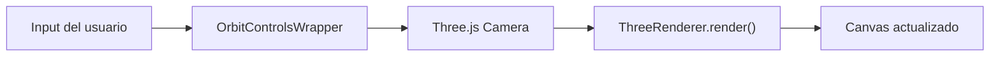

# Tutorial 14: Orbit Controls

> **Nivel:** Intermedio  
> **Tiempo estimado:** 15 minutos  
> **Qué aprenderás:** Habilitar controles de cámara interactivos con `OrbitControlsWrapper` para orbitar, hacer pan y zoom en escenas 3D.

---

## Concepto: Controles de cámara

Los orbit controls permiten al usuario explorar una escena 3D de forma intuitiva:

| Acción | Mouse | Touch |
|--------|-------|-------|
| **Orbitar** | Click izquierdo + arrastrar | Un dedo + arrastrar |
| **Pan** | Click derecho + arrastrar | Dos dedos + arrastrar |
| **Zoom** | Scroll wheel | Pinch |



El wrapper encapsula `OrbitControls` de Three.js y se integra con el render loop de Oroya.

---

## Paso 1: Crear la escena

```typescript
import {
  Scene, Node, Camera, CameraType,
  Material, createBox, createSphere,
} from '@joroya/core';
import { ThreeRenderer } from '@joroya/renderer-three';

const canvas = document.getElementById('canvas') as HTMLCanvasElement;

const scene = new Scene();

// Cámara — la posición inicial define el punto de vista al cargar
const cam = new Node('camera');
cam.addComponent(new Camera({
  type: CameraType.Perspective,
  fov: 60,
  aspect: canvas.clientWidth / canvas.clientHeight,
  near: 0.1,
  far: 200,
}));
cam.transform.position = { x: 5, y: 4, z: 8 };
scene.add(cam);

// Algunos objetos para explorar
const ground = new Node('ground');
ground.addComponent(createBox(20, 0.1, 20));
ground.addComponent(new Material({
  color: { r: 0.12, g: 0.12, b: 0.16 },
  roughness: 0.9,
}));
ground.transform.position = { x: 0, y: -0.05, z: 0 };
scene.add(ground);

// Torre central
const tower = new Node('tower');
tower.addComponent(createBox(1.5, 6, 1.5));
tower.addComponent(new Material({
  color: { r: 0.8, g: 0.6, b: 0.2 },
  metalness: 0.5,
  roughness: 0.4,
}));
tower.transform.position = { x: 0, y: 3, z: 0 };
scene.add(tower);

// Esferas alrededor
for (let i = 0; i < 6; i++) {
  const angle = (i / 6) * Math.PI * 2;
  const sphere = new Node(`sphere-${i}`);
  sphere.addComponent(createSphere(0.5, 24, 24));
  sphere.addComponent(new Material({
    color: {
      r: Math.sin(angle) * 0.5 + 0.5,
      g: Math.cos(angle) * 0.5 + 0.5,
      b: 0.6,
    },
    metalness: 0.7,
    roughness: 0.2,
  }));
  sphere.transform.position = {
    x: Math.cos(angle) * 5,
    y: 0.5,
    z: Math.sin(angle) * 5,
  };
  scene.add(sphere);
}
```

---

## Paso 2: Habilitar Orbit Controls

```typescript
const renderer = new ThreeRenderer({
  canvas,
  width: canvas.clientWidth,
  height: canvas.clientHeight,
});
renderer.mount(scene);

// Habilitar orbit controls — llamar después de mount()
renderer.enableOrbitControls();
```

¡Eso es todo! Ahora el usuario puede orbitar, hacer pan y zoom con el mouse o touch.

> **Importante:** `enableOrbitControls()` debe llamarse **después** de `mount()`, porque necesita la cámara activa de Three.js.

---

## Paso 3: Render loop

Los orbit controls usan damping (inercia) por defecto. Para que funcione, necesitas llamar `renderer.render()` en un loop continuo:

```typescript
function loop() {
  renderer.render(); // Internamente llama a orbitControls.update()
  requestAnimationFrame(loop);
}
requestAnimationFrame(loop);
```

El `render()` del `ThreeRenderer` ya incluye `orbitControls.update()` automáticamente, así que no necesitas llamarlo manualmente.

---

## Paso 4: Configuración avanzada

Para personalizar los controles, accede al wrapper nativo:

```typescript
import { OrbitControlsWrapper } from '@joroya/renderer-three';

// Obtener acceso al wrapper después de habilitarlo
// (el ThreeRenderer lo gestiona internamente)
```

El `OrbitControlsWrapper` configura estos defaults:

| Propiedad | Default | Descripción |
|-----------|---------|-------------|
| `enableDamping` | `true` | Inercia suave al soltar |
| `dampingFactor` | `0.05` | Intensidad del damping |
| `screenSpacePanning` | `false` | Pan en plano horizontal |
| `minDistance` | `1` | Zoom mínimo (distancia a target) |
| `maxDistance` | `500` | Zoom máximo |
| `maxPolarAngle` | `π` | Máximo ángulo vertical (permite voltear) |

Para modificar estos valores, puedes acceder a `nativeControls`:

```typescript
// Si necesitas acceso directo al OrbitControlsWrapper:
const wrapper = new OrbitControlsWrapper(threeCamera, canvas);

// Personalizar
wrapper.nativeControls.enableDamping = true;
wrapper.nativeControls.dampingFactor = 0.1;
wrapper.nativeControls.minDistance = 2;
wrapper.nativeControls.maxDistance = 50;
wrapper.nativeControls.maxPolarAngle = Math.PI / 2; // No permitir ver desde abajo
wrapper.nativeControls.autoRotate = true;            // Rotación automática
wrapper.nativeControls.autoRotateSpeed = 1.0;
```

---

## Paso 5: Combinar con interactividad

Los orbit controls y la interactividad pueden coexistir:

```typescript
renderer.mount(scene);
renderer.enableOrbitControls();  // Controles de cámara
renderer.enableInteraction();    // Raycasting + eventos

// Ahora el usuario puede:
// - Orbitar la escena con click izquierdo
// - Hacer click en objetos interactivos
// - Hacer zoom con el scroll
```

> **Nota:** Al arrastrar para orbitar, los clicks no disparan eventos de interacción porque el puntero se mueve. Solo los clicks estáticos (sin arrastre) generan eventos `click`.

---

## Paso 6: Desactivar y limpiar

```typescript
// Desactivar solo orbit controls
renderer.disableOrbitControls();

// O disponer todo
renderer.dispose(); // Limpia orbit controls + interaction + WebGL context
```

---

## Ejemplo completo

```typescript
import {
  Scene, Node, Camera, CameraType,
  Material, Interactive, ComponentType,
  createBox, createSphere,
} from '@joroya/core';
import { ThreeRenderer } from '@joroya/renderer-three';

const canvas = document.getElementById('canvas') as HTMLCanvasElement;

// Escena
const scene = new Scene();

const cam = new Node('camera');
cam.addComponent(new Camera({
  type: CameraType.Perspective,
  fov: 60,
  aspect: canvas.clientWidth / canvas.clientHeight,
  near: 0.1, far: 200,
}));
cam.transform.position = { x: 5, y: 4, z: 8 };
scene.add(cam);

// Suelo
const ground = new Node('ground');
ground.addComponent(createBox(20, 0.1, 20));
ground.addComponent(new Material({
  color: { r: 0.12, g: 0.12, b: 0.16 },
  roughness: 0.9,
}));
ground.transform.position = { x: 0, y: -0.05, z: 0 };
scene.add(ground);

// Objetos interactivos
for (let i = 0; i < 8; i++) {
  const angle = (i / 8) * Math.PI * 2;
  const radius = 4;

  const obj = new Node(`obj-${i}`);
  if (i % 2 === 0) {
    obj.addComponent(createBox(0.8, 0.8, 0.8));
  } else {
    obj.addComponent(createSphere(0.5, 24, 24));
  }
  obj.addComponent(new Material({
    color: {
      r: Math.sin(angle) * 0.4 + 0.6,
      g: Math.cos(angle) * 0.4 + 0.6,
      b: 0.5,
    },
    metalness: 0.4,
    roughness: 0.4,
  }));
  obj.addComponent(new Interactive({ cursor: 'pointer' }));
  obj.transform.position = {
    x: Math.cos(angle) * radius,
    y: 0.5,
    z: Math.sin(angle) * radius,
  };
  scene.add(obj);

  obj.on('click', () => {
    const mat = obj.getComponent<Material>(ComponentType.Material);
    if (mat) {
      mat.definition.color = {
        r: Math.random(),
        g: Math.random(),
        b: Math.random(),
      };
    }
    console.log(`${obj.name} clicked!`);
  });
}

// Renderer con orbit controls + interactividad
const renderer = new ThreeRenderer({
  canvas,
  width: canvas.clientWidth,
  height: canvas.clientHeight,
});
renderer.mount(scene);
renderer.enableOrbitControls();
renderer.enableInteraction();

// Render loop
function loop() {
  renderer.render();
  requestAnimationFrame(loop);
}
requestAnimationFrame(loop);
```

---

## Resumen

| Método | Descripción |
|--------|-------------|
| `renderer.enableOrbitControls()` | Activa orbit/pan/zoom |
| `renderer.disableOrbitControls()` | Desactiva y limpia listeners |
| `renderer.enableInteraction()` | Activa raycasting + eventos |
| `renderer.disableInteraction()` | Desactiva raycasting |
| `renderer.dispose()` | Limpia todo |

---

## Demo interactiva

Explora orbit controls en acción en las demos 3D de la galería de ejemplos — todas las escenas 3D soportan orbit controls en la vista modal.

---

## ¿Qué sigue?

Has completado todos los tutoriales de Oroya Animate. Ahora puedes:

- Combinar animación por keyframes + interactividad + orbit controls.
- Crear escenas 3D explorables con objetos clickeables.
- Exportar SVG animados e interactivos.
- Cargar modelos glTF con animaciones.

→ [Volver al índice de tutoriales](./README.md)
