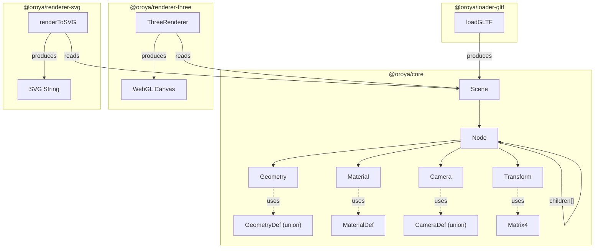
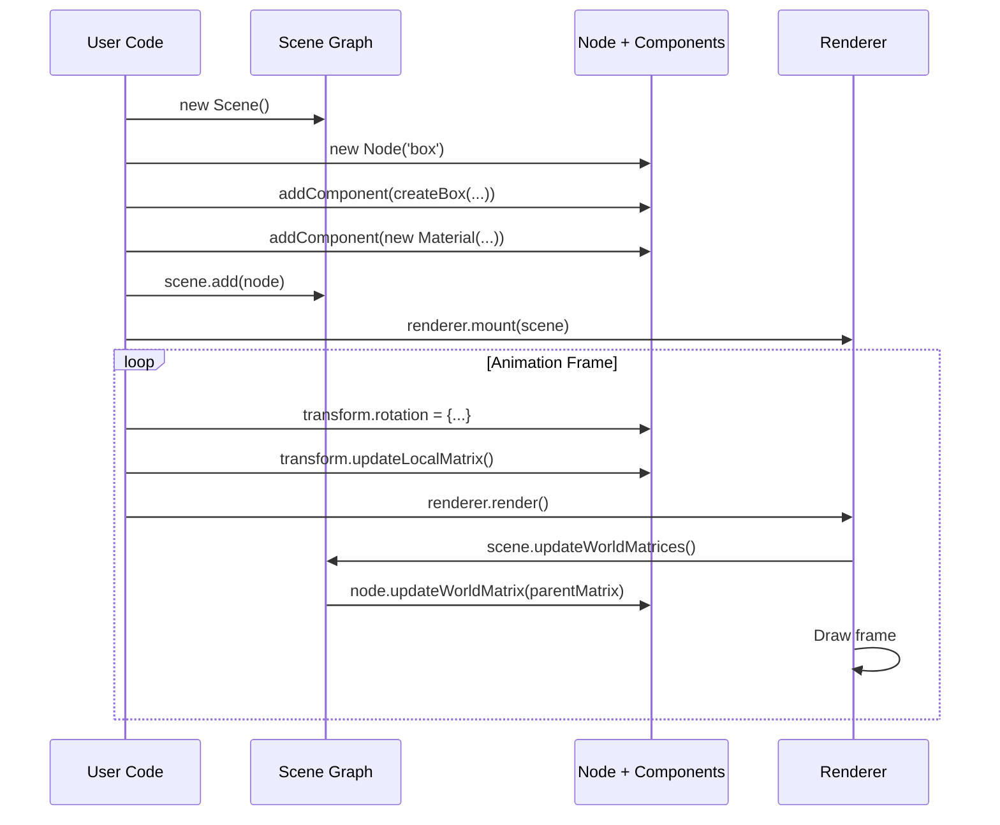
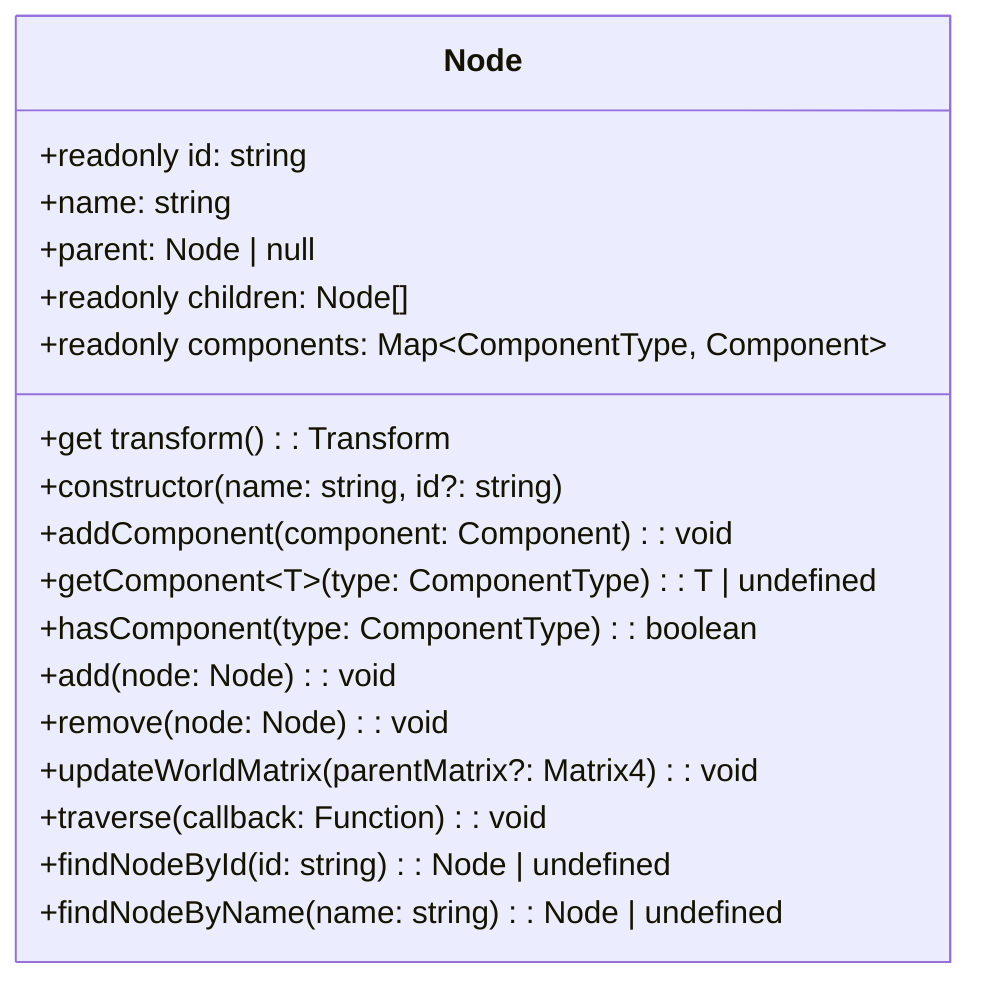
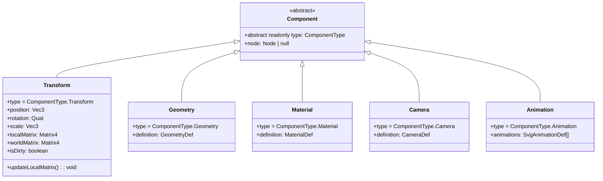
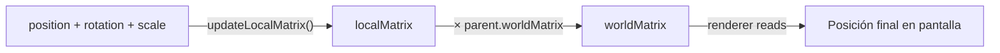
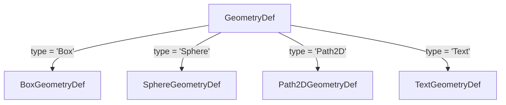
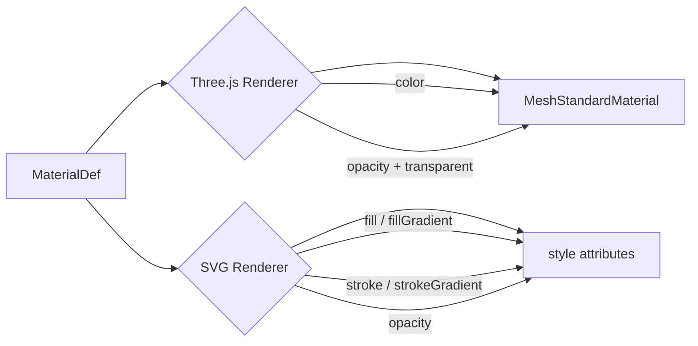
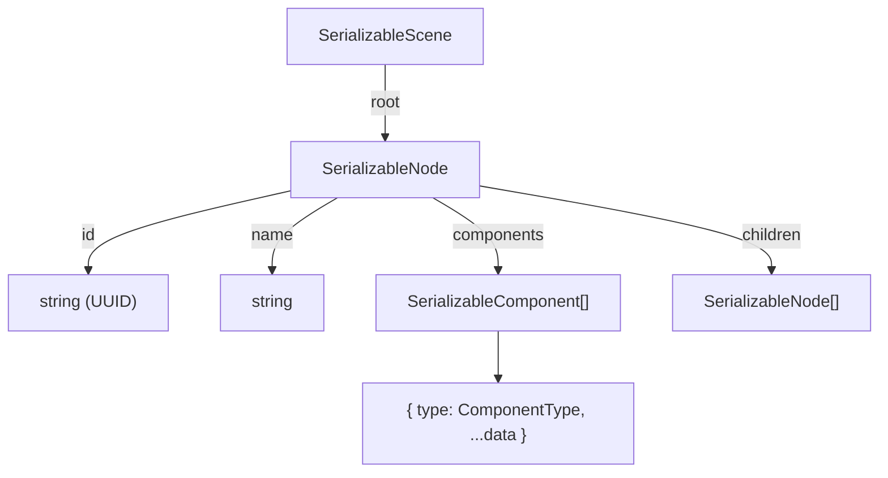
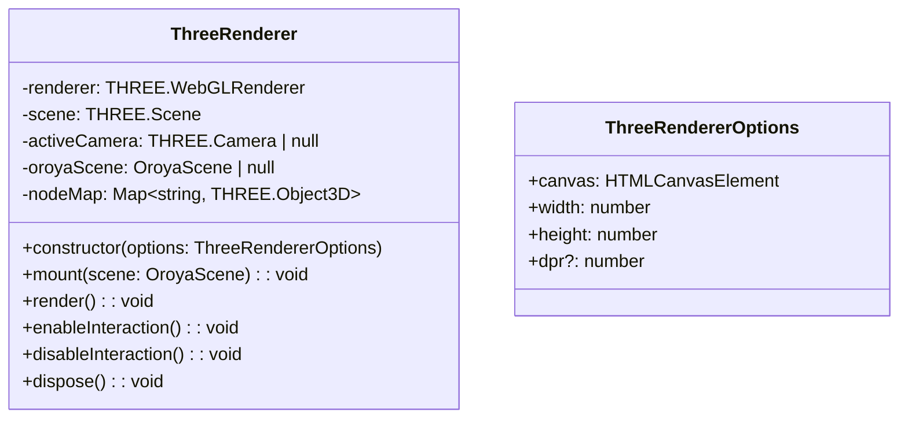
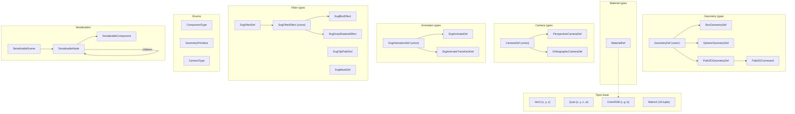

# API Reference

Complete reference for all packages in the Oroya Animate ecosystem.

---

## Tabla de contenidos

- [Visión general de la arquitectura](#visión-general-de-la-arquitectura)
- [`@oroya/core`](#oroyacore)
  - [Scene](#scene)
  - [Node](#node)
  - [Component (base)](#component-base-abstracta)
  - [Transform](#transform-componente)
  - [Geometry](#geometry-componente)
  - [Material](#material-componente)
  - [Camera](#camera-componente)
  - [Interactive](#interactive-componente)
  - [EventEmitter](#eventemitter)
  - [InteractionEvent](#interactionevent)
  - [Factory Functions](#factory-functions)
  - [Serialization](#serialización)
  - [Math — Matrix4](#math--matrix4)
  - [Math — BoundingBox](#math--boundingbox)
- [`@oroya/renderer-three`](#oroyarenderer-three)
  - [ThreeRenderer](#threerenderer)
- [`@oroya/renderer-svg`](#oroyarenderer-svg)
  - [renderToSVG](#rendertosvg)
  - [renderToSVGElement](#rendertosvgelement)
- [`@oroya/loader-gltf`](#oroyaloader-gltf)
  - [loadGLTF](#loadgltf)
- [Mapa completo de tipos](#mapa-completo-de-tipos)

---

## Visión general de la arquitectura



### Flujo de datos



---

## `@oroya/core`

### Exports completos

```typescript
// Scene
export { Scene } from './scene/Scene';

// Nodes
export { Node } from './nodes/Node';

// Components
export { Component, ComponentType } from './components/Component';
export { Transform } from './components/Transform';
export type { Vec3, Quat } from './components/Transform';
export { Geometry, GeometryPrimitive } from './components/Geometry';
export type { BoxGeometryDef, SphereGeometryDef, Path2DGeometryDef, Path2DCommand, GeometryDef } from './components/Geometry';
export { Material } from './components/Material';
export type { ColorRGB, MaterialDef } from './components/Material';
export { Camera, CameraType } from './components/Camera';
export type { PerspectiveCameraDef, OrthographicCameraDef, CameraDef } from './components/Camera';
export { Animation } from './components/Animation';
export type { SvgAnimateDef, SvgAnimateTransformDef, SvgAnimationDef } from './components/Animation';
export type {
  SvgFilterDef, SvgFilterEffect, SvgBlurEffect, SvgDropShadowEffect,
  SvgClipPathDef, SvgMaskDef,
} from './components/Material';

// Primitives
export { createBox, createSphere, createPath2D } from './geometry/primitives';

// Serialization
export { serialize, deserialize } from './serialization/json';

// Math
export { Matrix4Identity, composeMatrix, multiplyMatrices } from './math/Matrix4';
export type { Matrix4 } from './math/Matrix4';
```

---

### `Scene`

El contenedor de nivel superior del scene graph.

**Archivo fuente:** [Scene.ts](file:///c:/devfiles/personal-projects/oroya-animate/packages/core/src/scene/Scene.ts)

```typescript
import { Scene } from '@oroya/core';
const scene = new Scene();
```

#### Constructor

| Parámetro | Tipo | Descripción |
|-----------|------|-------------|
| *(ninguno)* | — | Crea una escena con un nodo raíz llamado `'root'` |

#### Propiedades

| Propiedad | Tipo | Acceso | Descripción |
|-----------|------|--------|-------------|
| `root` | `Node` | `readonly` | El nodo raíz del árbol de escena |

#### Métodos

| Método | Firma | Retorno | Descripción |
|--------|-------|---------|-------------|
| `add` | `add(node: Node, parent?: Node)` | `void` | Agrega un nodo. Si no se especifica `parent`, se agrega como hijo del `root` |
| `remove` | `remove(node: Node)` | `void` | Remueve un nodo de su padre |
| `findNodeById` | `findNodeById(id: string)` | `Node \| undefined` | Busca recursivamente un nodo por su UUID |
| `findNodeByName` | `findNodeByName(name: string)` | `Node \| undefined` | Busca recursivamente un nodo por su nombre |
| `traverse` | `traverse(callback: (node: Node) => void)` | `void` | Recorre todos los nodos del árbol en profundidad (DFS pre-order) |
| `updateWorldMatrices` | `updateWorldMatrices()` | `void` | Recalcula las matrices del mundo de todos los nodos. Se llama internamente por los renderers |

#### Ejemplo

```typescript
const scene = new Scene();

const parent = new Node('group');
const child = new Node('child');

scene.add(parent);
scene.add(child, parent); // child es hijo de parent, no del root

scene.traverse(node => console.log(node.name));
// → 'root', 'group', 'child'

const found = scene.findNodeByName('child');
console.log(found?.parent?.name); // → 'group'
```

---

### `Node`

Un elemento del scene graph. Soporta jerarquía padre-hijo y un sistema de componentes ECS.

**Archivo fuente:** [Node.ts](file:///c:/devfiles/personal-projects/oroya-animate/packages/core/src/nodes/Node.ts)



#### Constructor

| Parámetro | Tipo | Default | Descripción |
|-----------|------|---------|-------------|
| `name` | `string` | *(requerido)* | Nombre legible del nodo |
| `id` | `string` | `uuidv4()` | Identificador único. Se auto-genera si no se provee |

> **Nota:** Cada nodo recibe automáticamente un componente `Transform` al crearse.

#### Propiedades

| Propiedad | Tipo | Acceso | Descripción |
|-----------|------|--------|-------------|
| `id` | `string` | `readonly` | UUID único generado automáticamente |
| `name` | `string` | read/write | Etiqueta legible para humanos |
| `parent` | `Node \| null` | read/write | Referencia al nodo padre |
| `children` | `Node[]` | `readonly` | Array de nodos hijos |
| `components` | `Map<ComponentType, Component>` | `readonly` | Mapa de componentes. Máximo uno por tipo |
| `transform` | `Transform` | getter | Acceso directo al componente Transform |
| `cssClass` | `string \| undefined` | read/write | Clase(s) CSS que el renderer SVG emite como atributo `class` en el elemento |
| `cssId` | `string \| undefined` | read/write | ID semántico que el renderer SVG emite como atributo `id` en el elemento |

#### Métodos

| Método | Firma | Retorno | Descripción |
|--------|-------|---------|-------------|
| `addComponent` | `addComponent(component: Component)` | `void` | Adjunta un componente. Si ya existe uno del mismo tipo, lo reemplaza. Establece `component.node = this` |
| `getComponent<T>` | `getComponent<T>(type: ComponentType)` | `T \| undefined` | Obtiene un componente por tipo, casteado al tipo genérico |
| `hasComponent` | `hasComponent(type: ComponentType)` | `boolean` | Verifica si existe un componente de ese tipo |
| `add` | `add(node: Node)` | `void` | Agrega un hijo. Si el nodo ya tiene padre, lo remueve primero (re-parenting) |
| `remove` | `remove(node: Node)` | `void` | Remueve un hijo. Establece `node.parent = null` |
| `updateWorldMatrix` | `updateWorldMatrix(parentMatrix?: Matrix4)` | `void` | Recalcula la world matrix y propaga a los hijos recursivamente |
| `traverse` | `traverse(callback: (node: Node) => void)` | `void` | DFS pre-order sobre este nodo y todos los descendientes |
| `findNodeById` | `findNodeById(id: string)` | `Node \| undefined` | Búsqueda recursiva por UUID |
| `findNodeByName` | `findNodeByName(name: string)` | `Node \| undefined` | Búsqueda recursiva por nombre. Retorna el primero encontrado |

#### Ejemplo completo

```typescript
const player = new Node('player');
player.addComponent(createBox(0.5, 1, 0.5));
player.addComponent(new Material({ color: { r: 0.3, g: 0.8, b: 0.5 } }));

// Composición jerárquica
const weapon = new Node('weapon');
weapon.addComponent(createBox(0.1, 0.1, 0.8));
weapon.transform.position = { x: 0.3, y: 0.5, z: 0 };
player.add(weapon); // weapon es hijo de player

// Consultar componentes
const geo = player.getComponent<Geometry>(ComponentType.Geometry);
console.log(geo?.definition); // { type: 'Box', width: 0.5, ... }
console.log(player.hasComponent(ComponentType.Camera)); // false

// Re-parenting: mover weapon a otro nodo
const chest = new Node('chest');
chest.add(weapon); // se remueve automáticamente de player
console.log(weapon.parent?.name); // 'chest'
```

---

### `Component` (base abstracta)

Clase base para todos los componentes del sistema ECS.

**Archivo fuente:** [Component.ts](file:///c:/devfiles/personal-projects/oroya-animate/packages/core/src/components/Component.ts)



#### `ComponentType` (Enum)

| Valor | String | Usado por |
|-------|--------|-----------|
| `Transform` | `'Transform'` | `Transform` — automático en cada `Node` |
| `Geometry` | `'Geometry'` | `Geometry` — define la forma |
| `Material` | `'Material'` | `Material` — define la apariencia |
| `Camera` | `'Camera'` | `Camera` — define el punto de vista |
| `Interactive` | `'Interactive'` | `Interactive` — habilita eventos de interacción |
| `Animation` | `'Animation'` | `Animation` — animaciones SVG nativas |

> **Regla ECS:** Cada nodo puede tener **máximo un componente** de cada tipo. Agregar un segundo componente del mismo tipo reemplaza al anterior.

---

### `Transform` (Componente)

Define la posición, rotación y escala de un nodo en espacio 3D. Se crea **automáticamente** con cada `Node`.

**Archivo fuente:** [Transform.ts](file:///c:/devfiles/personal-projects/oroya-animate/packages/core/src/components/Transform.ts)

#### Propiedades

| Propiedad | Tipo | Default | Descripción |
|-----------|------|---------|-------------|
| `position` | `Vec3` | `{ x: 0, y: 0, z: 0 }` | Traslación en espacio local |
| `rotation` | `Quat` | `{ x: 0, y: 0, z: 0, w: 1 }` | Rotación como quaternion (identidad = sin rotación) |
| `scale` | `Vec3` | `{ x: 1, y: 1, z: 1 }` | Escala en espacio local |
| `localMatrix` | `Matrix4` | Identidad | Matriz de transformación local (calculada) |
| `worldMatrix` | `Matrix4` | Identidad | Matriz de transformación en espacio mundo (calculada) |
| `isDirty` | `boolean` | `true` | Indica si la matriz necesita recalcularse |

#### Métodos

| Método | Descripción |
|--------|-------------|
| `updateLocalMatrix()` | Recalcula `localMatrix` a partir de `position`, `rotation` y `scale`. Marca `isDirty = true` |

#### Pipeline de transformación



#### Guía rápida de quaterniones

Los quaterniones `{ x, y, z, w }` representan rotaciones 3D sin gimbal lock.

| Rotación deseada | Quaternion |
|-----------------|------------|
| Sin rotación | `{ x: 0, y: 0, z: 0, w: 1 }` |
| 90° en eje Y | `{ x: 0, y: 0.707, z: 0, w: 0.707 }` |
| 180° en eje Y | `{ x: 0, y: 1, z: 0, w: 0 }` |
| θ grados en eje Y | `{ x: 0, y: sin(θ/2), z: 0, w: cos(θ/2) }` |
| θ grados en eje X | `{ x: sin(θ/2), y: 0, z: 0, w: cos(θ/2) }` |
| θ grados en eje Z | `{ x: 0, y: 0, z: sin(θ/2), w: cos(θ/2) }` |

> **Fórmula:** Para rotar `θ` radianes alrededor del eje unitario `(ax, ay, az)`:
> `{ x: ax * sin(θ/2), y: ay * sin(θ/2), z: az * sin(θ/2), w: cos(θ/2) }`

---

### `Geometry` (Componente)

Define la forma geométrica de un nodo.

**Archivo fuente:** [Geometry.ts](file:///c:/devfiles/personal-projects/oroya-animate/packages/core/src/components/Geometry.ts)

#### Constructor

```typescript
new Geometry(definition: GeometryDef)
```

#### `GeometryPrimitive` (Enum)

| Valor | String | Descripción |
|-------|--------|-------------|
| `Box` | `'Box'` | Paralelepípedo (cubo, caja) |
| `Sphere` | `'Sphere'` | Esfera UV |
| `Path2D` | `'Path2D'` | Path vectorial 2D (para SVG) |
| `Text` | `'Text'` | Texto SVG |

#### `GeometryDef` (Union type)



#### `BoxGeometryDef`

| Campo | Tipo | Descripción |
|-------|------|-------------|
| `type` | `GeometryPrimitive.Box` | Discriminante |
| `width` | `number` | Ancho (eje X) |
| `height` | `number` | Alto (eje Y) |
| `depth` | `number` | Profundidad (eje Z) |

#### `SphereGeometryDef`

| Campo | Tipo | Descripción |
|-------|------|-------------|
| `type` | `GeometryPrimitive.Sphere` | Discriminante |
| `radius` | `number` | Radio de la esfera |
| `widthSegments` | `number` | Segmentos horizontales (meridianos) |
| `heightSegments` | `number` | Segmentos verticales (paralelos) |

> **Tip:** Más segmentos = esfera más suave. Valores comunes: 16 (baja calidad), 32 (estándar), 64 (alta calidad).

#### `Path2DGeometryDef`

| Campo | Tipo | Descripción |
|-------|------|-------------|
| `type` | `GeometryPrimitive.Path2D` | Discriminante |
| `path` | `Path2DCommand[]` | Array de comandos SVG-like |

#### `Path2DCommand`

| Campo | Tipo | Descripción |
|-------|------|-------------|
| `command` | `string` | Comando SVG: `'M'`, `'L'`, `'C'`, `'Q'`, `'Z'`, etc. |
| `args` | `number[]` | Argumentos numéricos del comando |

**Comandos SVG soportados:**

| Comando | Argumentos | Descripción |
|---------|-----------|-------------|
| `M` | `[x, y]` | Move to — mover sin dibujar |
| `L` | `[x, y]` | Line to — línea recta |
| `C` | `[cx1, cy1, cx2, cy2, x, y]` | Cubic Bézier |
| `Q` | `[cx, cy, x, y]` | Quadratic Bézier |
| `A` | `[rx, ry, rotation, largeArc, sweep, x, y]` | Arc |
| `Z` | `[]` | Close path — cerrar el camino |

#### `TextGeometryDef`

| Campo | Tipo | Default | Descripción |
|-------|------|---------|-------------|
| `type` | `GeometryPrimitive.Text` | — | Discriminante |
| `text` | `string` | — | Contenido del texto |
| `fontSize` | `number` | `16` | Tamaño de fuente (px) |
| `fontFamily` | `string` | `'sans-serif'` | Familia tipográfica |
| `fontWeight` | `string` | `'normal'` | Peso: `'normal'`, `'bold'`, `'100'`–`'900'` |
| `textAnchor` | `string` | `'start'` | Alineación horizontal: `'start'`, `'middle'`, `'end'` |
| `dominantBaseline` | `string` | `'auto'` | Alineación vertical: `'auto'`, `'middle'`, `'hanging'` |

#### Compatibilidad con renderers

| GeometryDef | Three.js | SVG |
|------------|----------|-----|
| `BoxGeometryDef` | ✅ → `THREE.BoxGeometry` | ✅ → `<rect>` |
| `SphereGeometryDef` | ✅ → `THREE.SphereGeometry` | ✅ → `<circle>` |
| `Path2DGeometryDef` | ❌ ignorado | ✅ → `<path d="...">` |
| `TextGeometryDef` | ❌ ignorado | ✅ → `<text>` |

---

### `Material` (Componente)

Define la apariencia visual de un nodo.

**Archivo fuente:** [Material.ts](file:///c:/devfiles/personal-projects/oroya-animate/packages/core/src/components/Material.ts)

#### Constructor

```typescript
new Material(definition?: MaterialDef)  // default: {}
```

#### `ColorRGB`

| Campo | Tipo | Rango | Descripción |
|-------|------|-------|-------------|
| `r` | `number` | 0.0 – 1.0 | Componente rojo |
| `g` | `number` | 0.0 – 1.0 | Componente verde |
| `b` | `number` | 0.0 – 1.0 | Componente azul |

> **Conversión:** Para convertir de hex `#3399ff` a RGB normalizado: `{ r: 0x33/255, g: 0x99/255, b: 0xff/255 }` → `{ r: 0.2, g: 0.6, b: 1.0 }`

#### `MaterialDef`

| Campo | Tipo | Default | Usado por | Descripción |
|-------|------|---------|-----------|-------------|
| `color` | `ColorRGB` | `undefined` | Three.js | Color de la superficie para renderizado 3D |
| `opacity` | `number` | `undefined` | Three.js, SVG | Opacidad: 0 (transparente) a 1 (opaco). Activa transparencia automáticamente si < 1 |
| `fill` | `ColorRGB` | `undefined` | SVG | Color de relleno para paths 2D |
| `stroke` | `ColorRGB` | `undefined` | SVG | Color del trazo para paths 2D |
| `strokeWidth` | `number` | `undefined` | SVG | Ancho del trazo en píxeles |
| `fillGradient` | `GradientDef` | `undefined` | SVG | Gradiente para relleno. Tiene prioridad sobre `fill` |
| `strokeGradient` | `GradientDef` | `undefined` | SVG | Gradiente para trazo. Tiene prioridad sobre `stroke` |
| `filter` | `SvgFilterDef` | `undefined` | SVG | Filtro SVG (blur, drop-shadow). Genera un `<filter>` en `<defs>` |
| `clipPath` | `SvgClipPathDef` | `undefined` | SVG | Recorte vectorial. Genera un `<clipPath>` en `<defs>` |
| `mask` | `SvgMaskDef` | `undefined` | SVG | Máscara de luminancia. Genera un `<mask>` en `<defs>` |

#### `GradientDef` (Union type)

```typescript
type GradientDef = LinearGradientDef | RadialGradientDef;
```

#### SVG Filters (`SvgFilterDef`)

Permite aplicar filtros SVG nativos a un nodo.

```typescript
interface SvgFilterDef {
  effects: SvgFilterEffect[];
}

type SvgFilterEffect = SvgBlurEffect | SvgDropShadowEffect;
```

##### `SvgBlurEffect`

| Campo | Tipo | Descripción |
|-------|------|-------------|
| `type` | `'blur'` | Discriminante |
| `stdDeviation` | `number` | Radio de desenfoque gaussiano |

##### `SvgDropShadowEffect`

| Campo | Tipo | Default | Descripción |
|-------|------|---------|-------------|
| `type` | `'dropShadow'` | — | Discriminante |
| `dx` | `number` | — | Desplazamiento horizontal de la sombra |
| `dy` | `number` | — | Desplazamiento vertical de la sombra |
| `stdDeviation` | `number` | — | Radio de desenfoque de la sombra |
| `floodColor` | `string` | `undefined` | Color de la sombra (e.g., `'black'`, `'#333'`) |
| `floodOpacity` | `number` | `undefined` | Opacidad de la sombra (0–1) |

#### `SvgClipPathDef`

Recorta el nodo a una región vectorial definida por un path SVG.

| Campo | Tipo | Descripción |
|-------|------|-------------|
| `path` | `Path2DCommand[]` | Comandos del path de recorte |

#### `SvgMaskDef`

Aplica una máscara de luminancia al nodo.

| Campo | Tipo | Default | Descripción |
|-------|------|---------|-------------|
| `path` | `Path2DCommand[]` | — | Comandos del path de la máscara |
| `fill` | `string` | `undefined` | Color de relleno de la máscara (e.g., `'white'`) |
| `opacity` | `number` | `undefined` | Opacidad del path de la máscara |

#### Ejemplo: Filtros, clip-path y máscara

```typescript
// Blur
const blurred = new Material({
  fill: { r: 1, g: 0, b: 0 },
  filter: { effects: [{ type: 'blur', stdDeviation: 3 }] },
});

// Drop shadow con color personalizado
const shadowed = new Material({
  fill: { r: 0, g: 0.5, b: 1 },
  filter: {
    effects: [{ type: 'dropShadow', dx: 4, dy: 4, stdDeviation: 2, floodColor: '#333', floodOpacity: 0.6 }],
  },
});

// Clip path
const clipped = new Material({
  fill: { r: 0, g: 1, b: 0 },
  clipPath: {
    path: [
      { command: 'M', args: [0, 0] },
      { command: 'L', args: [100, 0] },
      { command: 'L', args: [50, 100] },
      { command: 'Z', args: [] },
    ],
  },
});
```

#### `LinearGradientDef`

| Campo | Tipo | Default | Descripción |
|-------|------|---------|-------------|
| `type` | `'linear'` | — | Discriminante |
| `x1` | `number` | `0` | Coordenada X inicio (0–1) |
| `y1` | `number` | `0` | Coordenada Y inicio (0–1) |
| `x2` | `number` | `1` | Coordenada X fin (0–1) |
| `y2` | `number` | `0` | Coordenada Y fin (0–1) |
| `stops` | `GradientStop[]` | — | Paradas de color |

#### `RadialGradientDef`

| Campo | Tipo | Default | Descripción |
|-------|------|---------|-------------|
| `type` | `'radial'` | — | Discriminante |
| `cx` | `number` | `0.5` | Centro X (0–1) |
| `cy` | `number` | `0.5` | Centro Y (0–1) |
| `r` | `number` | `0.5` | Radio (0–1) |
| `fx` | `number` | `undefined` | Foco X (0–1), opcional |
| `fy` | `number` | `undefined` | Foco Y (0–1), opcional |
| `stops` | `GradientStop[]` | — | Paradas de color |

#### `GradientStop`

| Campo | Tipo | Descripción |
|-------|------|-------------|
| `offset` | `number` | Posición en el gradiente (0–1) |
| `color` | `ColorRGB` | Color en esta parada |
| `opacity` | `number` | *(opcional)* Opacidad de la parada (0–1) |

#### Ejemplo: Material para ambos renderers

```typescript
// Material que funciona en 3D y SVG
const material = new Material({
  color: { r: 0.2, g: 0.6, b: 1.0 },    // Three.js lo usa como diffuse color
  fill: { r: 0.2, g: 0.6, b: 1.0 },      // SVG lo usa como fill
  stroke: { r: 0.1, g: 0.3, b: 0.8 },    // SVG lo usa como stroke
  strokeWidth: 2,
  opacity: 0.9,
});
```

#### Cómo lo interpretan los renderers



---

### `Camera` (Componente)

Define un punto de vista para renderizar la escena. El `ThreeRenderer` busca automáticamente el primer nodo con `Camera` al montar la escena.

**Archivo fuente:** [Camera.ts](file:///c:/devfiles/personal-projects/oroya-animate/packages/core/src/components/Camera.ts)

#### Constructor

```typescript
new Camera(definition: CameraDef)
```

#### `CameraType` (Enum)

| Valor | String | Estado |
|-------|--------|--------|
| `Perspective` | `'Perspective'` | ✅ Implementado |
| `Orthographic` | `'Orthographic'` | ✅ Implementado |

#### `PerspectiveCameraDef`

| Campo | Tipo | Descripción | Valor típico |
|-------|------|-------------|--------------|
| `type` | `CameraType.Perspective` | Discriminante | — |
| `fov` | `number` | Campo de visión en grados | 45 – 90 |
| `aspect` | `number` | Relación de aspecto (ancho / alto) | `window.innerWidth / window.innerHeight` |
| `near` | `number` | Plano de corte cercano | 0.1 |
| `far` | `number` | Plano de corte lejano | 1000 |

#### Diagrama de frustum (perspectiva)

```
              far plane
          ┌─────────────────┐
         /                   \
        /     Visible         \
       /      Volume           \
      /      (frustum)          \
     /                           \
    └─────────────────────────────┘
     ├── near plane ──┤
              △
           Camera
          position
```

#### Ejemplo de uso

```typescript
const cam = new Node('main-camera');
cam.addComponent(new Camera({
  type: CameraType.Perspective,
  fov: 75,
  aspect: 16 / 9,
  near: 0.1,
  far: 1000,
}));
cam.transform.position = { x: 0, y: 5, z: 10 };
scene.add(cam);
```

#### `OrthographicCameraDef`

| Campo | Tipo | Descripción | Valor típico |
|-------|------|-------------|-------------|
| `type` | `CameraType.Orthographic` | Discriminante | — |
| `left` | `number` | Borde izquierdo del frustum | `-400` |
| `right` | `number` | Borde derecho del frustum | `400` |
| `top` | `number` | Borde superior del frustum | `-300` |
| `bottom` | `number` | Borde inferior del frustum | `300` |
| `near` | `number` | Plano de corte cercano | `0.1` |
| `far` | `number` | Plano de corte lejano | `1000` |

> **SVG:** Cuando una escena tiene un nodo con `OrthographicCameraDef`, el renderer SVG calcula automáticamente el `viewBox` a partir de `left`, `right`, `top` y `bottom`, más el offset de posición de la cámara. Un `viewBox` explícito en las opciones tiene prioridad.

#### Ejemplo: Cámara ortográfica para SVG

```typescript
const cam = new Node('ortho-cam');
cam.addComponent(new Camera({
  type: CameraType.Orthographic,
  left: -400, right: 400,
  top: -300, bottom: 300,
  near: 0.1, far: 1000,
}));
cam.transform.position = { x: 50, y: 25, z: 0 };
scene.add(cam);

// viewBox se calcula como "-350 -275 800 600" (offset por posición de cámara)
const svg = renderToSVG(scene, { width: 800, height: 600 });
```

> **Nota:** Si no se agrega ninguna cámara, `ThreeRenderer` crea un fallback en `(0, 0, 5)` con FOV 75.

---

### Interactive (componente)

**Archivo fuente:** [Interactive.ts](file:///c:/devfiles/personal-projects/oroya-animate/packages/core/src/components/Interactive.ts)

Marca un nodo como interactivo, permitiendo que responda a eventos de puntero (click, hover, drag, etc.).

---

### Animation (componente)

**Archivo fuente:** [Animation.ts](file:///c:/devfiles/personal-projects/oroya-animate/packages/core/src/components/Animation.ts)

Permite agregar animaciones SVG nativas (`<animate>` y `<animateTransform>`) a un nodo. Estas animaciones se ejecutan directamente en el navegador sin JavaScript.

#### Constructor

```typescript
new Animation(animations: SvgAnimationDef[])
```

#### `SvgAnimationDef` (Union type)

```typescript
type SvgAnimationDef = SvgAnimateDef | SvgAnimateTransformDef;
```

#### `SvgAnimateDef`

Genera un elemento `<animate>` que anima un atributo escalar.

| Campo | Tipo | Default | Descripción |
|-------|------|---------|-------------|
| `type` | `'animate'` | — | Discriminante |
| `attributeName` | `string` | — | Atributo SVG a animar (e.g., `'opacity'`, `'r'`, `'fill'`) |
| `from` | `string` | `undefined` | Valor inicial |
| `to` | `string` | `undefined` | Valor final |
| `values` | `string` | `undefined` | Lista de valores separados por `;` (alternativa a from/to) |
| `dur` | `string` | `undefined` | Duración (e.g., `'2s'`, `'500ms'`) |
| `repeatCount` | `string` | `undefined` | Repeticiones: un número o `'indefinite'` |
| `begin` | `string` | `undefined` | Cuándo empieza (e.g., `'0s'`, `'click'`) |
| `fill` | `string` | `undefined` | Comportamiento al terminar: `'freeze'` o `'remove'` |
| `keyTimes` | `string` | `undefined` | Tiempos clave separados por `;` (0–1) |
| `keySplines` | `string` | `undefined` | Curvas Bézier para interpolación entre keyframes |
| `calcMode` | `string` | `undefined` | Modo de cálculo: `'linear'`, `'discrete'`, `'paced'`, `'spline'` |

#### `SvgAnimateTransformDef`

Genera un elemento `<animateTransform>` que anima una transformación geométrica.

| Campo | Tipo | Default | Descripción |
|-------|------|---------|-------------|
| `type` | `'animateTransform'` | — | Discriminante |
| `transformType` | `string` | — | Tipo de transformación: `'translate'`, `'scale'`, `'rotate'`, `'skewX'`, `'skewY'` |
| `from` | `string` | `undefined` | Valor inicial (e.g., `'0 50 50'` para rotación) |
| `to` | `string` | `undefined` | Valor final |
| `values` | `string` | `undefined` | Lista de valores separados por `;` |
| `dur` | `string` | `undefined` | Duración |
| `repeatCount` | `string` | `undefined` | Repeticiones |
| `begin` | `string` | `undefined` | Cuándo empieza |
| `fill` | `string` | `undefined` | `'freeze'` o `'remove'` |
| `additive` | `string` | `undefined` | `'sum'` para acumular con la transformación base |

#### Ejemplo

```typescript
const circle = new Node('pulse');
circle.addComponent(createSphere(30));
circle.addComponent(new Material({ fill: { r: 1, g: 0, b: 0 } }));
circle.addComponent(new Animation([
  // Pulsar opacidad
  {
    type: 'animate',
    attributeName: 'opacity',
    values: '1;0.3;1',
    dur: '2s',
    repeatCount: 'indefinite',
  },
  // Rotar continuamente
  {
    type: 'animateTransform',
    transformType: 'rotate',
    from: '0 50 50',
    to: '360 50 50',
    dur: '4s',
    repeatCount: 'indefinite',
  },
]));
scene.add(circle);
```

Genera:
```xml
<circle cx="0" cy="0" r="30" fill="rgb(255, 0, 0)">
  <animate attributeName="opacity" values="1;0.3;1" dur="2s" repeatCount="indefinite" />
  <animateTransform attributeName="transform" type="rotate"
    from="0 50 50" to="360 50 50" dur="4s" repeatCount="indefinite" />
</circle>
```

> **Nota:** Las animaciones SVG nativas solo tienen efecto en el renderer SVG. El renderer Three.js las ignora.

---

#### Definición

```typescript
interface InteractiveDef {
  enabled: boolean;
  cursor: string;
  blocksRaycast: boolean;
}
```

| Campo | Tipo | Default | Descripción |
|-------|------|---------|-------------|
| `enabled` | `boolean` | `true` | Si el nodo responde a eventos |
| `cursor` | `string` | `'pointer'` | CSS cursor al hacer hover (e.g., `'pointer'`, `'grab'`, `'move'`) |
| `blocksRaycast` | `boolean` | `true` | Si bloquea raycasts a objetos detrás |

#### Uso

```typescript
import { Node, Interactive, createBox } from '@oroya/core';

const button = new Node('button');
button.addComponent(createBox(2, 1, 0.2));
button.addComponent(new Interactive({ cursor: 'pointer' }));

// Registrar event handlers
button.on('click', (e) => {
  console.log('Clicked!', e.target.name);
});

button.on('pointerenter', (e) => {
  console.log('Hover started');
});

button.on('pointerleave', (e) => {
  console.log('Hover ended');
});
```

#### Integración con renderers

- **ThreeRenderer:** Requiere llamar `renderer.enableInteraction()` después de `mount()`. Usa `THREE.Raycaster` para hit-testing 3D.
- **SVG Renderer:** Usa `renderToSVGElement()` (no `renderToSVG()`) para obtener un DOM element con event listeners.

---

### EventEmitter

**Archivo fuente:** [EventEmitter.ts](file:///c:/devfiles/personal-projects/oroya-animate/packages/core/src/events/EventEmitter.ts)

Sistema de eventos genérico con tipado fuerte. Cada `Node` tiene un `EventEmitter` interno para manejar `InteractionEvent`s.

#### API

```typescript
class EventEmitter<EventMap extends Record<string, any>> {
  on<K extends keyof EventMap>(
    eventType: K,
    handler: (payload: EventMap[K]) => void
  ): void;

  off<K extends keyof EventMap>(
    eventType: K,
    handler: (payload: EventMap[K]) => void
  ): void;

  emit<K extends keyof EventMap>(
    eventType: K,
    payload: EventMap[K]
  ): void;

  removeAllListeners(eventType?: keyof EventMap): void;

  hasListeners(eventType: keyof EventMap): boolean;
}
```

#### Ejemplo de uso directo

```typescript
import { EventEmitter } from '@oroya/core';

type MyEvents = {
  'data-loaded': { id: string; data: any };
  'error': { message: string };
};

const emitter = new EventEmitter<MyEvents>();

emitter.on('data-loaded', (payload) => {
  console.log('Data:', payload.data);
});

emitter.emit('data-loaded', { id: '123', data: { foo: 'bar' } });
```

#### Uso en Node

Los nodos exponen shortcuts `on()` y `off()` que delegan al `EventEmitter` interno:

```typescript
const node = new Node('my-node');

node.on('click', (e: InteractionEvent) => {
  console.log('Clicked at', e.screenPosition);
});
```

---

### InteractionEvent

**Archivo fuente:** [InteractionEvent.ts](file:///c:/devfiles/personal-projects/oroya-animate/packages/core/src/events/InteractionEvent.ts)

Eventos de interacción que se disparan cuando el usuario interactúa con nodos marcados como `Interactive`.

#### Tipos de eventos

```typescript
enum InteractionEventType {
  Click = 'click',
  PointerDown = 'pointerdown',
  PointerUp = 'pointerup',
  PointerMove = 'pointermove',
  PointerEnter = 'pointerenter',
  PointerLeave = 'pointerleave',
  PointerCancel = 'pointercancel',
  Wheel = 'wheel',
  DragStart = 'dragstart',
  DragEnd = 'dragend',
}
```

#### Interfaz

```typescript
interface InteractionEvent {
  type: InteractionEventType;
  target: Node;                    // Nodo que recibió el evento originalmente
  currentTarget: Node;             // Nodo actual durante bubbling
  point?: { x: number; y: number; z: number };  // Posición 3D en world space
  localPoint?: { x: number; y: number; z: number };  // Posición en local space del nodo
  screenPosition: { x: number; y: number };  // Posición en pantalla (clientX/Y)
  nativeEvent: unknown;            // Evento DOM original (PointerEvent, MouseEvent, etc.)
  propagationStopped: boolean;
  stopPropagation(): void;
}
```

#### Event Bubbling

Los eventos se propagan hacia arriba en el scene graph (de hijo a padre), similar al DOM:

```typescript
const parent = new Node('parent');
const child = new Node('child');
parent.add(child);

parent.on('click', (e) => {
  console.log('Parent clicked, target:', e.target.name);  // "child"
  console.log('Current target:', e.currentTarget.name);   // "parent"
});

child.on('click', (e) => {
  console.log('Child clicked');
  e.stopPropagation();  // Detiene el bubbling
});
```

#### Factory

```typescript
function createInteractionEvent(
  type: InteractionEventType,
  target: Node,
  nativeEvent: unknown,
  screenPosition: { x: number; y: number },
  options?: {
    point?: { x: number; y: number; z: number };
    localPoint?: { x: number; y: number; z: number };
  }
): InteractionEvent;
```

---

### Factory Functions


Funciones helper para crear componentes `Geometry` de forma concisa.

**Archivo fuente:** [primitives.ts](file:///c:/devfiles/personal-projects/oroya-animate/packages/core/src/geometry/primitives.ts)

#### `createBox`

```typescript
function createBox(width?: number, height?: number, depth?: number): Geometry
```

| Parámetro | Tipo | Default | Descripción |
|-----------|------|---------|-------------|
| `width` | `number` | `1` | Ancho (eje X) |
| `height` | `number` | `1` | Alto (eje Y) |
| `depth` | `number` | `1` | Profundidad (eje Z) |

```typescript
const cube = createBox();          // Cubo 1×1×1
const plank = createBox(5, 0.2, 1); // Tabla plana
```

#### `createSphere`

```typescript
function createSphere(radius?: number, widthSegments?: number, heightSegments?: number): Geometry
```

| Parámetro | Tipo | Default | Descripción |
|-----------|------|---------|-------------|
| `radius` | `number` | `0.5` | Radio de la esfera |
| `widthSegments` | `number` | `16` | Segmentos horizontales |
| `heightSegments` | `number` | `16` | Segmentos verticales |

```typescript
const ball = createSphere(1, 32, 32); // Esfera suave
const lowpoly = createSphere(1, 8, 6); // Esfera facetada
```

#### `createPath2D`

```typescript
function createPath2D(path: Path2DCommand[]): Geometry
```

| Parámetro | Tipo | Descripción |
|-----------|------|-------------|
| `path` | `Path2DCommand[]` | Array de comandos SVG |

```typescript
const triangle = createPath2D([
  { command: 'M', args: [50, 0] },
  { command: 'L', args: [100, 100] },
  { command: 'L', args: [0, 100] },
  { command: 'Z', args: [] },
]);
```

#### `createText`

```typescript
function createText(text: string, options?: {
  fontSize?: number;
  fontFamily?: string;
  fontWeight?: string;
  textAnchor?: string;
  dominantBaseline?: string;
}): Geometry
```

| Parámetro | Tipo | Descripción |
|-----------|------|-------------|
| `text` | `string` | Contenido del texto |
| `options` | `object` | *(opcional)* Opciones tipográficas |

```typescript
const title = createText('Hello', { fontSize: 32, fontFamily: 'monospace', textAnchor: 'middle' });
```

---

### Serialización

Funciones para convertir escenas a JSON y reconstruirlas.

**Archivo fuente:** [json.ts](file:///c:/devfiles/personal-projects/oroya-animate/packages/core/src/serialization/json.ts)

#### `serialize`

```typescript
function serialize(scene: Scene): string
```

Convierte todo el scene graph a una cadena JSON formateada con indentación de 2 espacios.

**Componentes soportados en serialización:**

| Componente | ¿Se serializa? | Datos incluidos |
|------------|----------------|-----------------|
| `Transform` | ✅ | `position`, `rotation`, `scale`, `localMatrix`, `worldMatrix`, `isDirty` |
| `Geometry` | ✅ | `definition` completo (tipo + parámetros) |
| `Material` | ✅ | `definition` completo (color, opacity, fill, stroke, etc.) |
| `Camera` | ✅ | `definition` completo (type, fov/aspect/near/far para Perspective; left/right/top/bottom/near/far para Orthographic) |
| `Animation` | ✅ | Array de `SvgAnimationDef` (animate y animateTransform) |

#### `deserialize`

```typescript
function deserialize(jsonString: string): Scene
```

Reconstruye una `Scene` funcional desde un string JSON.

**Comportamiento:**
- Los UUIDs de los nodos se **preservan** (mismo ID que el original).
- Los campos `cssClass` y `cssId` se serializan y restauran.
- Todos los componentes (`Transform`, `Geometry`, `Material`, `Camera`, `Animation`) se serializan y deserializan correctamente.
- El nodo raíz deserializado transfiere sus hijos al raíz de la nueva escena.

#### Formato del JSON



```json
{
  "root": {
    "id": "550e8400-e29b-41d4-a716-446655440000",
    "name": "root",
    "components": [
      {
        "type": "Transform",
        "position": { "x": 0, "y": 0, "z": 0 },
        "rotation": { "x": 0, "y": 0, "z": 0, "w": 1 },
        "scale": { "x": 1, "y": 1, "z": 1 }
      }
    ],
    "children": [
      {
        "id": "6ba7b810-9dad-11d1-80b4-00c04fd430c8",
        "name": "my-box",
        "components": [
          { "type": "Transform", "..." : "..." },
          { "type": "Geometry", "definition": { "type": "Box", "width": 2, "height": 2, "depth": 2 } },
          { "type": "Material", "definition": { "color": { "r": 1, "g": 0.5, "b": 0 } } }
        ],
        "children": []
      }
    ]
  }
}
```

---

### Math — Matrix4

Utilidades matemáticas para transformaciones 3D con matrices 4×4.

**Archivo fuente:** [Matrix4.ts](file:///c:/devfiles/personal-projects/oroya-animate/packages/core/src/math/Matrix4.ts)

#### `Matrix4` (Type)

Tupla de 16 números en **column-major order** (compatible con WebGL/Three.js):

```typescript
type Matrix4 = [
  number, number, number, number,  // Columna 0 (Right)
  number, number, number, number,  // Columna 1 (Up)
  number, number, number, number,  // Columna 2 (Forward)
  number, number, number, number   // Columna 3 (Position)
];
```

**Layout de la matriz:**

```
Índice:  [ 0]  [ 4]  [ 8]  [12]
         [ 1]  [ 5]  [ 9]  [13]
         [ 2]  [ 6]  [10]  [14]
         [ 3]  [ 7]  [11]  [15]

Significado:
         [Rx]  [Ux]  [Fx]  [Tx]     R = Right (eje X)
         [Ry]  [Uy]  [Fy]  [Ty]     U = Up (eje Y)
         [Rz]  [Uz]  [Fz]  [Tz]     F = Forward (eje Z)
         [ 0]  [ 0]  [ 0]  [ 1]     T = Translation
```

#### `Matrix4Identity`

```typescript
const Matrix4Identity: Readonly<Matrix4> = [
  1, 0, 0, 0,
  0, 1, 0, 0,
  0, 0, 1, 0,
  0, 0, 0, 1
];
```

#### `composeMatrix`

```typescript
function composeMatrix(position: Vec3, quaternion: Quat, scale: Vec3): Matrix4
```

Construye una matriz de transformación a partir de posición, rotación (quaternion) y escala. Esta es la función usada internamente por `Transform.updateLocalMatrix()`.

#### `multiplyMatrices`

```typescript
function multiplyMatrices(a: Matrix4, b: Matrix4): Matrix4
```

Multiplica dos matrices 4×4. El orden es importante: `result = A × B` (A se aplica después de B).

Usada internamente por `Node.updateWorldMatrix()`:

```typescript
worldMatrix = multiplyMatrices(parent.worldMatrix, this.localMatrix)
```

---

### Math — BoundingBox

**Archivo fuente:** [BoundingBox.ts](file:///c:/devfiles/personal-projects/oroya-animate/packages/core/src/math/BoundingBox.ts)

Utilidades para calcular y manipular Axis-Aligned Bounding Boxes (AABB).

#### Tipos

```typescript
interface AABB {
  min: { x: number; y: number; z: number };
  max: { x: number; y: number; z: number };
}
```

#### Funciones

##### `computeLocalAABB`

Calcula el AABB local basado en la definición de la geometría.

```typescript
function computeLocalAABB(def: GeometryDef): AABB
```

- Soporta `Box`, `Sphere` y `Path2D`.
- Para `Path2D`, calcula el bounding box exacto de los puntos de control.

##### `transformAABB`

Transforma un AABB local al espacio de mundo usando una matriz de transformación.

```typescript
function transformAABB(localAABB: AABB, matrix: Matrix4): AABB
```

##### `pointInAABB`

Verifica si un punto está dentro de un AABB.

```typescript
function pointInAABB(point: { x: number; y: number; z: number }, aabb: AABB): boolean
```

---

## `@oroya/renderer-three`

### `ThreeRenderer`

Renderer WebGL basado en Three.js.

**Archivo fuente:** [ThreeRenderer.ts](file:///c:/devfiles/personal-projects/oroya-animate/packages/renderer-three/src/ThreeRenderer.ts)



#### `ThreeRendererOptions`

| Campo | Tipo | Default | Descripción |
|-------|------|---------|-------------|
| `canvas` | `HTMLCanvasElement` | *(requerido)* | El elemento canvas donde se renderiza |
| `width` | `number` | *(requerido)* | Ancho del viewport en píxeles |
| `height` | `number` | *(requerido)* | Alto del viewport en píxeles |
| `dpr` | `number` | `window.devicePixelRatio` | Device pixel ratio para HiDPI |

#### Métodos

| Método | Descripción |
|--------|-------------|
| `mount(scene)` | Conecta una `Scene` de Oroya. Reconstruye internamente los objetos Three.js, busca la primera cámara, y agrega luces ambientales. Puede llamarse múltiples veces |
| `render()` | Actualiza las matrices del mundo, sincroniza las posiciones de los objetos Three.js con el scene graph de Oroya, y dibuja el frame. Debe llamarse en un `requestAnimationFrame` loop |
| `enableInteraction()` | Activa el sistema de interactividad (raycasting, listeners DOM). Debe llamarse después de `mount()`. |
| `disableInteraction()` | Desactiva el sistema de interactividad y remueve listeners. |
| `dispose()` | Libera los recursos del WebGLRenderer y limpia listeners de interacción. |

#### Traducción de componentes

| Oroya Component | Three.js Object |
|----------------|-----------------|
| `Node` sin geometría ni cámara | `THREE.Group` |
| `Node` con `Geometry` (Box) | `THREE.Mesh` + `THREE.BoxGeometry` |
| `Node` con `Geometry` (Sphere) | `THREE.Mesh` + `THREE.SphereGeometry` |
| `Node` con `Camera` (Perspective) | `THREE.PerspectiveCamera` |
| `Material` con `color` | `THREE.MeshStandardMaterial` |
| `Material` con `opacity < 1` | `THREE.MeshStandardMaterial({ transparent: true })` |
| Sin `Material` | `THREE.MeshStandardMaterial({ color: 0xcccccc })` (gris por defecto) |

#### Iluminación automática

Al montar una escena, el renderer agrega automáticamente:

| Luz | Configuración |
|-----|---------------|
| `AmbientLight` | Color: blanco, Intensidad: 0.5 |
| `DirectionalLight` | Color: blanco, Intensidad: 1.5, Posición: `(2, 5, 3)` |

#### Ejemplo

```typescript
const renderer = new ThreeRenderer({
  canvas: document.getElementById('canvas') as HTMLCanvasElement,
  width: window.innerWidth,
  height: window.innerHeight,
  dpr: 2, // Retina display
});

renderer.mount(scene);

function animate() {
  // ... mutate scene ...
  renderer.render();
  requestAnimationFrame(animate);
}
animate();

// Cleanup
renderer.dispose();
```

---

## `@oroya/renderer-svg`

### `renderToSVG`

Función pura que genera un string SVG a partir de una escena.

**Archivo fuente:** [renderSVG.ts](file:///c:/devfiles/personal-projects/oroya-animate/packages/renderer-svg/src/renderSVG.ts)

```typescript
function renderToSVG(scene: Scene, options: SvgRenderOptions): string
```

#### `SvgRenderOptions`

| Campo | Tipo | Default | Descripción |
|-------|------|---------|-------------|
| `width` | `number` | *(requerido)* | Ancho del SVG en píxeles |
| `height` | `number` | *(requerido)* | Alto del SVG en píxeles |
| `viewBox` | `string` | `"0 0 {width} {height}"` | viewBox SVG personalizado |

### `renderToSVGElement`

Genera un elemento SVG del DOM (`SVGSVGElement`) con event listeners para interactividad.

**Archivo fuente:** [renderSVG.ts](file:///c:/devfiles/personal-projects/oroya-animate/packages/renderer-svg/src/renderSVG.ts)

```typescript
function renderToSVGElement(
  scene: Scene,
  options: SvgElementRenderOptions
): { svg: SVGSVGElement; dispose: () => void }
```

#### `SvgElementRenderOptions`

Extiende `SvgRenderOptions` con:

| Campo | Tipo | Descripción |
|-------|------|-------------|
| `container` | `HTMLElement` | *(opcional)* Elemento padre donde se adjuntará el SVG automáticamente |

#### Retorno

Retorna un objeto con:
- `svg`: El elemento DOM SVG creado.
- `dispose()`: Función para limpiar event listeners y remover el elemento del DOM.

#### Ejemplo

```typescript
const { dispose } = renderToSVGElement(scene, {
  width: 800,
  height: 600,
  container: document.body
});

// Más tarde...
dispose();
```

#### Comportamiento

1. Llama a `scene.updateWorldMatrices()` para sincronizar transforms.
2. Recorre recursivamente el árbol de nodos generando `<g>` para la jerarquía.
3. Geometrías soportadas: `Path2D` → `<path>`, `Box` → `<rect>`, `Sphere` → `<circle>`, `Text` → `<text>`.
4. Si el nodo tiene un `Material`, aplica `fill`, `stroke`, `stroke-width`, `opacity`, `fillGradient` y `strokeGradient`.
5. Los gradientes generan un bloque `<defs>` al inicio del SVG con `<linearGradient>` / `<radialGradient>`.
6. El `localMatrix` de cada nodo se aplica como `transform="matrix(a,b,c,d,e,f)"`.
7. Los colores se convierten de RGB normalizado (0–1) a `rgb(R, G, B)` con valores 0–255.

#### Ejemplo

```typescript
import { renderToSVG } from '@oroya/renderer-svg';

const svg = renderToSVG(scene, {
  width: 800,
  height: 600,
  viewBox: '0 0 800 600',
});

// Insertar en el DOM
document.body.innerHTML = svg;

// O guardar como archivo en Node.js
import { writeFileSync } from 'fs';
writeFileSync('output.svg', svg);
```

> **Ventaja clave:** Esta función es **pura** y no requiere DOM. Funciona en Node.js para server-side rendering.

---

## `@oroya/loader-gltf`

### `loadGLTF`

Carga un archivo glTF/GLB y lo traduce al scene graph de Oroya.

**Archivo fuente:** [loadGLTF.ts](file:///c:/devfiles/personal-projects/oroya-animate/packages/loader-gltf/src/loadGLTF.ts)

```typescript
async function loadGLTF(url: string): Promise<Scene>
```

| Parámetro | Tipo | Descripción |
|-----------|------|-------------|
| `url` | `string` | URL del archivo .gltf o .glb |

#### Traducción (simplificada — v0.3)

| glTF Element | Oroya Node |
|-------------|------------|
| `THREE.Object3D` (cualquiera) | `Node` con posición/rotación/escala del objeto |
| `THREE.Mesh` | `Node` + `createBox(1,1,1)` (placeholder) + `Material` con color si disponible |
| Hijos del objeto | Nodos hijos recursivos |

> **⚠️ Limitaciones actuales:** La geometría real del glTF no se traduce — se usa un box placeholder. Los materiales solo extraen el color base. Las animaciones no se importan. Esto se mejorará en v0.4.

---

## Mapa completo de tipos



### Tabla resumen de todos los exports

| Export | Tipo | Categoría | Paquete |
|--------|------|-----------|---------|
| `Scene` | class | Scene graph | `@oroya/core` |
| `Node` | class | Scene graph | `@oroya/core` |
| `Component` | abstract class | ECS | `@oroya/core` |
| `ComponentType` | enum | ECS | `@oroya/core` |
| `Transform` | class | Components | `@oroya/core` |
| `Vec3` | interface | Types | `@oroya/core` |
| `Quat` | interface | Types | `@oroya/core` |
| `Geometry` | class | Components | `@oroya/core` |
| `GeometryPrimitive` | enum | Components | `@oroya/core` |
| `BoxGeometryDef` | interface | Types | `@oroya/core` |
| `SphereGeometryDef` | interface | Types | `@oroya/core` |
| `Path2DGeometryDef` | interface | Types | `@oroya/core` |
| `Path2DCommand` | interface | Types | `@oroya/core` |
| `GeometryDef` | type alias | Types | `@oroya/core` |
| `Material` | class | Components | `@oroya/core` |
| `ColorRGB` | interface | Types | `@oroya/core` |
| `MaterialDef` | interface | Types | `@oroya/core` |
| `Camera` | class | Components | `@oroya/core` |
| `CameraType` | enum | Components | `@oroya/core` |
| `PerspectiveCameraDef` | interface | Types | `@oroya/core` |
| `CameraDef` | type alias | Types | `@oroya/core` |
| `OrthographicCameraDef` | interface | Types | `@oroya/core` |
| `Interactive` | class | Components | `@oroya/core` |
| `Animation` | class | Components | `@oroya/core` |
| `SvgAnimateDef` | interface | Types | `@oroya/core` |
| `SvgAnimateTransformDef` | interface | Types | `@oroya/core` |
| `SvgAnimationDef` | type alias | Types | `@oroya/core` |
| `SvgFilterDef` | interface | Types | `@oroya/core` |
| `SvgFilterEffect` | type alias | Types | `@oroya/core` |
| `SvgBlurEffect` | interface | Types | `@oroya/core` |
| `SvgDropShadowEffect` | interface | Types | `@oroya/core` |
| `SvgClipPathDef` | interface | Types | `@oroya/core` |
| `SvgMaskDef` | interface | Types | `@oroya/core` |
| `createBox` | function | Factory | `@oroya/core` |
| `createSphere` | function | Factory | `@oroya/core` |
| `createPath2D` | function | Factory | `@oroya/core` |
| `serialize` | function | Serialization | `@oroya/core` |
| `deserialize` | function | Serialization | `@oroya/core` |
| `Matrix4` | type alias | Math | `@oroya/core` |
| `Matrix4Identity` | constant | Math | `@oroya/core` |
| `composeMatrix` | function | Math | `@oroya/core` |
| `multiplyMatrices` | function | Math | `@oroya/core` |
| `ThreeRenderer` | class | Rendering | `@oroya/renderer-three` |
| `renderToSVG` | function | Rendering | `@oroya/renderer-svg` |
| `renderToSVGElement` | function | Rendering | `@oroya/renderer-svg` |
| `TextGeometryDef` | interface | Types | `@oroya/core` |
| `GradientDef` | type alias | Types | `@oroya/core` |
| `LinearGradientDef` | interface | Types | `@oroya/core` |
| `RadialGradientDef` | interface | Types | `@oroya/core` |
| `GradientStop` | interface | Types | `@oroya/core` |
| `createText` | function | Factory | `@oroya/core` |
| `loadGLTF` | async function | Loading | `@oroya/loader-gltf` |
