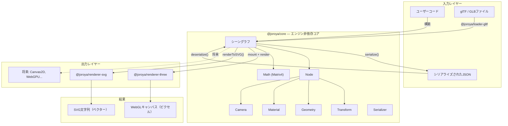
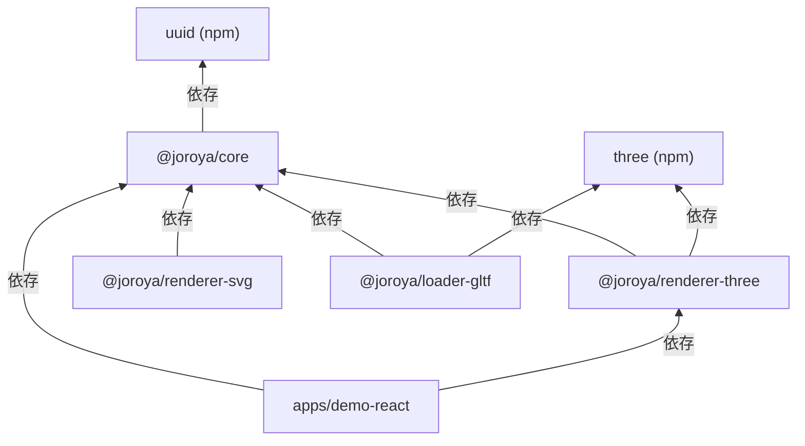
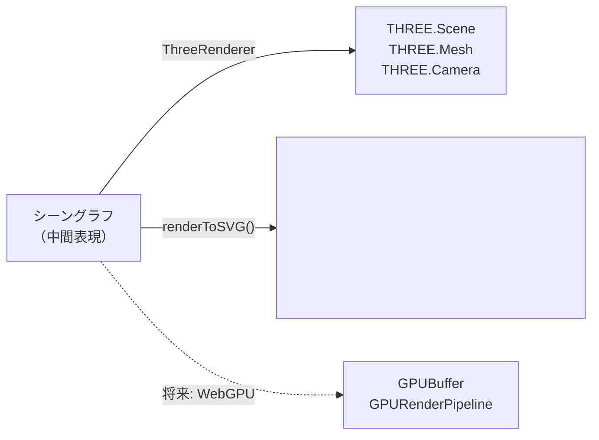
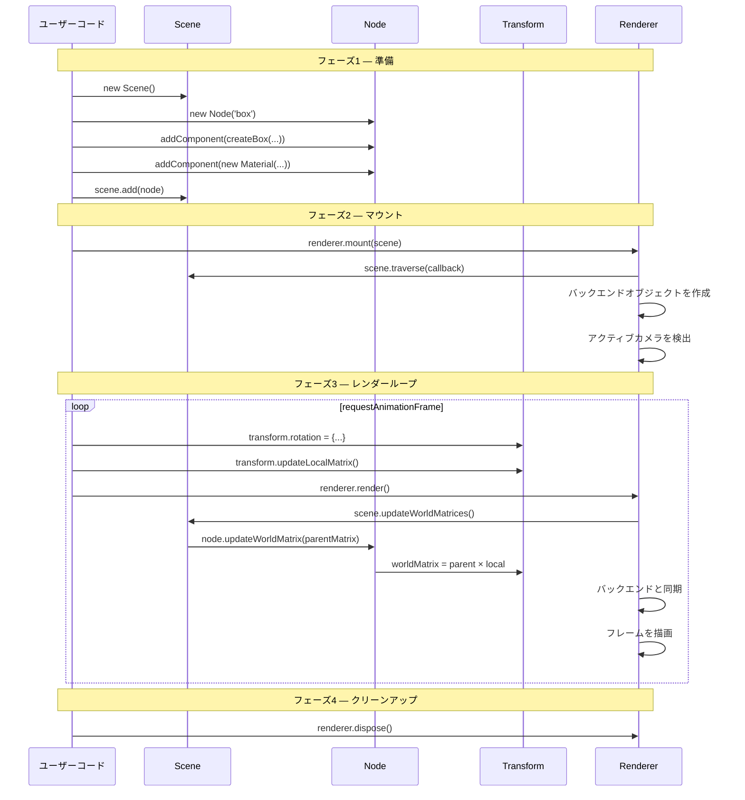
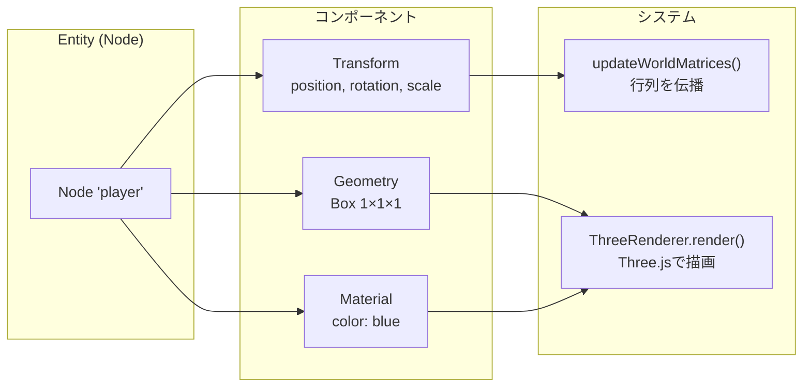

# アーキテクチャ概要

Oroya Animateは、シーンの表現がレンダリング技術から完全に独立した疎結合アーキテクチャを採用しています。

---

## 基本原則

> **「一度定義すれば、どこでもレンダリング可能」**
> シーングラフが唯一の信頼できるソースです。レンダラーはトランスレーターです。



---

## アーキテクチャレイヤー

| レイヤー | パッケージ | 責務 | 依存関係 |
|---------|-----------|------|---------|
| **コア** | `@joroya/core` | シーングラフ、コンポーネント、トランスフォーム、シリアライゼーション、数学 | `uuid`（唯一の依存） |
| **3Dレンダラー** | `@joroya/renderer-three` | Three.js WebGLへの変換 | `@joroya/core`, `three` |
| **SVGレンダラー** | `@joroya/renderer-svg` | ピュアSVG生成 | `@joroya/core` |
| **glTFローダー** | `@joroya/loader-gltf` | 3Dモデルのインポート | `@joroya/core`, `three` |

### 依存関係グラフ



> **重要なルール:** 依存関係の矢印は**単方向**であり、常に`@joroya/core`を指します。コアはレンダラーやローダーからは**決して**インポートしません。

---

## 「コンパイラ」パターン

レンダラーは**コンパイラ**のように機能します：中間表現（シーングラフ）を特定の出力形式に変換します。



| 概念 | 古典的コンパイラ | Oroya Animate |
|------|----------------|---------------|
| ソースコード | `.c`ファイル | ユーザーコード（TypeScript） |
| 中間表現 | AST / IR | シーングラフ |
| バックエンド | x86, ARM, WASM | Three.js, SVG, WebGPU |
| 出力 | マシンコード | ピクセル、ベクター |

このパターンにより以下が可能になります：
- コアを変更せずに**バックエンドを追加**できる。
- **レンダラーなしでテスト**可能 — ロジックはシーングラフに存在する。
- **サーバーサイドレンダリング** — SVGレンダラーはDOMなしでNode.jsで動作する。

---

## レンダリングのライフサイクル



### 各フェーズの詳細

| フェーズ | アクション | 実行者 |
|---------|-----------|--------|
| **1. 準備** | ノード、コンポーネント、親子関係でシーングラフを構築 | ユーザーコード |
| **2. マウント** | `renderer.mount(scene)` — ツリーを走査しバックエンドオブジェクトを作成 | レンダラー |
| **3. レンダーループ** | トランスフォームを変更 → `updateLocalMatrix()` → `renderer.render()` → 行列を伝播 → 描画 | ユーザーコード + レンダラー |
| **4. クリーンアップ** | `renderer.dispose()` — GPU/メモリリソースを解放 | ユーザーコード |

---

## 簡略化されたEntity-Component System（ECS）

Oroyaは**軽量ECS**を使用しています：

| ECS用語 | Oroyaの対応 | 説明 |
|---------|------------|------|
| **Entity** | `Node` | IDと階層を持つコンテナ |
| **Component** | `Transform`, `Geometry`, `Material`, `Camera` | ノードに付加されるデータ |
| **System** | レンダラー、`updateWorldMatrices()` | コンポーネントを処理するロジック |



### ECSのルール

1. **ノードごとに各タイプのコンポーネントは1つのみ** — 同じノードに2つの`Geometry`を持つことはできません。
2. **Transformは自動** — すべてのノードは作成時にTransformを持ちます。
3. **コンポーネントはデータ** — レンダリングロジックを含みません。
4. **レンダラーが「システム」** — コンポーネントを読み取り、視覚的な出力を生成します。

---

## 拡張性

### 新しいレンダラーの追加

```typescript
class MyRenderer {
  private scene: Scene | null = null;

  mount(scene: Scene): void {
    this.scene = scene;
    scene.traverse(node => {
      const geo = node.getComponent<Geometry>(ComponentType.Geometry);
      const mat = node.getComponent<Material>(ComponentType.Material);
      // ターゲットエンジン/フレームワーク用のオブジェクトを作成
    });
  }

  render(): void {
    if (!this.scene) return;
    this.scene.updateWorldMatrices();
    this.scene.traverse(node => {
      // node.transform.worldMatrixを読み取り
      // エンジンオブジェクトと同期
    });
    // フレームを描画
  }

  dispose(): void { /* リソースを解放 */ }
}
```

### 新しいローダーの追加

```typescript
async function loadMyFormat(url: string): Promise<Scene> {
  const data = await fetch(url).then(r => r.json());
  const scene = new Scene();

  for (const obj of data.objects) {
    const node = new Node(obj.name);
    node.addComponent(createBox(obj.width, obj.height, obj.depth));
    node.addComponent(new Material({ color: obj.color }));
    node.transform.position = obj.position;
    scene.add(node);
  }

  return scene;
}
```

---

## モノレポ構成

```
oroya-animate/
├── packages/
│   ├── core/               → エンジン非依存コア（Scene, Node, Components, Math）
│   ├── renderer-three/      → Three.js WebGLバックエンド
│   ├── renderer-svg/        → ピュアSVGバックエンド
│   └── loader-gltf/         → glTFモデルインポーター
├── apps/
│   └── demo-react/          → デモアプリケーション（Vite + React）
├── docs/                    → プロジェクトドキュメント
└── package.json             → モノレポルート（pnpm workspaces）
```

---

## 設計上の決定

| 決定 | 却下された代替案 | 理由 |
|------|----------------|------|
| IRとしてのシーングラフ | Three.js上の直接API | 複数バックエンドとGPUなしテストが可能 |
| 簡略化ECS（1コンポーネント/タイプ） | 完全なECS with Systems | 現在のスコープでの低い複雑性 |
| 回転にクォータニオン | オイラー角 | ジンバルロックなし、自然な補間（SLERP） |
| 列優先行列 | 行優先行列 | WebGLおよびThree.jsとの互換性 |
| ノードIDに`uuid` | インクリメンタルID | グローバルに一意、シリアライゼーションに必要 |
| バンドラーに`tsup` | `tsc`, `rollup`, `esbuild` | 最小限の設定でDTS + CJS + ESMを1ツールで |
| pnpm workspaces | npm/yarn workspaces | 高速、厳密な重複排除、モノレポに最適 |
