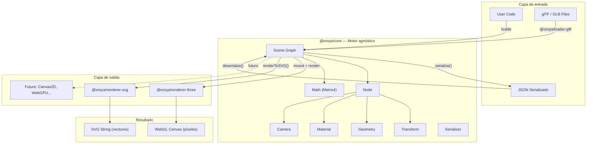
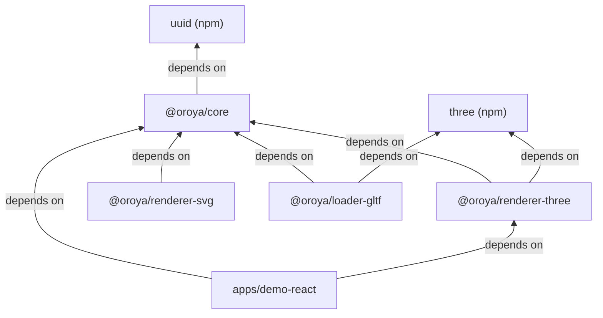
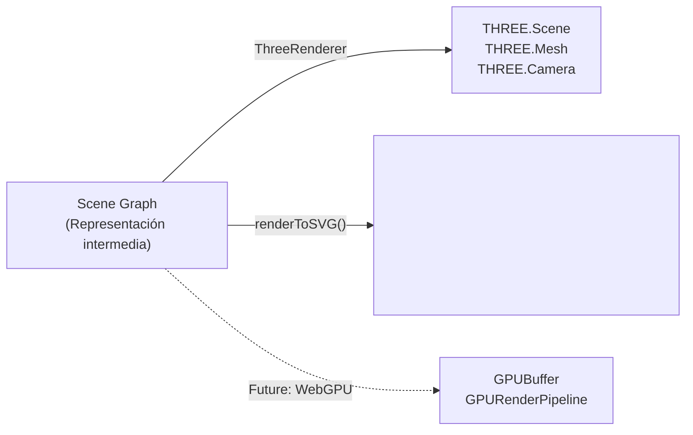
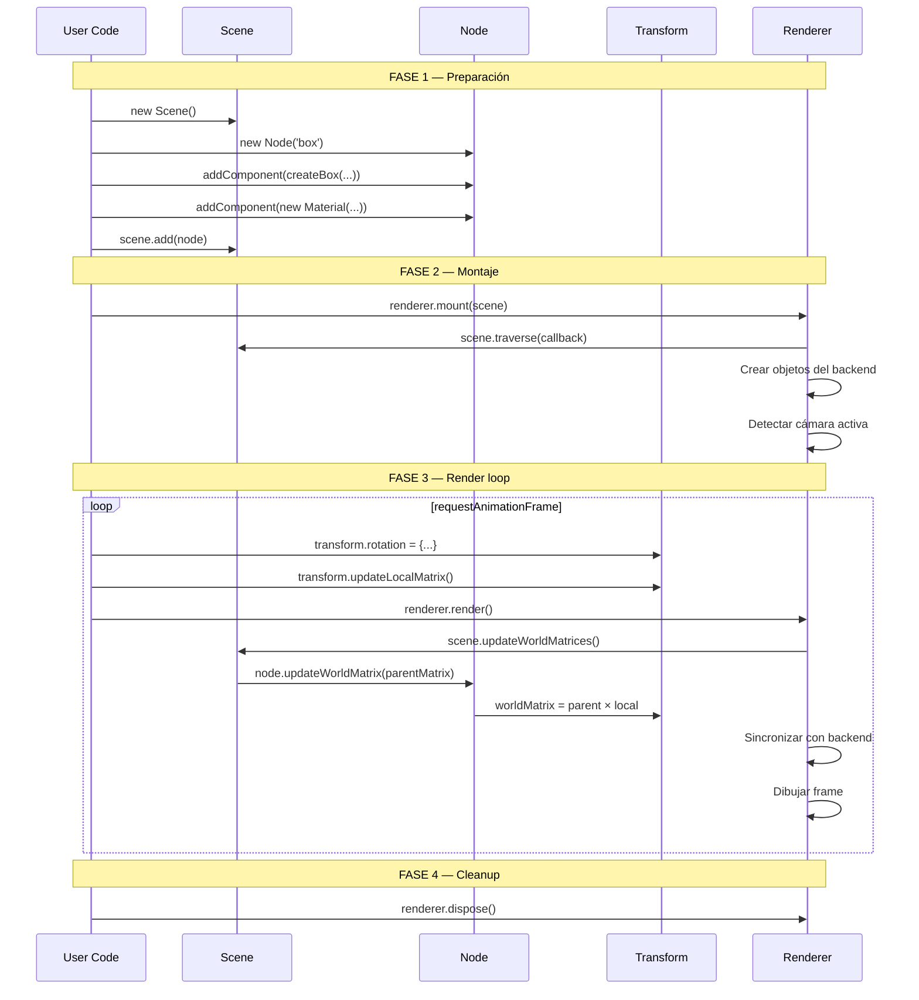
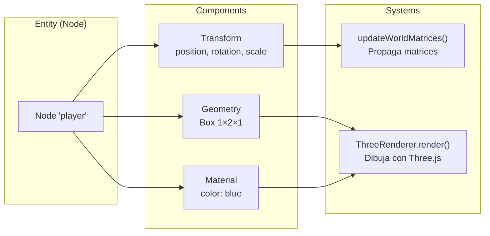

# Architecture Overview

Oroya Animate sigue una arquitectura desacoplada donde la representación de la escena es completamente independiente de la tecnología de renderizado.

---

## Principio fundamental

> **"Define once, render anywhere."**
> — El scene graph es la única fuente de verdad. Los renderers son traductores.



---

## Capas de la arquitectura

| Capa | Paquete | Responsabilidad | Dependencias |
|------|---------|-----------------|--------------|
| **Core** | `@oroya/core` | Scene graph, componentes, transforms, serialización, math | `uuid` (única dependencia) |
| **Renderer 3D** | `@oroya/renderer-three` | Traducción a Three.js WebGL | `@oroya/core`, `three` |
| **Renderer SVG** | `@oroya/renderer-svg` | Generación de SVG puro | `@oroya/core` |
| **Loader glTF** | `@oroya/loader-gltf` | Importación de modelos 3D | `@oroya/core`, `three` |

### Grafo de dependencias



> **Regla clave:** Las flechas de dependencia son **unidireccionales** y siempre apuntan hacia `@oroya/core`. El core **nunca** importa de los renderers ni de los loaders.

---

## El patrón "Compiler"

Los renderers funcionan como **compiladores**: traducen una representación intermedia (el scene graph) a un formato de salida específico.



| Concepto | Compilador clásico | Oroya Animate |
|----------|-------------------|---------------|
| Código fuente | Archivo `.c` | User Code (TypeScript) |
| Representación intermedia | AST / IR | Scene Graph |
| Backend | x86, ARM, WASM | Three.js, SVG, WebGPU |
| Salida | Código máquina | Píxeles, vectores |

Este patrón permite:
- **Agregar backends** sin modificar el core.
- **Testear sin renderer** — la lógica vive en el scene graph.
- **Server-side rendering** — el SVG renderer funciona en Node.js sin DOM.

---

## Ciclo de vida del renderizado



### Detalle de cada fase

| Fase | Acción | Quién la ejecuta |
|------|--------|-------------------|
| **1. Preparación** | Construir el scene graph con nodos, componentes y relaciones padre-hijo | User code |
| **2. Montaje** | `renderer.mount(scene)` — recorrer el árbol y crear los objetos del backend | Renderer |
| **3. Render loop** | Mutar transforms → `updateLocalMatrix()` → `renderer.render()` → propagar matrices → dibujar | User code + Renderer |
| **4. Cleanup** | `renderer.dispose()` — liberar recursos GPU/memoria | User code |

---

## Modelo Entity-Component System (ECS) simplificado

Oroya usa un **ECS ligero** donde:

| ECS Term | Oroya Equivalent | Descripción |
|----------|-----------------|-------------|
| **Entity** | `Node` | Contenedor con ID y jerarquía |
| **Component** | `Transform`, `Geometry`, `Material`, `Camera` | Datos adjuntos a un nodo |
| **System** | Renderers, `updateWorldMatrices()` | Lógica que procesa componentes |



### Reglas del ECS

1. **Un componente por tipo por nodo** — No se pueden tener dos `Geometry` en un mismo nodo.
2. **Transform es automático** — Todos los nodos lo tienen desde su creación.
3. **Los componentes son datos** — No contienen lógica de renderizado.
4. **Los renderers son los "systems"** — Leen componentes y producen salida visual.

---

## Extensibilidad

### Agregar un nuevo renderer

```typescript
class MyRenderer {
  private scene: Scene | null = null;

  mount(scene: Scene): void {
    this.scene = scene;
    scene.traverse(node => {
      const geo = node.getComponent<Geometry>(ComponentType.Geometry);
      const mat = node.getComponent<Material>(ComponentType.Material);
      // Crear objetos del motor/framework destino
    });
  }

  render(): void {
    if (!this.scene) return;
    this.scene.updateWorldMatrices();
    this.scene.traverse(node => {
      // Leer node.transform.worldMatrix
      // Sincronizar con los objetos del motor
    });
    // Dibujar frame
  }

  dispose(): void { /* liberar recursos */ }
}
```

### Agregar un nuevo loader

```typescript
async function loadMyFormat(url: string): Promise<Scene> {
  const data = await fetch(url).then(r => r.json());
  const scene = new Scene();

  for (const obj of data.objects) {
    const node = new Node(obj.name);
    node.addComponent(createBox(obj.width, obj.height, obj.depth));
    node.addComponent(new Material({ color: obj.color }));
    node.transform.position = obj.position;
    scene.add(node);
  }

  return scene;
}
```

---

## Estructura del monorepo

```
oroya-animate/
├── packages/
│   ├── core/               ← Motor agnóstico (Scene, Node, Components, Math)
│   ├── renderer-three/      ← Backend Three.js WebGL
│   ├── renderer-svg/        ← Backend SVG puro
│   └── loader-gltf/         ← Importador de modelos glTF
├── apps/
│   └── demo-react/          ← Aplicación demo (Vite + React)
├── docs/                    ← Documentación del proyecto
└── package.json             ← Root del monorepo (pnpm workspaces)
```

---

## Decisiones de diseño

| Decisión | Alternativa rechazada | Razón |
|----------|----------------------|-------|
| Scene graph como IR | API directa sobre Three.js | Permite múltiples backends y testing sin GPU |
| ECS simplificado (1 comp/tipo) | ECS completo con Systems | Menor complejidad para el alcance actual |
| Quaterniones para rotación | Ángulos de Euler | Sin gimbal lock, interpolación natural (SLERP) |
| Matrices column-major | Matrices row-major | Compatible con WebGL y Three.js |
| `uuid` para IDs de nodo | IDs incrementales | IDs únicos globalmente, necesario para serialización |
| `tsup` como bundler | `tsc`, `rollup`, `esbuild` | DTS + CJS + ESM en un solo tool con configuración mínima |
| pnpm workspaces | npm/yarn workspaces | Más rápido, deduplicación estricta, mejor para monorepos |
