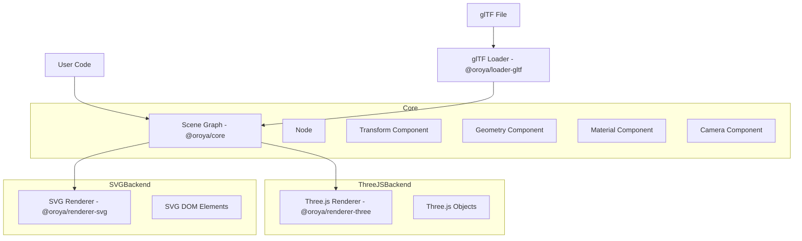

# Architecture Overview

Oroya Animate follows a decoupled architecture where the scene representation is completely independent of the rendering technology.

## 🏗️ Core Components

The architecture is divided into three main layers:

1.  **Core (Scene Graph):** Manages the logical structure of the world, including nodes, components, and transformations.
2.  **Backends (Renderers):** "Compilers" that translate the Core's Scene Graph into engine-specific objects (e.g., Three.js, SVG).
3.  **Loaders:** Utilities to bridge external data formats (like glTF) with the internal Scene Graph.

## 📊 High-Level Flow

## 🌳 Scene Graph

The Scene Graph is a hierarchical tree of `Node` objects. Each node:
-   Has a `Transform` (position, rotation, scale) with `localMatrix` and `worldMatrix`.
-   Can have multiple children nodes.
-   Can have several `Component`s attached (Geometry, Material, Camera, etc.).
-   Cameras are scene graph nodes too — they inherit parent transforms like any other node.

### Decoupling Logic
The `@oroya/core` package does **not** depend on Three.js or any other rendering library. This allows it to:
-   Run in environments without WebGL (e.g., Node.js for server-side SVG generation).
-   Be easily extended with new renderers (Canvas2D, WebGPU, etc.).
-   Maintain a lightweight footprint.

## ⚙️ The Rendering Lifecycle

1.  **Scene Preparation:** User builds the scene using `Node` and `Component` (including a `Camera` node).
2.  **Transform Updates:** Call `transform.updateLocalMatrix()` on modified nodes to recompute local matrices.
3.  **World Matrix Propagation:** `renderer.render()` internally calls `scene.updateWorldMatrices()`, which walks the tree and computes each node's `worldMatrix` by multiplying with its parent.
4.  **Mounting:** The renderer (e.g., `ThreeRenderer`) is "mounted" to the Oroya scene via `renderer.mount(scene)`. It traverses the graph, builds engine-specific objects, and locates the first `Camera` node to use as the active camera.
5.  **Render Loop:**
    -   User mutates Oroya node transforms (e.g., rotates a cube).
    -   User calls `transform.updateLocalMatrix()` to mark the change.
    -   `renderer.render()` is called.
    -   The renderer reads each node's `worldMatrix`, applies it to the backend object via `matrix.fromArray()` + `decompose()`.
    -   The final frame is rendered using the active camera.

### Camera Resolution
The `ThreeRenderer` searches the scene graph for the first node with a `Camera` component during `mount()`. If none is found, a default `PerspectiveCamera` at `z=5` is created as a fallback.
