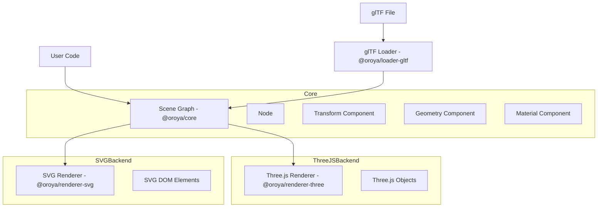

# Architecture Overview

Oroya Animate follows a decoupled architecture where the scene representation is completely independent of the rendering technology.

## 🏗️ Core Components

The architecture is divided into three main layers:

1.  **Core (Scene Graph):** Manages the logical structure of the world, including nodes, components, and transformations.
2.  **Backends (Renderers):** "Compilers" that translate the Core's Scene Graph into engine-specific objects (e.g., Three.js, SVG).
3.  **Loaders:** Utilities to bridge external data formats (like glTF) with the internal Scene Graph.

## 📊 High-Level Flow

## 🌳 Scene Graph

The Scene Graph is a hierarchical tree of `Node` objects. Each node:
-   Has a `Transform` (position, rotation, scale).
-   Can have multiple children nodes.
-   Can have several `Component`s attached (Geometry, Material, etc.).

### Decoupling Logic
The `@oroya/core` package does **not** depend on Three.js or any other rendering library. This allows it to:
-   Run in environments without WebGL (e.g., Node.js for server-side SVG generation).
-   Be easily extended with new renderers (Canvas2D, WebGPU, etc.).
-   Maintain a lightweight footprint.

## ⚙️ The Rendering Lifecycle

1.  **Scene Preparation:** User builds the scene using `Node` and `Component`.
2.  **Transformation Matrix Update:** The `scene.updateWorldMatrices()` method calculates world-space coordinates.
3.  **Mounting:** The renderer (e.g., `ThreeRenderer`) is "mounted" to the Oroya scene. It performs an initial traversal to build the engine-specific objects.
4.  **Render Loop:**
    -   User updates Oroya nodes (e.g., rotates a cube).
    -   `renderer.render()` is called.
    -   The renderer syncs the state from Oroya nodes to the backend objects.
    -   The final frame is rendered to the screen.
