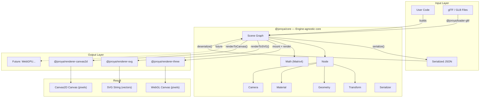
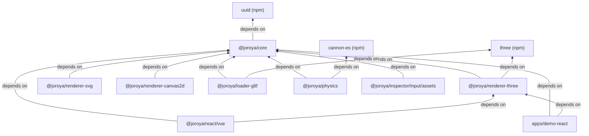
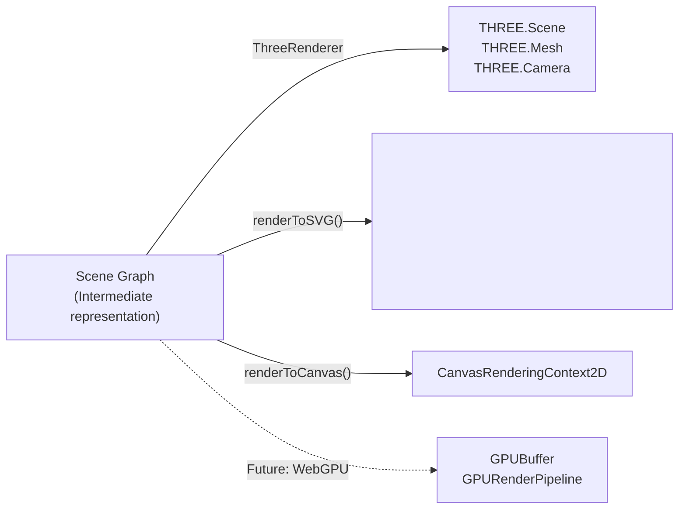
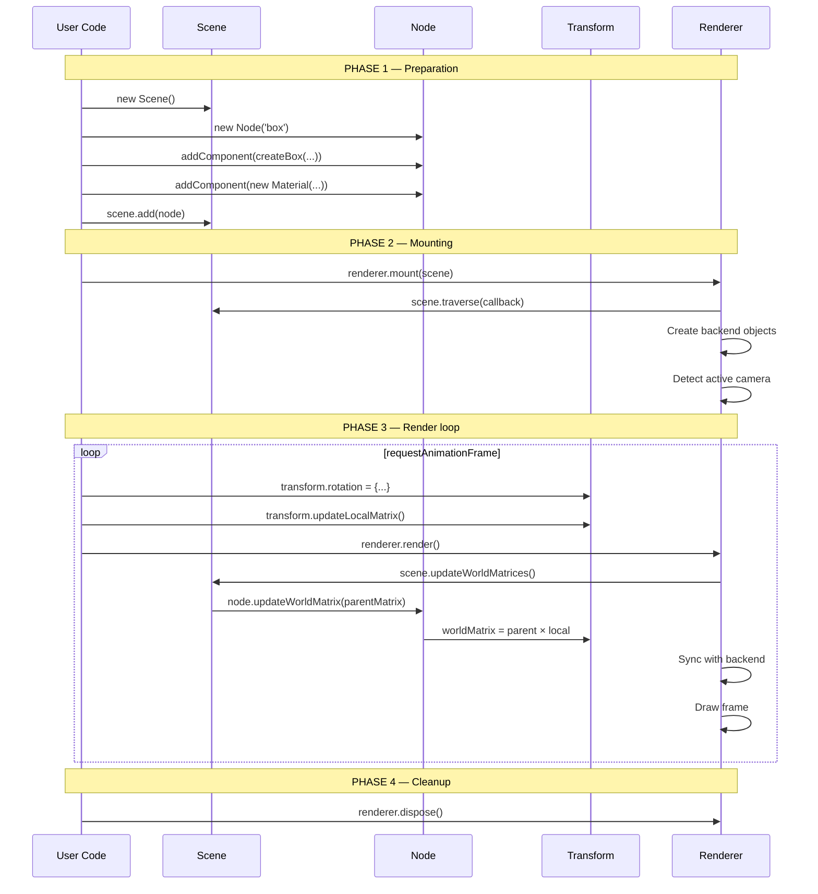
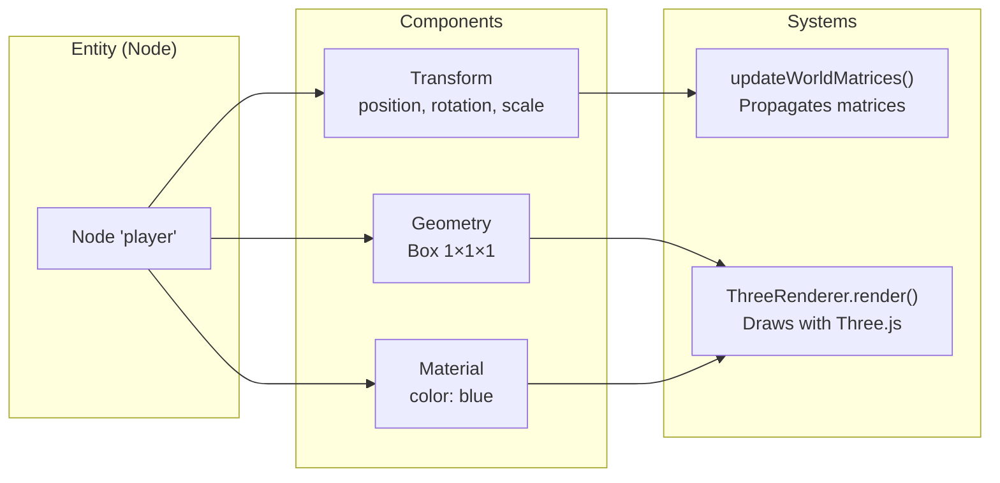

# Architecture Overview

Oroya Animate follows a decoupled architecture where the scene representation is completely independent of the rendering technology.

---

## Core Principle

> **"Define once, render anywhere."**
> The scene graph is the single source of truth. Renderers are translators.


```mermaid
graph TD
    subgraph "Input Layer"
        UC["User Code"]
        GLTF["glTF / GLB Files"]
        JSON["Serialized JSON"]
    end

    subgraph "@joroya/core — Engine-agnostic core"
        SG["Scene Graph"]
        N["Node"]
        T["Transform"]
        G["Geometry"]
        M["Material"]
        C["Camera"]
        SER["Serializer"]
        MATH["Math (Matrix4)"]
    end

    subgraph "Output Layer"
        R3["@joroya/renderer-three"]
        RS["@joroya/renderer-svg"]
        RC["@joroya/renderer-canvas2d"]
        R_FUTURE["Future: WebGPU..."]
    end

    subgraph "Result"
        WEBGL["WebGL Canvas (pixels)"]
        SVG["SVG String (vectors)"]
        CANVAS["Canvas2D Canvas (pixels)"]
    end

    UC -->|"builds"| SG
    GLTF -->|"@joroya/loader-gltf"| SG
    JSON -->|"deserialize()"| SG
    SG -->|"serialize()"| JSON

    SG --> N
    N --> T
    N --> G
    N --> M
    N --> C
    SG --> MATH

    SG -->|"mount + render"| R3
    SG -->|"renderToSVG()"| RS
    SG -->|"renderToCanvas()"| RC
    SG -.->|"future"| R_FUTURE

    R3 --> WEBGL
    RS --> SVG
    RC --> CANVAS
```

---

## Architecture Layers

| Layer | Package | Responsibility | Dependencies |
|-------|---------|----------------|--------------|
| **Core** | `@joroya/core` | Scene graph, components, transforms, serialization, math | `uuid` (only dependency) |
| **3D Renderer** | `@joroya/renderer-three` | Translation to Three.js WebGL | `@joroya/core`, `three` |
| **SVG Renderer** | `@joroya/renderer-svg` | Pure SVG generation | `@joroya/core` |
| **Canvas2D Renderer** | `@joroya/renderer-canvas2d` | Browser-native Canvas2D drawing | `@joroya/core` |
| **glTF Loader** | `@joroya/loader-gltf` | 3D model importing | `@joroya/core`, `three` |
| **Physics** | `@joroya/physics` | cannon-es rigid bodies, joints, sensors, raycasts, vehicles | `@joroya/core`, `cannon-es` |
| **Tooling** | `@joroya/inspector`, `@joroya/input`, `@joroya/assets` | Debug overlay, input mapping, asset cache | `@joroya/core` |
| **Frameworks** | `@joroya/react`, `@joroya/vue` | Experimental UI bindings | `@joroya/core`, `@joroya/renderer-three`, framework peer |

### Dependency Graph


```mermaid
graph BT
    CORE["@joroya/core"]
    R3["@joroya/renderer-three"]
    RS["@joroya/renderer-svg"]
    RC["@joroya/renderer-canvas2d"]
    LG["@joroya/loader-gltf"]
    PHYS["@joroya/physics"]
    TOOLS["@joroya/inspector/input/assets"]
    FW["@joroya/react/vue"]
    THREE["three (npm)"]
    CANNON["cannon-es (npm)"]
    UUID["uuid (npm)"]
    DEMO["apps/demo-react"]

    CORE -->|"depends on"| UUID
    R3 -->|"depends on"| CORE
    R3 -->|"depends on"| THREE
    RS -->|"depends on"| CORE
    RC -->|"depends on"| CORE
    LG -->|"depends on"| CORE
    LG -->|"depends on"| THREE
    PHYS -->|"depends on"| CORE
    PHYS -->|"depends on"| CANNON
    TOOLS -->|"depends on"| CORE
    FW -->|"depends on"| CORE
    FW -->|"depends on"| R3
    DEMO -->|"depends on"| CORE
    DEMO -->|"depends on"| R3
```

> **Key rule:** Dependency arrows are **unidirectional** and always point towards `@joroya/core`. The core **never** imports from renderers or loaders.

---

## The "Compiler" Pattern

Renderers work like **compilers**: they translate an intermediate representation (the scene graph) into a specific output format.


```mermaid
flowchart LR
    IR["Scene Graph\n(Intermediate representation)"] -->|"ThreeRenderer"| OUT1["THREE.Scene\nTHREE.Mesh\nTHREE.Camera"]
    IR -->|"renderToSVG()"| OUT2["<svg>\n  <path/>\n</svg>"]
    IR -->|"renderToCanvas()"| OUT3["CanvasRenderingContext2D"]
    IR -.->|"Future: WebGPU"| OUT4["GPUBuffer\nGPURenderPipeline"]
```

| Concept | Classic Compiler | Oroya Animate |
|---------|-----------------|---------------|
| Source code | `.c` file | User Code (TypeScript) |
| Intermediate representation | AST / IR | Scene Graph |
| Backend | x86, ARM, WASM | Three.js, SVG, WebGPU |
| Output | Machine code | Pixels, vectors |

This pattern enables:
- **Adding backends** without modifying the core.
- **Testing without a renderer** — logic lives in the scene graph.
- **Server-side rendering** — the SVG renderer works in Node.js without DOM.

---

## Rendering Lifecycle


```mermaid
sequenceDiagram
    participant U as User Code
    participant S as Scene
    participant N as Node
    participant T as Transform
    participant R as Renderer

    Note over U,R: PHASE 1 — Preparation
    U->>S: new Scene()
    U->>N: new Node('box')
    U->>N: addComponent(createBox(...))
    U->>N: addComponent(new Material(...))
    U->>S: scene.add(node)

    Note over U,R: PHASE 2 — Mounting
    U->>R: renderer.mount(scene)
    R->>S: scene.traverse(callback)
    R->>R: Create backend objects
    R->>R: Detect active camera

    Note over U,R: PHASE 3 — Render loop
    loop requestAnimationFrame
        U->>T: transform.rotation = {...}
        U->>T: transform.updateLocalMatrix()
        U->>R: renderer.render()
        R->>S: scene.updateWorldMatrices()
        S->>N: node.updateWorldMatrix(parentMatrix)
        N->>T: worldMatrix = parent × local
        R->>R: Sync with backend
        R->>R: Draw frame
    end

    Note over U,R: PHASE 4 — Cleanup
    U->>R: renderer.dispose()
```

### Phase Details

| Phase | Action | Executed by |
|-------|--------|-------------|
| **1. Preparation** | Build the scene graph with nodes, components, and parent-child relationships | User code |
| **2. Mounting** | `renderer.mount(scene)` — traverse the tree and create backend objects | Renderer |
| **3. Render loop** | Mutate transforms → `updateLocalMatrix()` → `renderer.render()` → propagate matrices → draw | User code + Renderer |
| **4. Cleanup** | `renderer.dispose()` — release GPU/memory resources | User code |

---

## Simplified Entity-Component System (ECS)

Oroya uses a **lightweight ECS** where:

| ECS Term | Oroya Equivalent | Description |
|----------|-----------------|-------------|
| **Entity** | `Node` | Container with ID and hierarchy |
| **Component** | `Transform`, `Geometry`, `Material`, `Camera` | Data attached to a node |
| **System** | Renderers, `updateWorldMatrices()` | Logic that processes components |


```mermaid
graph LR
    subgraph "Entity (Node)"
        N["Node 'player'"]
    end

    subgraph "Components"
        T["Transform\nposition, rotation, scale"]
        G["Geometry\nBox 1×1×1"]
        M["Material\ncolor: blue"]
    end

    subgraph "Systems"
        S1["updateWorldMatrices()\nPropagates matrices"]
        S2["ThreeRenderer.render()\nDraws with Three.js"]
    end

    N --> T
    N --> G
    N --> M
    T --> S1
    G --> S2
    M --> S2
```

### ECS Rules

1. **One component per type per node** — You cannot have two `Geometry` components on the same node.
2. **Transform is automatic** — All nodes have it from creation.
3. **Components are data** — They contain no rendering logic.
4. **Renderers are the "systems"** — They read components and produce visual output.

---

## Extensibility

### Adding a new renderer

```typescript
class MyRenderer {
  private scene: Scene | null = null;

  mount(scene: Scene): void {
    this.scene = scene;
    scene.traverse(node => {
      const geo = node.getComponent<Geometry>(ComponentType.Geometry);
      const mat = node.getComponent<Material>(ComponentType.Material);
      // Create objects for the target engine/framework
    });
  }

  render(): void {
    if (!this.scene) return;
    this.scene.updateWorldMatrices();
    this.scene.traverse(node => {
      // Read node.transform.worldMatrix
      // Sync with engine objects
    });
    // Draw frame
  }

  dispose(): void { /* release resources */ }
}
```

### Adding a new loader

```typescript
async function loadMyFormat(url: string): Promise<Scene> {
  const data = await fetch(url).then(r => r.json());
  const scene = new Scene();

  for (const obj of data.objects) {
    const node = new Node(obj.name);
    node.addComponent(createBox(obj.width, obj.height, obj.depth));
    node.addComponent(new Material({ color: obj.color }));
    node.transform.position = obj.position;
    scene.add(node);
  }

  return scene;
}
```

---

## Monorepo Structure

```
oroya-animate/
├── packages/
│   ├── core/               → Engine-agnostic core (Scene, Node, Components, Math)
│   ├── renderer-three/      → Three.js WebGL backend
│   ├── renderer-svg/        → Pure SVG backend
│   └── loader-gltf/         → glTF model importer
├── apps/
│   └── demo-react/          → Demo application (Vite + React)
├── docs/                    → Project documentation
└── package.json             → Monorepo root (pnpm workspaces)
```

---

## Design Decisions

| Decision | Rejected Alternative | Reason |
|----------|---------------------|--------|
| Scene graph as IR | Direct API over Three.js | Enables multiple backends and GPU-free testing |
| Simplified ECS (1 comp/type) | Full ECS with Systems | Lower complexity for current scope |
| Quaternions for rotation | Euler angles | No gimbal lock, natural interpolation (SLERP) |
| Column-major matrices | Row-major matrices | Compatible with WebGL and Three.js |
| `uuid` for node IDs | Incremental IDs | Globally unique IDs, required for serialization |
| `tsup` as bundler | `tsc`, `rollup`, `esbuild` | DTS + CJS + ESM in a single tool with minimal config |
| pnpm workspaces | npm/yarn workspaces | Faster, strict deduplication, better for monorepos |
