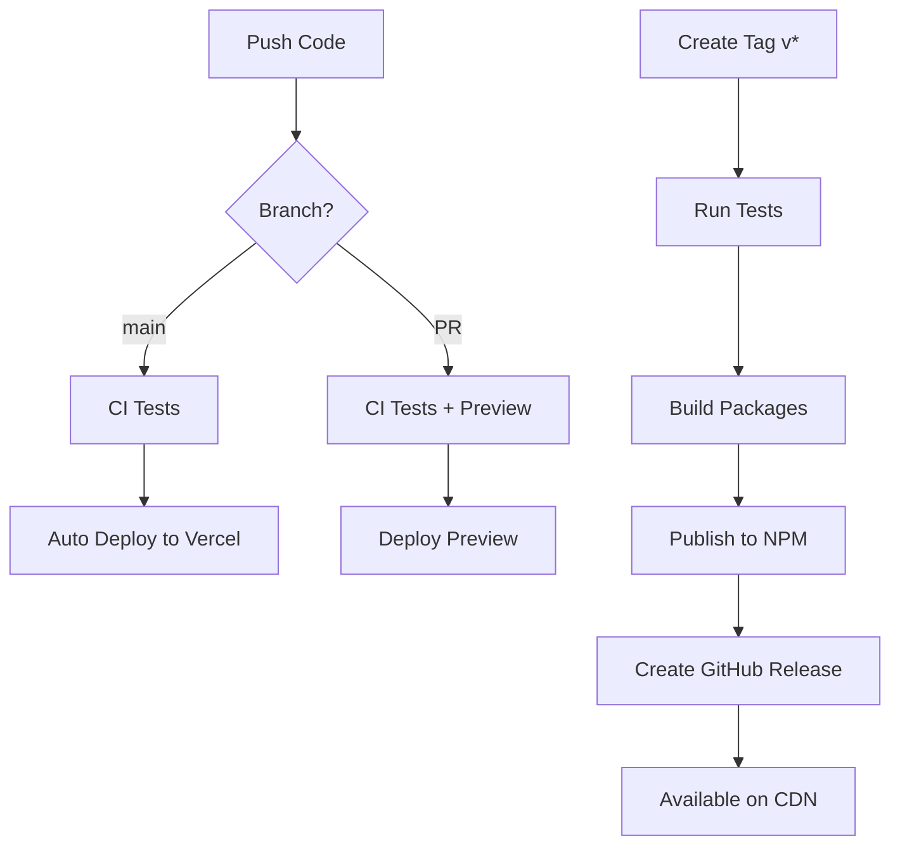

# Deployment & Publishing

This directory contains guides for deploying and publishing Oroya Animate.

## 📚 Documentation

- **[NPM Publishing](./npm-publishing.md)** - Complete guide to publishing packages to NPM
- **[CDN Setup](./cdn-setup.md)** - Using Oroya Animate directly from CDN
- **[Vercel Deployment](./vercel-deployment.md)** - Deploy the documentation website to Vercel

## 🚀 Quick Start

### Publish Packages to NPM

```bash
# 1. Update versions
node scripts/sync-versions.js 0.4.0

# 2. Build and test
pnpm build
pnpm test

# 3. Commit and tag
git commit -am "Release v0.4.0"
git tag v0.4.0

# 4. Push (GitHub Actions will auto-publish)
git push && git push --tags
```

### Deploy Website to Vercel

```bash
# One-time setup
npm install -g vercel
vercel login

# Deploy
vercel --prod
```

## 🔧 Configuration Files

The following configuration files are already set up:

- [`/.github/workflows/ci.yml`](../../.github/workflows/ci.yml) - Continuous Integration
- [`/.github/workflows/publish.yml`](../../.github/workflows/publish.yml) - NPM Publishing
- [`/.github/workflows/deploy-web.yml`](../../.github/workflows/deploy-web.yml) - Vercel Deployment
- [`/vercel.json`](../../vercel.json) - Vercel configuration
- [`/.npmrc`](../../.npmrc) - NPM configuration
- [`/scripts/sync-versions.js`](../../scripts/sync-versions.js) - Version synchronization

## 🔐 Required Secrets

### For NPM Publishing

Add to GitHub Secrets (Settings → Secrets → Actions):

- `NPM_TOKEN` - NPM authentication token (generate with `npm token create`)

### For Vercel Deployment

Add to GitHub Secrets:

- `VERCEL_TOKEN` - Vercel authentication token
- `VERCEL_ORG_ID` - Vercel organization ID
- `VERCEL_PROJECT_ID` - Vercel project ID

Get these values by running:
```bash
vercel link
cat .vercel/project.json
```

## 📊 Deployment Flow



## 🎯 Checklist for First Deploy

### NPM Publishing

- [ ] Create NPM account
- [ ] Create `@oroya` organization on NPM
- [ ] Generate NPM token
- [ ] Add `NPM_TOKEN` to GitHub Secrets
- [ ] Test local build: `pnpm build`
- [ ] Create version tag: `git tag v0.3.0`
- [ ] Push tag: `git push --tags`
- [ ] Verify on npmjs.com

### Vercel Deployment

- [ ] Create Vercel account
- [ ] Install Vercel CLI: `npm i -g vercel`
- [ ] Login: `vercel login`
- [ ] Link project: `vercel link`
- [ ] Get Vercel secrets: `cat .vercel/project.json`
- [ ] Add secrets to GitHub
- [ ] Push to main branch
- [ ] Verify deployment on Vercel dashboard

## 🐛 Troubleshooting

See individual guides for detailed troubleshooting:
- [NPM Publishing Issues](./npm-publishing.md#-troubleshooting)
- [CDN Issues](./cdn-setup.md#-limitations--considerations)
- [Vercel Issues](./vercel-deployment.md#-troubleshooting)

## 📞 Support

- GitHub Issues: https://github.com/joshuacba08/oroya-animate/issues
- Discussions: https://github.com/joshuacba08/oroya-animate/discussions
