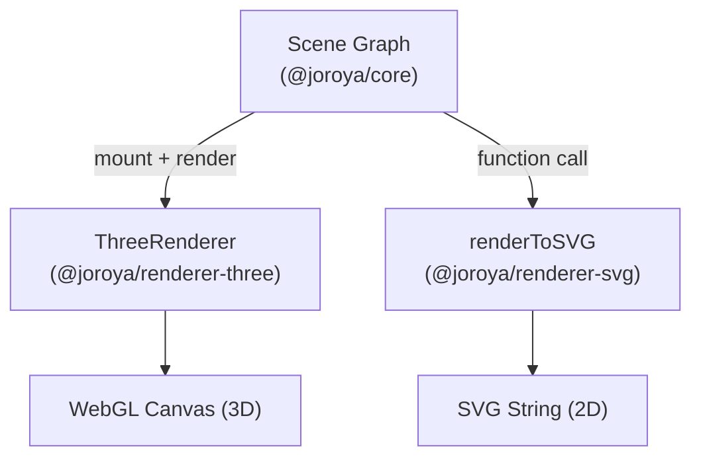
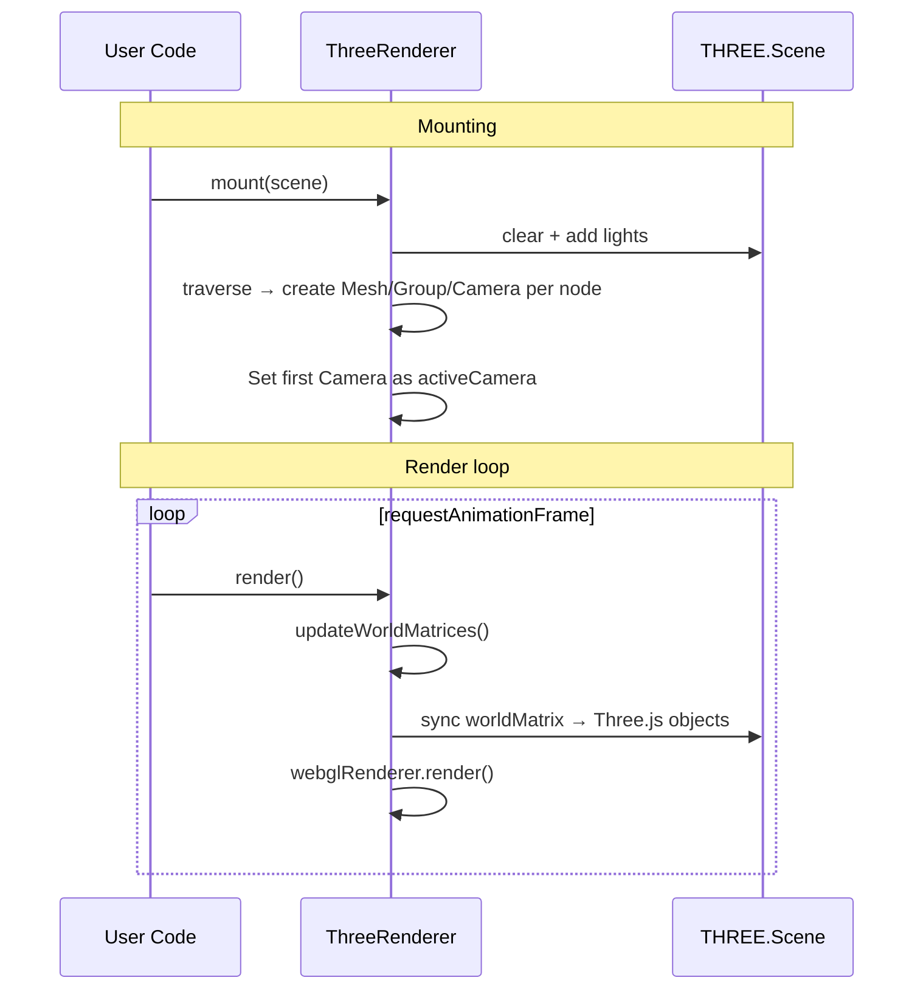
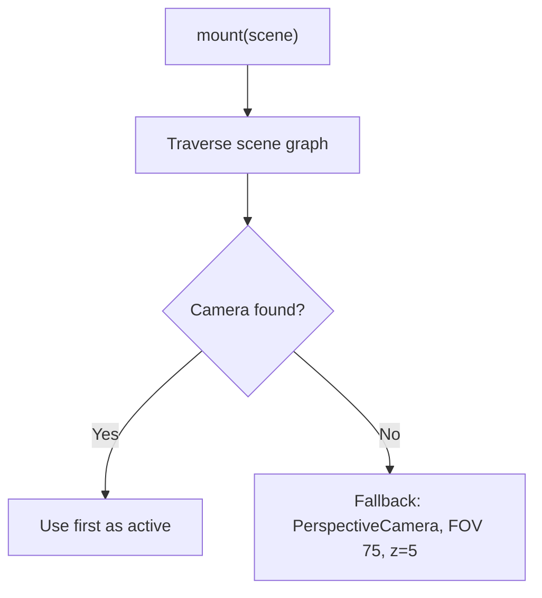
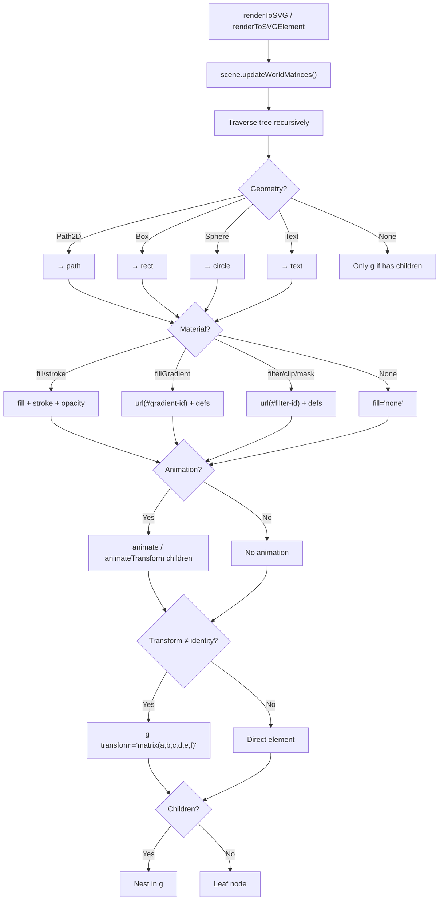

# Renderers

Oroya Animate renderers are **translators** that convert the agnostic scene graph into visual output. The core does not know about renderers — each one reads the scene graph and produces its own representation.

---

## Overview


```mermaid
graph TD
    SG["Scene Graph\n(@joroya/core)"]
    R3["ThreeRenderer\n(@joroya/renderer-three)"]
    RS["renderToSVG\n(@joroya/renderer-svg)"]
    WEBGL["WebGL Canvas (3D)"]
    SVG["SVG String (2D)"]

    SG -->|"mount + render"| R3
    SG -->|"function call"| RS
    R3 --> WEBGL
    RS --> SVG
```

| Aspect | `ThreeRenderer` | `renderToSVG` |
|---------|----------------|---------------|
| **Paradigm** | Stateful instance (class) | Pure function (stateless) |
| **Output** | Draws to a `<canvas>` | Returns an SVG `string` |
| **Requires DOM** | ✅ Yes (`HTMLCanvasElement`) | ❌ No (works in Node.js) |
| **3D** | ✅ Perspective, lights, shadows | ❌ 2D only |
| **Vector** | ❌ Rasterized | ✅ Infinitely scalable |

---

## `@joroya/renderer-three` — Three.js (WebGL)

The main renderer for interactive 3D visualization.

### Setup

```typescript
import { ThreeRenderer } from '@joroya/renderer-three';

const renderer = new ThreeRenderer({
  canvas: document.getElementById('canvas') as HTMLCanvasElement,
  width: window.innerWidth,
  height: window.innerHeight,
  dpr: window.devicePixelRatio,  // optional
});
```

### Constructor options

| Option | Type | Default | Description |
|--------|------|---------|-------------|
| `canvas` | `HTMLCanvasElement` | *(required)* | Target canvas element |
| `width` | `number` | *(required)* | Viewport width |
| `height` | `number` | *(required)* | Viewport height |
| `dpr` | `number` | `window.devicePixelRatio` | Device pixel ratio (HiDPI) |

### Methods

| Method | Description |
|--------|-------------|
| `mount(scene)` | Connects a scene. Rebuilds the Three.js scene, detects the active camera, adds lights |
| `render()` | Syncs transforms, propagates matrices and draws a frame |
| `dispose()` | Releases WebGL resources |

### Lifecycle


```mermaid
sequenceDiagram
    participant U as User Code
    participant TR as ThreeRenderer
    participant TS as THREE.Scene

    Note over U,TS: Mounting
    U->>TR: mount(scene)
    TR->>TS: clear + add lights
    TR->>TR: traverse → create Mesh/Group/Camera per node
    TR->>TR: Set first Camera as activeCamera

    Note over U,TS: Render loop
    loop requestAnimationFrame
        U->>TR: render()
        TR->>TR: updateWorldMatrices()
        TR->>TS: sync worldMatrix → Three.js objects
        TR->>TR: webglRenderer.render()
    end
```

### Component translation

| Oroya Node | Three.js Object |
|------------|-----------------|
| Node without Geometry or Camera | `THREE.Group` |
| Node + `Geometry(Box)` | `THREE.Mesh(BoxGeometry)` |
| Node + `Geometry(Sphere)` | `THREE.Mesh(SphereGeometry)` |
| Node + `Geometry(Path2D)` | ❌ Ignored |
| Node + `Camera(Perspective)` | `THREE.PerspectiveCamera` |
| `Material` with `color` | `MeshStandardMaterial({ color })` |
| `Material` with `opacity < 1` | `MeshStandardMaterial({ transparent: true })` |
| Without `Material` | `MeshStandardMaterial({ color: 0xcccccc })` |

### Automatic lighting

| Type | Config |
|------|--------|
| `AmbientLight` | White, intensity `0.5` |
| `DirectionalLight` | White, intensity `1.5`, position `(2, 5, 3)` |

### Camera resolution


```mermaid
flowchart TD
    START["mount(scene)"] --> TRAVERSE["Traverse scene graph"]
    TRAVERSE --> FOUND{"Camera found?"}
    FOUND -->|"Yes"| USE["Use first as active"]
    FOUND -->|"No"| FALLBACK["Fallback: PerspectiveCamera, FOV 75, z=5"]
```

### Full example

```typescript
import { Scene, Node, createBox, Material, Camera, CameraType } from '@joroya/core';
import { ThreeRenderer } from '@joroya/renderer-three';

const scene = new Scene();

const cam = new Node('cam');
cam.addComponent(new Camera({
  type: CameraType.Perspective, fov: 75,
  aspect: window.innerWidth / window.innerHeight, near: 0.1, far: 1000,
}));
cam.transform.position.z = 5;
scene.add(cam);

const box = new Node('box');
box.addComponent(createBox(1, 1, 1));
box.addComponent(new Material({ color: { r: 0.2, g: 0.6, b: 1.0 } }));
scene.add(box);

const renderer = new ThreeRenderer({
  canvas: document.getElementById('canvas') as HTMLCanvasElement,
  width: window.innerWidth, height: window.innerHeight,
});
renderer.mount(scene);

function loop() {
  box.transform.rotation.y = performance.now() * 0.001;
  box.transform.updateLocalMatrix();
  renderer.render();
  requestAnimationFrame(loop);
}
requestAnimationFrame(loop);
```

---

## `@joroya/renderer-svg` — SVG (2D)

Lightweight renderer that generates SVG markup. Ideal for generative art, vector export, and server-side rendering.

### `renderToSVG` — Pure string (server-safe)

Pure, stateless function that returns an SVG string. Works in Node.js without DOM.

```typescript
import { renderToSVG } from '@joroya/renderer-svg';

const svg: string = renderToSVG(scene, { width: 400, height: 300 });
```

#### Options (`SvgRenderOptions`)

| Option | Type | Default | Description |
|--------|------|---------|-------------|
| `width` | `number` | *(required)* | SVG width |
| `height` | `number` | *(required)* | SVG height |
| `viewBox` | `string` | `"0 0 {width} {height}"` | Custom viewBox |

### `renderToSVGElement` — Interactive DOM

Creates a real `SVGSVGElement` with event delegation. Nodes with the `Interactive` component receive pointer/click/wheel listeners.

```typescript
import { renderToSVGElement } from '@joroya/renderer-svg';

const { svg, dispose } = renderToSVGElement(scene, {
  width: 800,
  height: 600,
  container: document.getElementById('app')!,
});

// When no longer needed:
dispose(); // Cleans listeners and removes SVG from DOM
```

#### Options (`SvgElementRenderOptions`)

Extends `SvgRenderOptions` with:

| Option | Type | Description |
|--------|------|-------------|
| `container` | `HTMLElement` | *(optional)* Parent element where the SVG is automatically attached |

#### Return

| Field | Type | Description |
|-------|------|-------------|
| `svg` | `SVGSVGElement` | The created SVG element |
| `dispose` | `() => void` | Cleans event listeners and removes SVG from DOM |

#### Supported interactive events

| DOM Event | `InteractionEventType` |
|-----------|------------------------|
| `click` | `Click` |
| `pointerdown` | `PointerDown` |
| `pointerup` | `PointerUp` |
| `pointermove` | `PointerMove` |
| `pointerenter` | `PointerEnter` |
| `pointerleave` | `PointerLeave` |
| `wheel` | `Wheel` |

### Pipeline


```mermaid
flowchart TD
    START["renderToSVG / renderToSVGElement"] --> UPDATE["scene.updateWorldMatrices()"]
    UPDATE --> WALK["Traverse tree recursively"]
    WALK --> GEO{"Geometry?"}
    GEO -->|"Path2D"| PATH["→ path"]
    GEO -->|"Box"| RECT["→ rect"]
    GEO -->|"Sphere"| CIRCLE["→ circle"]
    GEO -->|"Text"| TEXT["→ text"]
    GEO -->|"None"| GROUP["Only g if has children"]
    PATH & RECT & CIRCLE & TEXT --> MAT{"Material?"}
    MAT -->|"fill/stroke"| STYLE["fill + stroke + opacity"]
    MAT -->|"fillGradient"| GRAD["url(#gradient-id) + defs"]
    MAT -->|"filter/clip/mask"| FILT["url(#filter-id) + defs"]
    MAT -->|"None"| NONE["fill='none'"]
    STYLE & GRAD & FILT & NONE --> ANIM{"Animation?"}
    ANIM -->|"Yes"| ANIMC["animate / animateTransform children"]
    ANIM -->|"No"| NOANIM["No animation"]
    ANIMC & NOANIM --> TRANSFORM{"Transform ≠ identity?"}
    TRANSFORM -->|"Yes"| MATRIX["g transform='matrix(a,b,c,d,e,f)'"]
    TRANSFORM -->|"No"| DIRECT["Direct element"]
    MATRIX & DIRECT --> CHILDREN{"Children?"}
    CHILDREN -->|"Yes"| NEST["Nest in g"]
    CHILDREN -->|"No"| LEAF["Leaf node"]
```

### Geometry support

| Geometry | Generated SVG Element |
|----------|----------------------|
| `Path2D` | `<path d="...">` |
| `Box` | `<rect>` (width × height, depth ignored) |
| `Sphere` | `<circle>` (radius) |
| `Text` | `<text>` with font-size, font-family, font-weight, text-anchor, dominant-baseline |

### Material properties for SVG

| Field | Type | SVG Effect | If absent |
|-------|------|-----------|-----------|
| `fill` | `ColorRGB` | `fill="rgb(R,G,B)"` | `fill="none"` |
| `stroke` | `ColorRGB` | `stroke="rgb(R,G,B)"` | No stroke |
| `strokeWidth` | `number` | `stroke-width="N"` | `1` |
| `opacity` | `number` | `opacity="N"` | No attribute (opaque) |
| `fillGradient` | `GradientDef` | `fill="url(#id)"` + `<defs>` | Uses normal `fill` |
| `strokeGradient` | `GradientDef` | `stroke="url(#id)"` + `<defs>` | Uses normal `stroke` |
| `filter` | `SvgFilterDef` | `filter="url(#id)"` + `<filter>` in `<defs>` | No filter |
| `clipPath` | `SvgClipPathDef` | `clip-path="url(#id)"` + `<clipPath>` in `<defs>` | No clipping |
| `mask` | `SvgMaskDef` | `mask="url(#id)"` + `<mask>` in `<defs>` | No mask |

### Transforms and hierarchy

The SVG renderer applies each node's `localMatrix` as a `transform="matrix(a,b,c,d,e,f)"` attribute and generates `<g>` elements to represent the parent-child hierarchy of the scene graph.

```typescript
const parent = new Node('group');
parent.transform.position = { x: 100, y: 50, z: 0 };

const child = new Node('square');
child.addComponent(createBox(30, 30, 0));
child.addComponent(new Material({ fill: { r: 1, g: 0, b: 0 } }));

parent.add(child);
scene.add(parent);
```

Generates:
```xml
<g transform="matrix(1,0,0,1,100,50)">
  <rect x="-15" y="-15" width="30" height="30" fill="rgb(255, 0, 0)" />
</g>
```

### Gradients

```typescript
const circle = new Node('sun');
circle.addComponent(createSphere(80));
circle.addComponent(new Material({
  fillGradient: {
    type: 'radial',
    cx: 0.5, cy: 0.5, r: 0.5,
    stops: [
      { offset: 0, color: { r: 1, g: 1, b: 0 } },
      { offset: 1, color: { r: 1, g: 0.3, b: 0 }, opacity: 0.8 },
    ],
  },
}));
```

Gradient types:

| Type | Definition | SVG Element |
|------|-----------|-------------|
| `linear` | `LinearGradientDef` (x1, y1, x2, y2) | `<linearGradient>` |
| `radial` | `RadialGradientDef` (cx, cy, r, fx, fy) | `<radialGradient>` |

### Text

```typescript
const label = new Node('title');
label.addComponent(createText('Oroya Animate', {
  fontSize: 24,
  fontFamily: 'Inter',
  fontWeight: 'bold',
  textAnchor: 'middle',
}));
label.addComponent(new Material({ fill: { r: 0, g: 0, b: 0 } }));
label.transform.position = { x: 200, y: 30, z: 0 };
scene.add(label);
```

### CSS Classes and Semantic IDs

Each node can have a `cssClass` and/or `cssId` that are emitted as `class` and `id` attributes on the generated SVG elements.

```typescript
const node = new Node('highlight-box');
node.addComponent(createBox(100, 60, 0));
node.addComponent(new Material({ fill: { r: 1, g: 0.9, b: 0 } }));
node.cssClass = 'highlight animated';
node.cssId = 'main-callout';
scene.add(node);
```

Generates:
```xml
<rect id="main-callout" class="highlight animated" x="-50" y="-30" width="100" height="60" fill="rgb(255, 230, 0)" />
```

When the node has children or a transform, the attribute is applied to the container `<g>`:
```xml
<g id="main-callout" class="highlight animated" transform="matrix(1,0,0,1,50,25)">
  <rect x="-50" y="-30" width="100" height="60" fill="rgb(255, 230, 0)" />
</g>
```

> **Serialization:** `cssClass` and `cssId` are preserved in `serialize()` / `deserialize()`.

### Orthographic camera and viewBox

If the scene contains a node with `OrthographicCameraDef`, the SVG renderer automatically calculates the `viewBox` from the camera frustum. An explicit `viewBox` in the options takes priority.

```typescript
const cam = new Node('ortho-cam');
cam.addComponent(new Camera({
  type: CameraType.Orthographic,
  left: -400, right: 400,
  top: -300, bottom: 300,
  near: 0.1, far: 1000,
}));
scene.add(cam);

// viewBox is computed as "-400 -300 800 600"
const svg = renderToSVG(scene, { width: 800, height: 600 });
```

The camera position is applied as an offset to the viewBox:
```typescript
cam.transform.position = { x: 50, y: 25, z: 0 };
// viewBox is computed as "-350 -275 800 600"
```

### SVG Filters, Clip Paths and Masks

The renderer supports native SVG filters, clip paths, and masks through fields in `MaterialDef`.

#### Blur

```typescript
const blurred = new Node('soft');
blurred.addComponent(createSphere(40));
blurred.addComponent(new Material({
  fill: { r: 0.5, g: 0.8, b: 1 },
  filter: { effects: [{ type: 'blur', stdDeviation: 3 }] },
}));
```

Generates:
```xml
<defs>
  <filter id="oroya-filter-0">
    <feGaussianBlur stdDeviation="3" />
  </filter>
</defs>
<circle cx="0" cy="0" r="40" fill="rgb(128, 204, 255)" filter="url(#oroya-filter-0)" />
```

#### Drop Shadow

```typescript
new Material({
  fill: { r: 1, g: 0, b: 0 },
  filter: {
    effects: [{
      type: 'dropShadow', dx: 4, dy: 4,
      stdDeviation: 2, floodColor: '#333', floodOpacity: 0.6,
    }],
  },
});
```

#### Clip Path

```typescript
new Material({
  fill: { r: 0, g: 1, b: 0 },
  clipPath: {
    path: [
      { command: 'M', args: [0, 0] },
      { command: 'L', args: [100, 0] },
      { command: 'L', args: [50, 100] },
      { command: 'Z', args: [] },
    ],
  },
});
```

#### Mask

```typescript
new Material({
  fill: { r: 0, g: 0, b: 1 },
  mask: {
    path: [
      { command: 'M', args: [0, 0] },
      { command: 'L', args: [80, 0] },
      { command: 'L', args: [80, 80] },
      { command: 'Z', args: [] },
    ],
    fill: 'white',
    opacity: 0.8,
  },
});
```

### Native SVG Animations

The `Animation` component allows adding declarative SVG animations (`<animate>` and `<animateTransform>`) that run in the browser without JavaScript.

```typescript
import { Animation } from '@joroya/core';

const circle = new Node('pulse');
circle.addComponent(createSphere(30));
circle.addComponent(new Material({ fill: { r: 1, g: 0, b: 0 } }));
circle.addComponent(new Animation([
  {
    type: 'animate',
    attributeName: 'opacity',
    values: '1;0.3;1',
    dur: '2s',
    repeatCount: 'indefinite',
  },
]));
```

Generates:
```xml
<circle cx="0" cy="0" r="30" fill="rgb(255, 0, 0)">
  <animate attributeName="opacity" values="1;0.3;1" dur="2s" repeatCount="indefinite" />
</circle>
```

Transform animations:
```typescript
new Animation([
  {
    type: 'animateTransform',
    transformType: 'rotate',
    from: '0 50 50',
    to: '360 50 50',
    dur: '4s',
    repeatCount: 'indefinite',
  },
]);
```

Generates:
```xml
<animateTransform attributeName="transform" type="rotate"
  from="0 50 50" to="360 50 50" dur="4s" repeatCount="indefinite" />
```

> **fill="freeze"** keeps the final value after the animation ends, instead of reverting.

> **Note:** Native animations only apply to the SVG renderer. The Three.js renderer ignores them.

### Full Example

```typescript
const triangle = new Node('triangle');
triangle.addComponent(createPath2D([
  { command: 'M', args: [200, 50] },
  { command: 'L', args: [350, 250] },
  { command: 'L', args: [50, 250] },
  { command: 'Z', args: [] },
]));
triangle.addComponent(new Material({
  fill: { r: 0.2, g: 0.8, b: 0.4 },
  stroke: { r: 0, g: 0, b: 0 },
  strokeWidth: 2,
  opacity: 0.9,
}));
scene.add(triangle);

const svg = renderToSVG(scene, { width: 400, height: 300 });
```

### Use Cases

| Use Case | Advantage |
|----------|-----------|
| Export to .svg | Open in Figma, Illustrator, Inkscape |
| Server-side rendering | Node.js without DOM |
| Generative art | Procedural patterns as vectors |
| Printing | Losslessly scalable |
| SVG Interactivity | `renderToSVGElement` with event delegation |

---

## Renderer Comparison

### Geometry Support

| Geometry | Three.js | SVG |
|----------|----------|-----|
| `Box` | ✅ | ✅ `<rect>` |
| `Sphere` | ✅ | ✅ `<circle>` |
| `Path2D` | ❌ | ✅ `<path>` |
| `Text` | ❌ | ✅ `<text>` |

### Material Support

| Property | Three.js | SVG |
|----------|----------|-----|
| `color` | ✅ | ❌ |
| `opacity` | ✅ | ✅ |
| `fill` | ❌ | ✅ |
| `stroke` | ❌ | ✅ |
| `strokeWidth` | ❌ | ✅ |
| `fillGradient` | ❌ | ✅ |
| `strokeGradient` | ❌ | ✅ |
| `filter` | ❌ | ✅ |
| `clipPath` | ❌ | ✅ |
| `mask` | ❌ | ✅ |

### Transform Support

| Feature | Three.js | SVG |
|---------|----------|-----|
| Position (translate) | ✅ | ✅ `matrix()` |
| Rotation | ✅ | ✅ `matrix()` |
| Scale | ✅ | ✅ `matrix()` |
| Hierarchy (`<g>`) | ✅ Groups | ✅ `<g>` |

### Special Component Support

| Feature | Three.js | SVG |
|---------|----------|-----|
| `Camera` (Perspective) | ✅ | ❌ |
| `Camera` (Orthographic) | ❌ | ✅ viewBox |
| `Interactive` (events) | ✅ Raycaster | ✅ Event delegation |
| `Animation` (native SVG) | ❌ | ✅ `<animate>` / `<animateTransform>` |
| `cssClass` / `cssId` | ❌ | ✅ `class` / `id` attributes |

---

## Creating a Custom Renderer

The contract is simple — implement `mount`, `render`, and `dispose`:

```typescript
import { Scene, ComponentType, Geometry, Material, GeometryPrimitive } from '@joroya/core';

export class Canvas2DRenderer {
  private ctx: CanvasRenderingContext2D;
  private scene: Scene | null = null;

  constructor(canvas: HTMLCanvasElement) {
    this.ctx = canvas.getContext('2d')!;
  }

  mount(scene: Scene): void { this.scene = scene; }

  render(): void {
    if (!this.scene) return;
    this.scene.updateWorldMatrices();
    this.ctx.clearRect(0, 0, this.ctx.canvas.width, this.ctx.canvas.height);

    this.scene.traverse(node => {
      const geo = node.getComponent<Geometry>(ComponentType.Geometry);
      if (!geo) return;
      const mat = node.getComponent<Material>(ComponentType.Material);
      const wm = node.transform.worldMatrix;

      this.ctx.save();
      this.ctx.translate(wm[12], wm[13]);

      if (geo.definition.type === GeometryPrimitive.Box) {
        const { width, height } = geo.definition;
        if (mat?.definition.color) {
          const c = mat.definition.color;
          this.ctx.fillStyle = `rgb(${c.r*255},${c.g*255},${c.b*255})`;
        }
        this.ctx.fillRect(-width/2, -height/2, width, height);
      }
      this.ctx.restore();
    });
  }

  dispose(): void { this.scene = null; }
}
```

### Checklist

| Step | Description |
|------|-------------|
| 1 | Create package in `packages/renderer-xxx/` |
| 2 | Add `@joroya/core` as dependency |
| 3 | Implement `mount()` — traverse tree and create objects |
| 4 | Implement `render()` — sync transforms and draw |
| 5 | Implement `dispose()` — release resources |
| 6 | Document supported geometries and materials |
