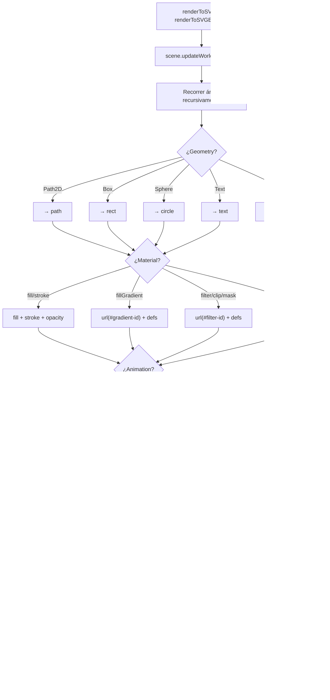

# Renderers

Los renderers de Oroya Animate son **traductores** que convierten el scene graph agnóstico en salida visual. El core no conoce a los renderers — cada uno lee el scene graph y produce su propia representación.

---

## Visión general


| Aspecto | `ThreeRenderer` | `renderToSVG` |
|---------|----------------|---------------|
| **Paradigma** | Instancia con estado (class) | Función pura (stateless) |
| **Output** | Dibuja en un `<canvas>` | Retorna un `string` SVG |
| **Requiere DOM** | ✅ Sí (`HTMLCanvasElement`) | ❌ No (funciona en Node.js) |
| **3D** | ✅ Perspectiva, luces, sombras | ❌ Solo 2D |
| **Vectorial** | ❌ Rasterizado | ✅ Infinitamente escalable |

---

## `@oroya/renderer-three` — Three.js (WebGL)

El renderer principal para visualización 3D interactiva.

### Setup

```typescript
import { ThreeRenderer } from '@oroya/renderer-three';

const renderer = new ThreeRenderer({
  canvas: document.getElementById('canvas') as HTMLCanvasElement,
  width: window.innerWidth,
  height: window.innerHeight,
  dpr: window.devicePixelRatio,  // opcional
});
```

### Opciones del constructor

| Opción | Tipo | Default | Descripción |
|--------|------|---------|-------------|
| `canvas` | `HTMLCanvasElement` | *(requerido)* | Elemento canvas destino |
| `width` | `number` | *(requerido)* | Ancho del viewport |
| `height` | `number` | *(requerido)* | Alto del viewport |
| `dpr` | `number` | `window.devicePixelRatio` | Device pixel ratio (HiDPI) |

### Métodos

| Método | Descripción |
|--------|-------------|
| `mount(scene)` | Conecta una escena. Reconstruye la escena Three.js, detecta la cámara activa, agrega luces |
| `render()` | Sincroniza transforms, propaga matrices y dibuja un frame |
| `dispose()` | Libera recursos WebGL |

### Ciclo de vida


### Traducción de componentes

| Nodo Oroya | Objeto Three.js |
|------------|-----------------|
| Node sin Geometry ni Camera | `THREE.Group` |
| Node + `Geometry(Box)` | `THREE.Mesh(BoxGeometry)` |
| Node + `Geometry(Sphere)` | `THREE.Mesh(SphereGeometry)` |
| Node + `Geometry(Path2D)` | ❌ Ignorado |
| Node + `Camera(Perspective)` | `THREE.PerspectiveCamera` |
| `Material` con `color` | `MeshStandardMaterial({ color })` |
| `Material` con `opacity < 1` | `MeshStandardMaterial({ transparent: true })` |
| Sin `Material` | `MeshStandardMaterial({ color: 0xcccccc })` |

### Iluminación automática

| Tipo | Config |
|------|--------|
| `AmbientLight` | Blanco, intensidad `0.5` |
| `DirectionalLight` | Blanco, intensidad `1.5`, posición `(2, 5, 3)` |

### Resolución de cámaras


### Ejemplo completo

```typescript
import { Scene, Node, createBox, Material, Camera, CameraType } from '@oroya/core';
import { ThreeRenderer } from '@oroya/renderer-three';

const scene = new Scene();

const cam = new Node('cam');
cam.addComponent(new Camera({
  type: CameraType.Perspective, fov: 75,
  aspect: window.innerWidth / window.innerHeight, near: 0.1, far: 1000,
}));
cam.transform.position.z = 5;
scene.add(cam);

const box = new Node('box');
box.addComponent(createBox(1, 1, 1));
box.addComponent(new Material({ color: { r: 0.2, g: 0.6, b: 1.0 } }));
scene.add(box);

const renderer = new ThreeRenderer({
  canvas: document.getElementById('canvas') as HTMLCanvasElement,
  width: window.innerWidth, height: window.innerHeight,
});
renderer.mount(scene);

function loop() {
  box.transform.rotation.y = performance.now() * 0.001;
  box.transform.updateLocalMatrix();
  renderer.render();
  requestAnimationFrame(loop);
}
requestAnimationFrame(loop);
```

---

## `@oroya/renderer-svg` — SVG (2D)

Renderer ligero que genera markup SVG. Ideal para arte generativo, exportación vectorial y server-side rendering.

### `renderToSVG` — String puro (server-safe)

Función pura y stateless que retorna un string SVG. Funciona en Node.js sin DOM.

```typescript
import { renderToSVG } from '@oroya/renderer-svg';

const svg: string = renderToSVG(scene, { width: 400, height: 300 });
```

#### Opciones (`SvgRenderOptions`)

| Opción | Tipo | Default | Descripción |
|--------|------|---------|-------------|
| `width` | `number` | *(requerido)* | Ancho del SVG |
| `height` | `number` | *(requerido)* | Alto del SVG |
| `viewBox` | `string` | `"0 0 {width} {height}"` | viewBox personalizado |

### `renderToSVGElement` — DOM interactivo

Crea un `SVGSVGElement` real con event delegation. Los nodos con componente `Interactive` reciben listeners de pointer/click/wheel.

```typescript
import { renderToSVGElement } from '@oroya/renderer-svg';

const { svg, dispose } = renderToSVGElement(scene, {
  width: 800,
  height: 600,
  container: document.getElementById('app')!,
});

// Cuando ya no se necesite:
dispose(); // Limpia listeners y remueve el SVG del DOM
```

#### Opciones (`SvgElementRenderOptions`)

Extiende `SvgRenderOptions` con:

| Opción | Tipo | Descripción |
|--------|------|-------------|
| `container` | `HTMLElement` | *(opcional)* Elemento padre donde se adjunta el SVG automáticamente |

#### Retorno

| Campo | Tipo | Descripción |
|-------|------|-------------|
| `svg` | `SVGSVGElement` | El elemento SVG creado |
| `dispose` | `() => void` | Limpia event listeners y remueve el SVG del DOM |

#### Eventos interactivos soportados

| Evento DOM | `InteractionEventType` |
|-----------|------------------------|
| `click` | `Click` |
| `pointerdown` | `PointerDown` |
| `pointerup` | `PointerUp` |
| `pointermove` | `PointerMove` |
| `pointerenter` | `PointerEnter` |
| `pointerleave` | `PointerLeave` |
| `wheel` | `Wheel` |

### Pipeline



### Soporte de geometrías

| Geometría | Elemento SVG generado |
|-----------|----------------------|
| `Path2D` | `<path d="...">` |
| `Box` | `<rect>` (width × height, depth ignorado) |
| `Sphere` | `<circle>` (radio) |
| `Text` | `<text>` con font-size, font-family, font-weight, text-anchor, dominant-baseline |

### Propiedades del material para SVG

| Campo | Tipo | Efecto SVG | Si ausente |
|-------|------|-----------|------------|
| `fill` | `ColorRGB` | `fill="rgb(R,G,B)"` | `fill="none"` |
| `stroke` | `ColorRGB` | `stroke="rgb(R,G,B)"` | Sin stroke |
| `strokeWidth` | `number` | `stroke-width="N"` | `1` |
| `opacity` | `number` | `opacity="N"` | Sin atributo (opaco) |
| `fillGradient` | `GradientDef` | `fill="url(#id)"` + `<defs>` | Usa `fill` normal |
| `strokeGradient` | `GradientDef` | `stroke="url(#id)"` + `<defs>` | Usa `stroke` normal |
| `filter` | `SvgFilterDef` | `filter="url(#id)"` + `<filter>` en `<defs>` | Sin filtro |
| `clipPath` | `SvgClipPathDef` | `clip-path="url(#id)"` + `<clipPath>` en `<defs>` | Sin recorte |
| `mask` | `SvgMaskDef` | `mask="url(#id)"` + `<mask>` en `<defs>` | Sin máscara |

### Transforms y jerarquía

El renderer SVG aplica el `localMatrix` de cada nodo como atributo `transform="matrix(a,b,c,d,e,f)"` y genera `<g>` para representar la jerarquía padre-hijo del scene graph.

```typescript
const parent = new Node('group');
parent.transform.position = { x: 100, y: 50, z: 0 };

const child = new Node('square');
child.addComponent(createBox(30, 30, 0));
child.addComponent(new Material({ fill: { r: 1, g: 0, b: 0 } }));

parent.add(child);
scene.add(parent);
```

Genera:
```xml
<g transform="matrix(1,0,0,1,100,50)">
  <rect x="-15" y="-15" width="30" height="30" fill="rgb(255, 0, 0)" />
</g>
```

### Gradientes

```typescript
const circle = new Node('sun');
circle.addComponent(createSphere(80));
circle.addComponent(new Material({
  fillGradient: {
    type: 'radial',
    cx: 0.5, cy: 0.5, r: 0.5,
    stops: [
      { offset: 0, color: { r: 1, g: 1, b: 0 } },
      { offset: 1, color: { r: 1, g: 0.3, b: 0 }, opacity: 0.8 },
    ],
  },
}));
```

Tipos de gradiente:

| Tipo | Definición | Elemento SVG |
|------|-----------|--------------|
| `linear` | `LinearGradientDef` (x1, y1, x2, y2) | `<linearGradient>` |
| `radial` | `RadialGradientDef` (cx, cy, r, fx, fy) | `<radialGradient>` |

### Texto

```typescript
const label = new Node('title');
label.addComponent(createText('Oroya Animate', {
  fontSize: 24,
  fontFamily: 'Inter',
  fontWeight: 'bold',
  textAnchor: 'middle',
}));
label.addComponent(new Material({ fill: { r: 0, g: 0, b: 0 } }));
label.transform.position = { x: 200, y: 30, z: 0 };
scene.add(label);
```

### CSS Classes y IDs semánticos

Cada nodo puede tener un `cssClass` y/o `cssId` que se emiten como atributos `class` e `id` en los elementos SVG generados.

```typescript
const node = new Node('highlight-box');
node.addComponent(createBox(100, 60, 0));
node.addComponent(new Material({ fill: { r: 1, g: 0.9, b: 0 } }));
node.cssClass = 'highlight animated';
node.cssId = 'main-callout';
scene.add(node);
```

Genera:
```xml
<rect id="main-callout" class="highlight animated" x="-50" y="-30" width="100" height="60" fill="rgb(255, 230, 0)" />
```

Cuando el nodo tiene hijos o transform, el atributo se aplica al `<g>` contenedor:
```xml
<g id="main-callout" class="highlight animated" transform="matrix(1,0,0,1,50,25)">
  <rect x="-50" y="-30" width="100" height="60" fill="rgb(255, 230, 0)" />
</g>
```

> **Serialización:** `cssClass` y `cssId` se preservan en `serialize()` / `deserialize()`.

### Cámara ortográfica y viewBox

Si la escena contiene un nodo con `OrthographicCameraDef`, el renderer SVG calcula automáticamente el `viewBox` a partir del frustum de la cámara. Un `viewBox` explícito en las opciones tiene prioridad.

```typescript
const cam = new Node('ortho-cam');
cam.addComponent(new Camera({
  type: CameraType.Orthographic,
  left: -400, right: 400,
  top: -300, bottom: 300,
  near: 0.1, far: 1000,
}));
scene.add(cam);

// viewBox se calcula como "-400 -300 800 600"
const svg = renderToSVG(scene, { width: 800, height: 600 });
```

La posición de la cámara se aplica como offset al viewBox:
```typescript
cam.transform.position = { x: 50, y: 25, z: 0 };
// viewBox se calcula como "-350 -275 800 600"
```

### SVG Filters, Clip Paths y Masks

El renderer soporta filtros SVG nativos, clip paths y máscaras a través de campos en `MaterialDef`.

#### Blur

```typescript
const blurred = new Node('soft');
blurred.addComponent(createSphere(40));
blurred.addComponent(new Material({
  fill: { r: 0.5, g: 0.8, b: 1 },
  filter: { effects: [{ type: 'blur', stdDeviation: 3 }] },
}));
```

Genera:
```xml
<defs>
  <filter id="oroya-filter-0">
    <feGaussianBlur stdDeviation="3" />
  </filter>
</defs>
<circle cx="0" cy="0" r="40" fill="rgb(128, 204, 255)" filter="url(#oroya-filter-0)" />
```

#### Drop Shadow

```typescript
new Material({
  fill: { r: 1, g: 0, b: 0 },
  filter: {
    effects: [{
      type: 'dropShadow', dx: 4, dy: 4,
      stdDeviation: 2, floodColor: '#333', floodOpacity: 0.6,
    }],
  },
});
```

#### Clip Path

```typescript
new Material({
  fill: { r: 0, g: 1, b: 0 },
  clipPath: {
    path: [
      { command: 'M', args: [0, 0] },
      { command: 'L', args: [100, 0] },
      { command: 'L', args: [50, 100] },
      { command: 'Z', args: [] },
    ],
  },
});
```

#### Mask

```typescript
new Material({
  fill: { r: 0, g: 0, b: 1 },
  mask: {
    path: [
      { command: 'M', args: [0, 0] },
      { command: 'L', args: [80, 0] },
      { command: 'L', args: [80, 80] },
      { command: 'Z', args: [] },
    ],
    fill: 'white',
    opacity: 0.8,
  },
});
```

### SVG Animaciones nativas

El componente `Animation` permite agregar animaciones SVG declarativas (`<animate>` y `<animateTransform>`) que se ejecutan en el navegador sin JavaScript.

```typescript
import { Animation } from '@oroya/core';

const circle = new Node('pulse');
circle.addComponent(createSphere(30));
circle.addComponent(new Material({ fill: { r: 1, g: 0, b: 0 } }));
circle.addComponent(new Animation([
  {
    type: 'animate',
    attributeName: 'opacity',
    values: '1;0.3;1',
    dur: '2s',
    repeatCount: 'indefinite',
  },
]));
```

Genera:
```xml
<circle cx="0" cy="0" r="30" fill="rgb(255, 0, 0)">
  <animate attributeName="opacity" values="1;0.3;1" dur="2s" repeatCount="indefinite" />
</circle>
```

Animaciones de transformación:
```typescript
new Animation([
  {
    type: 'animateTransform',
    transformType: 'rotate',
    from: '0 50 50',
    to: '360 50 50',
    dur: '4s',
    repeatCount: 'indefinite',
  },
]);
```

Genera:
```xml
<animateTransform attributeName="transform" type="rotate"
  from="0 50 50" to="360 50 50" dur="4s" repeatCount="indefinite" />
```

> **fill="freeze"** mantiene el valor final después de que la animación termina, en lugar de revertir.

> **Nota:** Las animaciones nativas solo aplican al renderer SVG. El renderer Three.js las ignora.

### Ejemplo completo

```typescript
const triangle = new Node('triangle');
triangle.addComponent(createPath2D([
  { command: 'M', args: [200, 50] },
  { command: 'L', args: [350, 250] },
  { command: 'L', args: [50, 250] },
  { command: 'Z', args: [] },
]));
triangle.addComponent(new Material({
  fill: { r: 0.2, g: 0.8, b: 0.4 },
  stroke: { r: 0, g: 0, b: 0 },
  strokeWidth: 2,
  opacity: 0.9,
}));
scene.add(triangle);

const svg = renderToSVG(scene, { width: 400, height: 300 });
```

### Casos de uso

| Caso | Ventaja |
|------|---------|
| Exportar a .svg | Abrir en Figma, Illustrator, Inkscape |
| Server-side rendering | Node.js sin DOM |
| Arte generativo | Patrones procedurales como vectores |
| Impresión | Escalable sin pérdida |
| Interactividad SVG | `renderToSVGElement` con event delegation |

---

## Comparación entre renderers

### Soporte de geometrías

| Geometría | Three.js | SVG |
|-----------|----------|-----|
| `Box` | ✅ | ✅ `<rect>` |
| `Sphere` | ✅ | ✅ `<circle>` |
| `Path2D` | ❌ | ✅ `<path>` |
| `Text` | ❌ | ✅ `<text>` |

### Soporte de material

| Propiedad | Three.js | SVG |
|-----------|----------|-----|
| `color` | ✅ | ❌ |
| `opacity` | ✅ | ✅ |
| `fill` | ❌ | ✅ |
| `stroke` | ❌ | ✅ |
| `strokeWidth` | ❌ | ✅ |
| `fillGradient` | ❌ | ✅ |
| `strokeGradient` | ❌ | ✅ |
| `filter` | ❌ | ✅ |
| `clipPath` | ❌ | ✅ |
| `mask` | ❌ | ✅ |

### Soporte de transforms

| Feature | Three.js | SVG |
|---------|----------|-----|
| Position (translate) | ✅ | ✅ `matrix()` |
| Rotation | ✅ | ✅ `matrix()` |
| Scale | ✅ | ✅ `matrix()` |
| Jerarquía (`<g>`) | ✅ Groups | ✅ `<g>` |

### Soporte de componentes especiales

| Feature | Three.js | SVG |
|---------|----------|-----|
| `Camera` (Perspective) | ✅ | ❌ |
| `Camera` (Orthographic) | ❌ | ✅ viewBox |
| `Interactive` (eventos) | ✅ Raycaster | ✅ Event delegation |
| `Animation` (SVG nativo) | ❌ | ✅ `<animate>` / `<animateTransform>` |
| `cssClass` / `cssId` | ❌ | ✅ atributos `class` / `id` |

---

## Crear un renderer personalizado

El contrato es simple — implementar `mount`, `render` y `dispose`:

```typescript
import { Scene, ComponentType, Geometry, Material, GeometryPrimitive } from '@oroya/core';

export class Canvas2DRenderer {
  private ctx: CanvasRenderingContext2D;
  private scene: Scene | null = null;

  constructor(canvas: HTMLCanvasElement) {
    this.ctx = canvas.getContext('2d')!;
  }

  mount(scene: Scene): void { this.scene = scene; }

  render(): void {
    if (!this.scene) return;
    this.scene.updateWorldMatrices();
    this.ctx.clearRect(0, 0, this.ctx.canvas.width, this.ctx.canvas.height);

    this.scene.traverse(node => {
      const geo = node.getComponent<Geometry>(ComponentType.Geometry);
      if (!geo) return;
      const mat = node.getComponent<Material>(ComponentType.Material);
      const wm = node.transform.worldMatrix;

      this.ctx.save();
      this.ctx.translate(wm[12], wm[13]);

      if (geo.definition.type === GeometryPrimitive.Box) {
        const { width, height } = geo.definition;
        if (mat?.definition.color) {
          const c = mat.definition.color;
          this.ctx.fillStyle = `rgb(${c.r*255},${c.g*255},${c.b*255})`;
        }
        this.ctx.fillRect(-width/2, -height/2, width, height);
      }
      this.ctx.restore();
    });
  }

  dispose(): void { this.scene = null; }
}
```

### Checklist

| Paso | Descripción |
|------|-------------|
| 1 | Crear paquete en `packages/renderer-xxx/` |
| 2 | Agregar `@oroya/core` como dependencia |
| 3 | Implementar `mount()` — recorrer árbol y crear objetos |
| 4 | Implementar `render()` — sincronizar transforms y dibujar |
| 5 | Implementar `dispose()` — liberar recursos |
| 6 | Documentar geometrías y materiales soportados |
