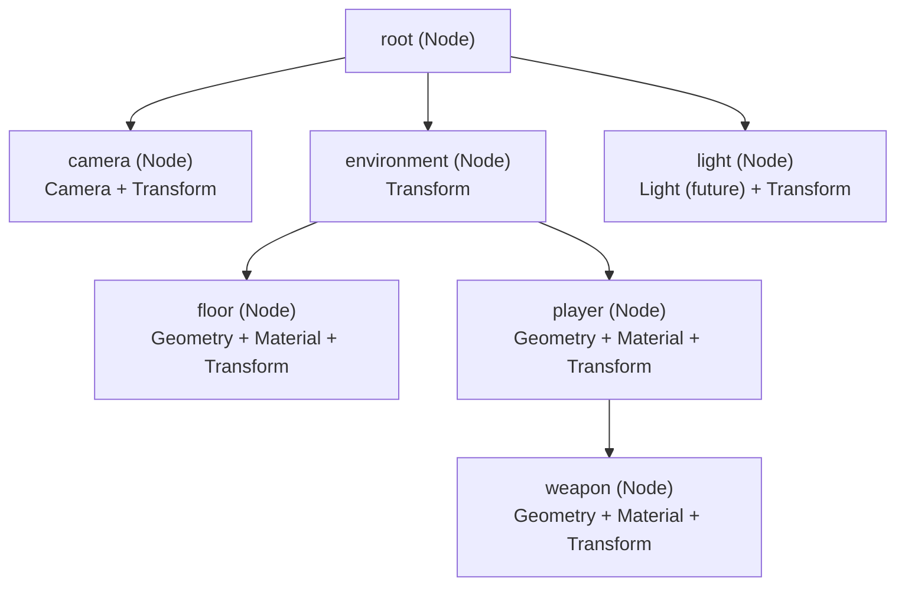
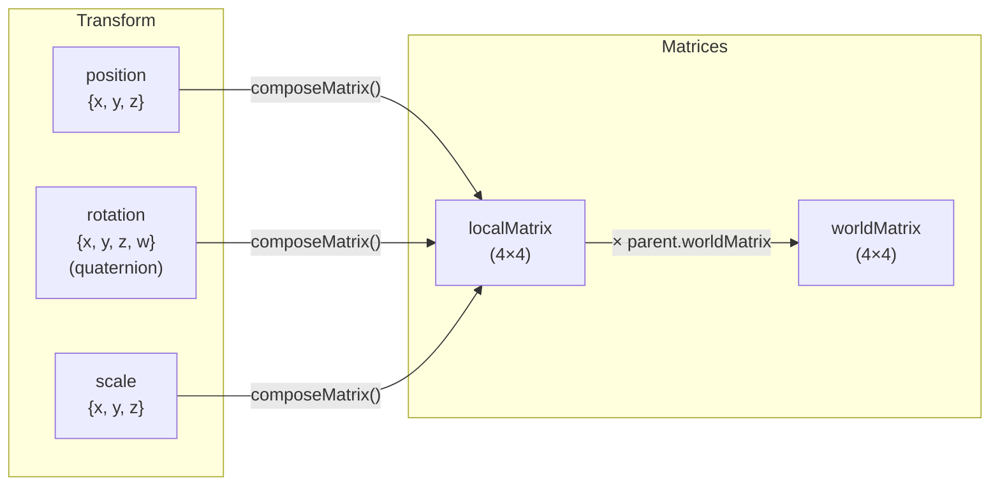
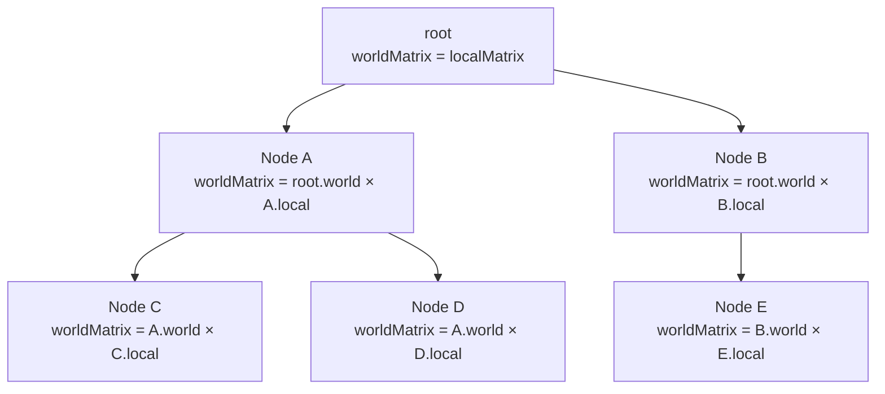
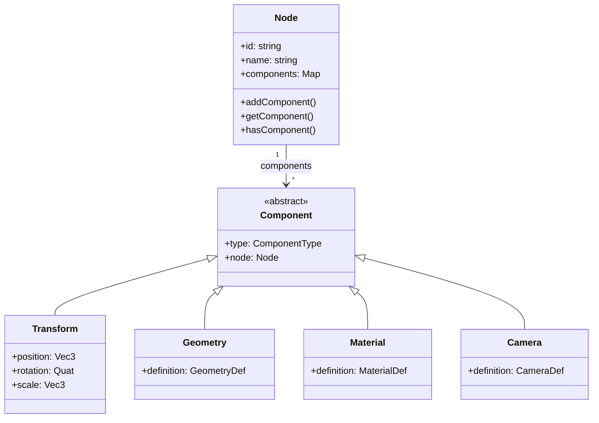

# Scene Graph & Transformations

The Scene Graph is the central data structure of Oroya Animate. It is a hierarchical tree that manages the spatial relationships between all objects in the scene.

---

## Table of Contents

- [Tree Structure](#tree-structure)
- [Parent-Child Hierarchy](#parent-child-hierarchy)
- [Transform System](#transform-system)
- [Matrix Propagation](#matrix-propagation)
- [Components (ECS)](#components-ecs)
- [Tree Operations](#tree-operations)
- [Advanced Patterns](#advanced-patterns)

---

## Tree Structure

Every `Scene` has a `root` node that serves as the tree's root. All other nodes are children or descendants of this root.



### Tree Rules

| Rule | Description |
|------|-------------|
| **Single root** | The scene always has exactly one `root` node |
| **One parent per node** | A node can only have one parent at a time |
| **Automatic re-parenting** | If a node with a parent is added to another parent, it is automatically removed from the previous one |
| **Mandatory transform** | All nodes have a `Transform` created automatically |
| **Empty nodes allowed** | A node can exist without Geometry or Material — useful as a container/pivot |

---

## Parent-Child Hierarchy

### Adding nodes

```typescript
const scene = new Scene();

// Add directly to root
const parent = new Node('parent');
scene.add(parent);

// Add as a child of another node
const child = new Node('child');
scene.add(child, parent);  // Equivalent to: parent.add(child)

// Also works directly on the node
const grandchild = new Node('grandchild');
child.add(grandchild);
```

### Removing nodes

```typescript
scene.remove(child);           // Removes from parent (wherever it is)
parent.remove(child);          // Removes only if it is a direct child
```

### Re-parenting

When you add a node that already has a parent to another parent, it is automatically removed from the previous one:

```typescript
const groupA = new Node('group-a');
const groupB = new Node('group-b');
const box = new Node('box');

groupA.add(box);
console.log(box.parent?.name); // 'group-a'

groupB.add(box);  // Automatically removed from groupA
console.log(box.parent?.name); // 'group-b'
console.log(groupA.children.length); // 0
```

---

## Transform System

Each node has a `Transform` component with three properties that define its position in local space:



### Transform Properties

| Property | Type | Default | Description |
|----------|------|---------|-------------|
| `position` | `Vec3 {x, y, z}` | `{0, 0, 0}` | Offset relative to parent |
| `rotation` | `Quat {x, y, z, w}` | `{0, 0, 0, 1}` | Rotation as quaternion |
| `scale` | `Vec3 {x, y, z}` | `{1, 1, 1}` | Scale factor |
| `localMatrix` | `Matrix4 (16 numbers)` | Identity | Computed from position + rotation + scale |
| `worldMatrix` | `Matrix4 (16 numbers)` | Identity | Computed: parent.worldMatrix × localMatrix |
| `isDirty` | `boolean` | `true` | Flag for recalculation optimization |

### Local Space vs World Space

| Concept | Definition | Example |
|---------|-----------|---------|
| **Local space** | Coordinates relative to parent | `position = {x: 2, y: 0, z: 0}` → 2 units to the right of parent |
| **World space** | Absolute coordinates in the scene | If parent is at `{x: 5, ...}`, child's world position is `{x: 7, ...}` |

```
Scene:
  root (world: 0,0,0)
  └── car (local: 10,0,0 → world: 10,0,0)
      └── wheel (local: -1,-0.5,0 → world: 9,-0.5,0)
          └── hubcap (local: 0,0,0.1 → world: 9,-0.5,0.1)
```

### Updating Transforms

After modifying `position`, `rotation`, or `scale`, you **must** call `updateLocalMatrix()`:

```typescript
// Wrong — local matrix does not reflect the change
node.transform.position.x = 5;

// Correct — recalculates the local matrix
node.transform.position.x = 5;
node.transform.updateLocalMatrix();
```

The world matrix is automatically recalculated by `renderer.render()` or manually with:

```typescript
scene.updateWorldMatrices();
```

---

## Matrix Propagation

The propagation algorithm traverses the tree in **DFS pre-order** and computes the world matrix of each node:



### Algorithm Pseudocode

```typescript
function updateWorldMatrix(node: Node, parentWorldMatrix?: Matrix4): void {
  // 1. If the transform was modified, recalculate the local matrix
  if (node.transform.isDirty) {
    node.transform.updateLocalMatrix();
  }

  // 2. Compute the world matrix
  if (parentWorldMatrix) {
    node.transform.worldMatrix = multiplyMatrices(parentWorldMatrix, node.transform.localMatrix);
  } else {
    node.transform.worldMatrix = node.transform.localMatrix;
  }

  node.transform.isDirty = false;

  // 3. Propagate to all children
  for (const child of node.children) {
    updateWorldMatrix(child, node.transform.worldMatrix);
  }
}
```

### Numerical Example

```
Parent: position = {x: 3, y: 0, z: 0}
Child:  position = {x: 2, y: 1, z: 0}

localMatrix(parent) → translation (3, 0, 0)
localMatrix(child)  → translation (2, 1, 0)

worldMatrix(parent) = localMatrix(parent)       → (3, 0, 0) in world
worldMatrix(child)  = worldMatrix(parent) × localMatrix(child)
                    = translation(3,0,0) × translation(2,1,0)
                    → (5, 1, 0) in world
```

---

## Components (ECS)

Nodes are empty containers until components are added to them. This follows a **simplified Entity-Component System (ECS)** pattern.



### Component Types

| Component | `ComponentType` | Auto-created | Description |
|-----------|-----------------|--------------|-------------|
| `Transform` | `Transform` | Yes | Position, rotation, scale, matrices |
| `Geometry` | `Geometry` | No | Geometric shape (Box, Sphere, Path2D) |
| `Material` | `Material` | No | Visual appearance (color, opacity, fill, stroke) |
| `Camera` | `Camera` | No | Viewpoint (Perspective; Orthographic planned) |

### Component Operations

```typescript
const node = new Node('player');

// Add
node.addComponent(createBox(1, 2, 1));
node.addComponent(new Material({ color: { r: 0, g: 0.8, b: 0.5 } }));

// Query
const geo = node.getComponent<Geometry>(ComponentType.Geometry);
console.log(geo?.definition.type); // 'Box'

// Check
if (node.hasComponent(ComponentType.Camera)) {
  console.log('It is a camera');
}

// Replace (same type = overwrite)
node.addComponent(createSphere(1, 32, 32)); // Replaces Box with Sphere
```

> **Rule:** Maximum **one component per type** per node. Adding a second component of the same type silently replaces the previous one.

---

## Tree Operations

### Traversal

Traverses the entire tree in DFS pre-order:

```typescript
// Traverse the entire scene
scene.traverse(node => {
  console.log(node.name, node.children.length);
});

// Traverse starting from a specific node
someNode.traverse(descendant => {
  // Only visits someNode and its descendants
});
```

### Search

```typescript
// By UUID (unique, guaranteed)
const node = scene.findNodeById('550e8400-e29b-41d4-a716-446655440000');

// By name (returns the first match)
const camera = scene.findNodeByName('main-camera');
```

### Node Count

```typescript
let count = 0;
scene.traverse(() => count++);
console.log(`The scene has ${count} nodes`);
```

---

## Advanced Patterns

### Pivot Node (for orbits)

An empty node whose rotation generates an orbit for its children:

```
Sun (sphere)
└── earthPivot (empty, rotates on Y)
    └── Earth (sphere, offset on X)
        └── moonPivot (empty, rotates faster)
            └── Moon (sphere, offset on X)
```

```typescript
const earthPivot = new Node('earth-pivot'); // No geometry
sun.add(earthPivot);

const earth = new Node('earth');
earth.transform.position = { x: 5, y: 0, z: 0 }; // Orbital distance
earthPivot.add(earth);

// Rotating the pivot makes Earth orbit the Sun
earthPivot.transform.rotation = rotateY(angle);
earthPivot.transform.updateLocalMatrix();
```

### Group Node (for organization)

```typescript
const ui = new Node('ui-layer');
const world = new Node('world-layer');

scene.add(ui);
scene.add(world);

// All world elements under one group
world.add(terrain);
world.add(buildings);
world.add(characters);

// Hide the entire world at once (future: visibility component)
scene.remove(world); // The entire group disappears
```

### Camera Attached to a Node

The camera inherits the transform from its parent:

```typescript
const character = new Node('character');
scene.add(character);

const followCam = new Node('follow-cam');
followCam.addComponent(new Camera({...}));
followCam.transform.position = { x: 0, y: 3, z: 8 }; // Relative offset
character.add(followCam);

// When the character moves, the camera follows automatically
```

### State Snapshot

Capture world positions of all nodes:

```typescript
const snapshot = new Map<string, Vec3>();

scene.traverse(node => {
  const wm = node.transform.worldMatrix;
  snapshot.set(node.id, {
    x: wm[12], // world X position
    y: wm[13], // world Y position
    z: wm[14], // world Z position
  });
});
```
