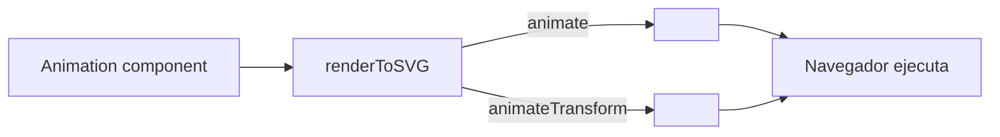

# Tutorial 10: Animaciones SVG Nativas 🟡

> **Nivel:** Intermedio  
> **Tiempo estimado:** 20 minutos  
> **Qué aprenderás:** Crear animaciones declarativas con `<animate>` y `<animateTransform>` usando el componente `Animation` de Oroya.

---

## Concepto: Animaciones sin JavaScript

Las animaciones SVG nativas se declaran dentro del markup SVG y el navegador las ejecuta directamente, sin `requestAnimationFrame` ni JavaScript. Son ideales para:

- **Exportación:** El archivo `.svg` es auto-animado al abrirlo en un browser.
- **Performance:** El motor de renderizado del browser optimiza las animaciones.
- **Server-side:** Funciona con `renderToSVG()` — el string SVG incluye las animaciones.



---

## Paso 1: Setup

```typescript
import {
  Scene, Node, Camera, CameraType,
  Material, Animation,
  createBox, createSphere, createPath2D,
} from '@oroya/core';
import { renderToSVG } from '@oroya/renderer-svg';

const scene = new Scene();

const cam = new Node('cam');
cam.addComponent(new Camera({
  type: CameraType.Orthographic,
  left: 0, right: 600,
  top: 0, bottom: 400,
  near: 0.1, far: 100,
}));
scene.add(cam);
```

---

## Paso 2: Animar opacidad (pulse)

El tipo `'animate'` genera un elemento `<animate>` que anima un atributo escalar:

```typescript
const pulse = new Node('pulse');
pulse.addComponent(createSphere(40));
pulse.addComponent(new Material({ fill: { r: 1, g: 0.2, b: 0.2 } }));
pulse.addComponent(new Animation([
  {
    type: 'animate',
    attributeName: 'opacity',
    values: '1;0.2;1',      // Keyframes separados por ";"
    dur: '2s',               // Duración del ciclo
    repeatCount: 'indefinite', // Repetir infinitamente
  },
]));
pulse.transform.position = { x: 100, y: 100, z: 0 };
pulse.transform.updateLocalMatrix();
scene.add(pulse);
```

Genera:
```xml
<circle cx="0" cy="0" r="40" fill="rgb(255, 51, 51)">
  <animate attributeName="opacity" values="1;0.2;1"
           dur="2s" repeatCount="indefinite" />
</circle>
```

---

## Paso 3: Rotar un cuadrado

El tipo `'animateTransform'` genera `<animateTransform>` para transformaciones geométricas:

```typescript
const spinner = new Node('spinner');
spinner.addComponent(createBox(60, 60, 0));
spinner.addComponent(new Material({
  fill: { r: 0.3, g: 0.6, b: 1.0 },
  stroke: { r: 0.1, g: 0.3, b: 0.8 },
  strokeWidth: 2,
}));
spinner.addComponent(new Animation([
  {
    type: 'animateTransform',
    transformType: 'rotate',       // Tipo: rotate, scale, translate, skewX, skewY
    from: '0 0 0',                 // from="ángulo cx cy"
    to: '360 0 0',                 // to="ángulo cx cy"
    dur: '3s',
    repeatCount: 'indefinite',
  },
]));
spinner.transform.position = { x: 300, y: 100, z: 0 };
spinner.transform.updateLocalMatrix();
scene.add(spinner);
```

### Sintaxis de `from`/`to` para cada `transformType`

| transformType | Formato | Ejemplo |
|--------------|---------|---------|
| `rotate` | `"angle cx cy"` | `"360 0 0"` (360° alrededor del centro) |
| `translate` | `"tx ty"` | `"0 -50"` (mover 50px arriba) |
| `scale` | `"sx sy"` | `"1.5 1.5"` (escalar 150%) |
| `skewX` | `"angle"` | `"30"` (inclinar 30°) |
| `skewY` | `"angle"` | `"15"` (inclinar 15°) |

---

## Paso 4: Escalar con values

Usando `values` en lugar de `from/to` para definir múltiples keyframes:

```typescript
const scalable = new Node('scalable');
scalable.addComponent(createSphere(30));
scalable.addComponent(new Material({ fill: { r: 0.2, g: 0.9, b: 0.5 } }));
scalable.addComponent(new Animation([
  {
    type: 'animateTransform',
    transformType: 'scale',
    values: '1;1.5;1',           // Tres keyframes: normal → grande → normal
    dur: '1.5s',
    repeatCount: 'indefinite',
  },
]));
scalable.transform.position = { x: 500, y: 100, z: 0 };
scalable.transform.updateLocalMatrix();
scene.add(scalable);
```

---

## Paso 5: Ciclo de colores

`<animate>` puede animar cualquier atributo SVG, incluyendo `fill`:

```typescript
const colorCycle = new Node('color-cycle');
colorCycle.addComponent(createBox(100, 70, 0));
colorCycle.addComponent(new Material({ fill: { r: 1, g: 0, b: 0 } }));
colorCycle.addComponent(new Animation([
  {
    type: 'animate',
    attributeName: 'fill',
    values: 'rgb(255,0,0);rgb(0,255,0);rgb(0,0,255);rgb(255,0,0)',
    dur: '3s',
    repeatCount: 'indefinite',
  },
]));
colorCycle.transform.position = { x: 100, y: 280, z: 0 };
colorCycle.transform.updateLocalMatrix();
scene.add(colorCycle);
```

---

## Paso 6: Bounce con easing (keySplines)

Para animaciones con curvas de easing, usa `calcMode="spline"` con `keySplines`:

```typescript
const bouncer = new Node('bouncer');
bouncer.addComponent(createSphere(20));
bouncer.addComponent(new Material({ fill: { r: 1, g: 0.8, b: 0.1 } }));
bouncer.addComponent(new Animation([
  {
    type: 'animateTransform',
    transformType: 'translate',
    values: '0 -40;0 40;0 -40',
    dur: '1.5s',
    repeatCount: 'indefinite',
    calcMode: 'spline',
    keyTimes: '0;0.5;1',
    keySplines: '0.42 0 0.58 1;0.42 0 0.58 1', // ease-in-out entre cada par
  },
]));
bouncer.transform.position = { x: 300, y: 280, z: 0 };
bouncer.transform.updateLocalMatrix();
scene.add(bouncer);
```

### Guía rápida de `keySplines`

Cada segmento entre keyframes necesita una curva Bézier cúbica definida por 4 valores: `x1 y1 x2 y2`.

| Easing | keySplines |
|--------|-----------|
| Lineal | `0 0 1 1` |
| Ease-in | `0.42 0 1 1` |
| Ease-out | `0 0 0.58 1` |
| Ease-in-out | `0.42 0 0.58 1` |
| Bounce | `0.3 1.5 0.7 1` |

---

## Paso 7: Combinar múltiples animaciones

Un nodo puede tener varias animaciones simultáneas:

```typescript
const star = new Node('star');
star.addComponent(createPath2D(createStarPath(0, 0, 6, 35, 15)));
star.addComponent(new Material({
  fillGradient: {
    type: 'linear', x1: 0, y1: 0, x2: 1, y2: 1,
    stops: [
      { offset: 0, color: { r: 1, g: 0.5, b: 0 } },
      { offset: 1, color: { r: 1, g: 0, b: 0.5 } },
    ],
  },
}));
star.addComponent(new Animation([
  // Rotación continua
  {
    type: 'animateTransform',
    transformType: 'rotate',
    from: '0 0 0',
    to: '360 0 0',
    dur: '4s',
    repeatCount: 'indefinite',
  },
  // Pulso de opacidad
  {
    type: 'animate',
    attributeName: 'opacity',
    values: '1;0.4;1',
    dur: '2s',
    repeatCount: 'indefinite',
  },
]));
star.transform.position = { x: 500, y: 280, z: 0 };
star.transform.updateLocalMatrix();
scene.add(star);
```

---

## Paso 8: Animación con freeze (una sola vez)

Usa `fill="freeze"` para que el valor final persista después de terminar:

```typescript
const oneShot = new Node('one-shot');
oneShot.addComponent(createBox(80, 50, 0));
oneShot.addComponent(new Material({ fill: { r: 0.5, g: 0.5, b: 0.5 } }));
oneShot.addComponent(new Animation([
  {
    type: 'animate',
    attributeName: 'fill',
    from: 'rgb(128,128,128)',
    to: 'rgb(0,255,128)',
    dur: '2s',
    repeatCount: '1',
    fill: 'freeze',   // Mantiene el color final
  },
]));
```

> **`fill="remove"` vs `fill="freeze"`:**  
> - `remove` (default) — al terminar, vuelve al valor original.  
> - `freeze` — mantiene el valor final de la animación.

---

## Paso 9: Renderizar

```typescript
const svg = renderToSVG(scene, { width: 600, height: 400 });

// En browser: se auto-anima al insertarlo en el DOM
document.body.innerHTML = svg;

// En Node.js: exportar como archivo .svg auto-animado
import { writeFileSync } from 'fs';
writeFileSync('animated.svg', svg);
```

---

## Referencia rápida de SvgAnimateDef

| Campo | Tipo | Descripción |
|-------|------|-------------|
| `type` | `'animate'` | Discriminante |
| `attributeName` | `string` | Atributo SVG a animar (`'opacity'`, `'fill'`, `'r'`, etc.) |
| `from` / `to` | `string` | Valor inicial / final |
| `values` | `string` | Keyframes separados por `;` (alternativa a from/to) |
| `dur` | `string` | Duración (`'2s'`, `'500ms'`) |
| `repeatCount` | `string` | `'indefinite'` o un número (`'3'`) |
| `fill` | `string` | `'freeze'` o `'remove'` |
| `calcMode` | `string` | `'linear'`, `'spline'`, `'discrete'`, `'paced'` |
| `keyTimes` | `string` | Tiempos clave (`'0;0.5;1'`) |
| `keySplines` | `string` | Curvas Bézier entre keyframes |

## Referencia rápida de SvgAnimateTransformDef

| Campo | Tipo | Descripción |
|-------|------|-------------|
| `type` | `'animateTransform'` | Discriminante |
| `transformType` | `string` | `'rotate'`, `'translate'`, `'scale'`, `'skewX'`, `'skewY'` |
| `from` / `to` / `values` | `string` | Valores de la transformación |
| `dur` | `string` | Duración |
| `repeatCount` | `string` | Repeticiones |
| `additive` | `string` | `'sum'` para acumular con el transform base |

---

## Demo interactiva

Explora todas estas animaciones en la demo **"SVG Animations"** del demo-react.

---

## Siguiente tutorial

➡️ [Tutorial 11: SVG Interactivo](./11-svg-interactive.md) — event delegation con `renderToSVGElement`.
