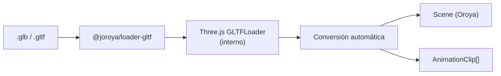
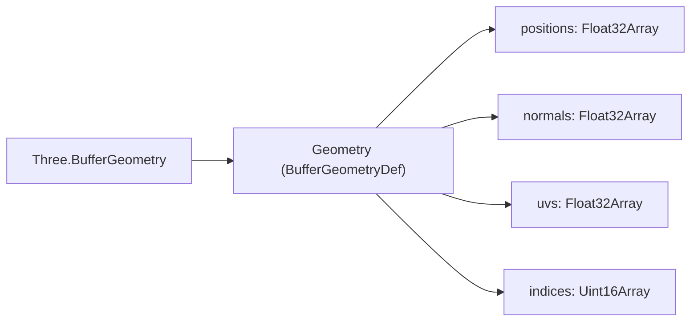

# Tutorial 16: Carga modelos 3D con el glTF Loader 🟡

> **Nivel:** Intermedio  
> **Tiempo estimado:** 20 minutos  
> **Qué aprenderás:** Importar modelos 3D en formato glTF/GLB desde Blender u otras herramientas 3D al scene graph agnóstico de Oroya, incluyendo geometría, materiales PBR y animaciones.

---

## ¿Qué es glTF?

**glTF** (GL Transmission Format) es el estándar de la industria para modelos 3D en la web. Es como el "JPEG de los modelos 3D":

| Formato | Extensión | Contenido |
|---------|-----------|-----------|
| glTF | `.gltf` + `.bin` | JSON separado + datos binarios |
| GLB | `.glb` | Todo empaquetado en un solo archivo binario |

> **Recomendación:** Usa `.glb` para web — un solo archivo, más rápido de cargar.

---

## Arquitectura del loader



El loader usa Three.js internamente para parsear el archivo, pero convierte todo al scene graph agnóstico de Oroya. El resultado es independiente de Three.js.

---

## Paso 1: Instalación

```bash
pnpm add @joroya/core @joroya/renderer-three @joroya/loader-gltf
```

> `@joroya/loader-gltf` requiere `three` como peer dependency (ya incluido con `@joroya/renderer-three`).

---

## Paso 2: Preparar el modelo

1. **Exportar desde Blender:** File → Export → glTF 2.0 (.glb)
2. **Usar modelos de prueba:** [glTF Sample Models](https://github.com/KhronosGroup/glTF-Sample-Models)

Coloca tu archivo `.glb` en la carpeta `public/models/` de tu proyecto:

```
my-project/
├── public/
│   └── models/
│       └── character.glb
├── src/
│   └── main.ts
└── index.html
```

---

## Paso 3: Cargar el modelo

```typescript
import { loadGLTF } from '@joroya/loader-gltf';

const { scene, animations } = await loadGLTF('/models/character.glb');

console.log('Nodos cargados:', scene.root.children.length);
console.log('Animaciones:', animations.length);
```

### ¿Qué retorna `loadGLTF`?

```typescript
interface GLTFLoadResult {
  /** Scene graph de Oroya con toda la jerarquía del modelo */
  scene: Scene;
  /** Clips de animación extraídos del modelo */
  animations: AnimationClip[];
}
```

---

## Paso 4: Qué se convierte automáticamente

El loader traduce cada aspecto del modelo a componentes de Oroya:

### Geometría



### Materiales PBR

| Propiedad Three.js | Propiedad Oroya |
|--------------------|-----------------|
| `color` | `color: { r, g, b }` |
| `metalness` | `metalness: number` |
| `roughness` | `roughness: number` |
| `emissive` | `emissive: { r, g, b }` |
| `opacity` | `opacity: number` |
| `side === DoubleSide` | `doubleSided: true` |

### Transforms

Cada nodo conserva su posición, rotación (quaternion) y escala del modelo original.

---

## Paso 5: Renderizar el modelo cargado

```typescript
import { Node, Camera, CameraType } from '@joroya/core';
import { ThreeRenderer } from '@joroya/renderer-three';
import { loadGLTF } from '@joroya/loader-gltf';

async function main() {
  // 1. Cargar el modelo
  const { scene, animations } = await loadGLTF('/models/BoxAnimated.glb');

  // 2. Agregar cámara
  const cam = new Node('camera');
  cam.addComponent(new Camera({
    type: CameraType.Perspective,
    fov: 60,
    aspect: window.innerWidth / window.innerHeight,
    near: 0.1,
    far: 1000,
  }));
  cam.transform.position = { x: 3, y: 3, z: 5 };
  scene.add(cam);

  // 3. Crear renderer
  const renderer = new ThreeRenderer({
    canvas: document.getElementById('canvas') as HTMLCanvasElement,
    width: window.innerWidth,
    height: window.innerHeight,
  });
  renderer.mount(scene);

  // 4. Render loop
  function animate() {
    renderer.render();
    requestAnimationFrame(animate);
  }
  animate();
}

main();
```

---

## Paso 6: Reproducir animaciones del modelo

Si el modelo glTF contiene animaciones, se extraen como `AnimationClip[]`:

```typescript
import { AnimationMixer } from '@joroya/core';

async function main() {
  const { scene, animations } = await loadGLTF('/models/BoxAnimated.glb');

  // Crear mixer de animación
  const mixer = new AnimationMixer(scene);

  // Listar animaciones disponibles
  animations.forEach((clip, i) => {
    console.log(`Clip ${i}: "${clip.name}" (${clip.duration}s, ${clip.tracks.length} tracks)`);
  });

  // Reproducir la primera animación
  if (animations.length > 0) {
    mixer.play(animations[0]);
  }

  // Setup renderer...
  const renderer = new ThreeRenderer({
    canvas: document.getElementById('canvas') as HTMLCanvasElement,
    width: window.innerWidth,
    height: window.innerHeight,
  });
  renderer.mount(scene);

  // Render loop con delta time
  let lastTime = performance.now();

  function animate() {
    const now = performance.now();
    const dt = (now - lastTime) / 1000; // en segundos
    lastTime = now;

    mixer.update(dt); // Avanzar la animación
    renderer.render();
    requestAnimationFrame(animate);
  }
  animate();
}

main();
```

---

## Paso 7: Explorar la jerarquía del modelo

Puedes recorrer el scene graph cargado para inspeccionar o modificar nodos:

```typescript
const { scene } = await loadGLTF('/models/character.glb');

// Recorrer todos los nodos
scene.traverse((node) => {
  const components = node.getComponentTypes();
  console.log(`Node: "${node.name}" | Components: [${components.join(', ')}]`);
});

// Buscar un nodo por nombre
const head = scene.findByName('Head');
if (head) {
  // Modificar después de cargar
  head.transform.scale = { x: 1.5, y: 1.5, z: 1.5 };
  head.transform.updateLocalMatrix();
}
```

---

## Paso 8: Tipos de interpolación en animaciones glTF

El loader detecta automáticamente el tipo de interpolación de cada track:

| Modo glTF | InterpolationMode | Descripción |
|-----------|-------------------|-------------|
| `LINEAR` | `'linear'` | Interpolación lineal entre keyframes |
| `STEP` | `'step'` | Salto abrupto entre valores |
| `CUBICSPLINE` | `'cubicspline'` | Curvas suaves con tangentes (ver Tutorial 19) |

```typescript
animations.forEach(clip => {
  clip.tracks.forEach(track => {
    console.log(
      `Track: ${track.targetNodeName}.${track.property}`,
      `| Interpolation: ${track.interpolation}`,
      `| Keyframes: ${track.times.length}`
    );
  });
});
```

---

## Código completo

```typescript
import { Node, Camera, CameraType, AnimationMixer } from '@joroya/core';
import { ThreeRenderer } from '@joroya/renderer-three';
import { loadGLTF } from '@joroya/loader-gltf';

async function main() {
  const { scene, animations } = await loadGLTF('/models/BoxAnimated.glb');

  // Cámara
  const cam = new Node('camera');
  cam.addComponent(new Camera({
    type: CameraType.Perspective,
    fov: 60,
    aspect: window.innerWidth / window.innerHeight,
    near: 0.1,
    far: 1000,
  }));
  cam.transform.position = { x: 3, y: 3, z: 5 };
  scene.add(cam);

  // Animaciones
  const mixer = new AnimationMixer(scene);
  if (animations.length > 0) {
    mixer.play(animations[0]);
  }

  // Renderer
  const renderer = new ThreeRenderer({
    canvas: document.getElementById('canvas') as HTMLCanvasElement,
    width: window.innerWidth,
    height: window.innerHeight,
  });
  renderer.mount(scene);

  // Loop
  let lastTime = performance.now();
  function animate() {
    const now = performance.now();
    const dt = (now - lastTime) / 1000;
    lastTime = now;

    mixer.update(dt);
    renderer.render();
    requestAnimationFrame(animate);
  }
  animate();
}

main();
```

---

## Siguiente tutorial

➡️ [Tutorial 17: Boolean Operations — CSG](./17-boolean-csg.md) — crea formas complejas combinando geometrías.
