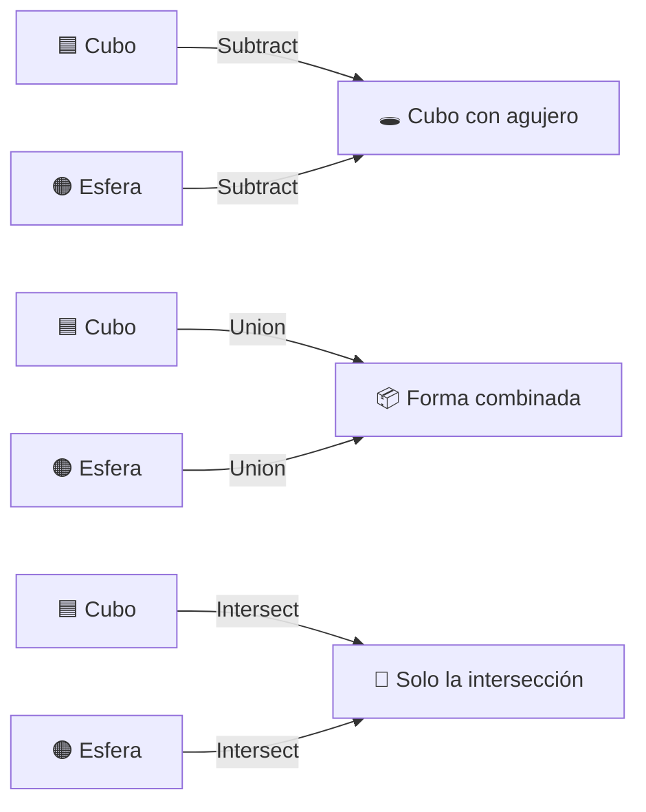

# Tutorial 17: Boolean Operations — Crea formas complejas con CSG 🔴

> **Nivel:** Avanzado  
> **Tiempo estimado:** 25 minutos  
> **Qué aprenderás:** Crear geometrías complejas combinando primitivas simples mediante operaciones booleanas (Constructive Solid Geometry): unión, sustracción e intersección.

---

## ¿Qué es CSG?

**CSG** (Constructive Solid Geometry) es una técnica que crea formas complejas a partir de primitivas simples usando operaciones booleanas:



| Operación | Resultado | Analogía |
|-----------|-----------|----------|
| **Union** | Combina ambas formas | Pegar dos piezas |
| **Subtract** | Resta el modifier del base | Hacer un agujero |
| **Intersect** | Solo la zona de superposición | El molde interior |

---

## Paso 1: Setup básico

```typescript
import {
  Scene, Node, Camera, CameraType,
  Geometry, GeometryPrimitive, CSGOperation,
  Material,
} from '@joroya/core';
import { ThreeRenderer } from '@joroya/renderer-three';

const scene = new Scene();

// Cámara
const cam = new Node('camera');
cam.addComponent(new Camera({
  type: CameraType.Perspective,
  fov: 60,
  aspect: window.innerWidth / window.innerHeight,
  near: 0.1,
  far: 100,
}));
cam.transform.position = { x: 3, y: 3, z: 5 };
scene.add(cam);
```

---

## Paso 2: Subtract — Crear un agujero

La operación más común: "tallar" una forma dentro de otra.

```typescript
// Cubo con una esfera sustraída → cubo con agujero esférico
const hollowCube = new Node('hollow-cube');
hollowCube.addComponent(new Geometry({
  type: GeometryPrimitive.CSG,
  operation: CSGOperation.Subtract,
  base: {
    type: GeometryPrimitive.Box,
    width: 2,
    height: 2,
    depth: 2,
  },
  modifier: {
    type: GeometryPrimitive.Sphere,
    radius: 1.3,
    widthSegments: 32,
    heightSegments: 32,
  },
}));
hollowCube.addComponent(new Material({
  color: { r: 0.2, g: 0.6, b: 1.0 },
}));
scene.add(hollowCube);
```

### ¿Qué está pasando?

1. **Base:** Un cubo de 2×2×2 unidades.
2. **Modifier:** Una esfera de radio 1.3 (más grande que la mitad del cubo, así que "asoma" por las caras).
3. **Resultado:** El cubo con una cavidad esférica interna.

---

## Paso 3: Union — Combinar formas

Une dos geometrías en una sola pieza sólida:

```typescript
const merged = new Node('merged-shape');
merged.addComponent(new Geometry({
  type: GeometryPrimitive.CSG,
  operation: CSGOperation.Union,
  base: {
    type: GeometryPrimitive.Box,
    width: 2,
    height: 1,
    depth: 2,
  },
  modifier: {
    type: GeometryPrimitive.Sphere,
    radius: 1.0,
    widthSegments: 32,
    heightSegments: 32,
  },
}));
merged.addComponent(new Material({
  color: { r: 0.2, g: 0.85, b: 0.4 },
}));
merged.transform.position.x = 4;
scene.add(merged);
```

El resultado es una sola geometría que contiene el volumen de ambas primitivas.

---

## Paso 4: Intersect — Solo la superposición

Mantiene únicamente la zona donde ambas formas se solapan:

```typescript
const intersection = new Node('intersection');
intersection.addComponent(new Geometry({
  type: GeometryPrimitive.CSG,
  operation: CSGOperation.Intersect,
  base: {
    type: GeometryPrimitive.Box,
    width: 2,
    height: 2,
    depth: 2,
  },
  modifier: {
    type: GeometryPrimitive.Sphere,
    radius: 1.3,
    widthSegments: 32,
    heightSegments: 32,
  },
}));
intersection.addComponent(new Material({
  color: { r: 1.0, g: 0.5, b: 0.1 },
}));
intersection.transform.position.x = -4;
scene.add(intersection);
```

El resultado es una forma redondeada — la "caja redondeada" donde cubo y esfera coinciden.

---

## Paso 5: Posicionar el modifier con modifierTransform

Por defecto, ambas geometrías están centradas en el origen. Usa `modifierTransform` para desplazar el modifier antes de la operación:

```typescript
// Crear una matriz de traslación (column-major 4×4)
function translationMatrix(x: number, y: number, z: number): number[] {
  return [
    1, 0, 0, 0,
    0, 1, 0, 0,
    0, 0, 1, 0,
    x, y, z, 1,
  ];
}

// Esfera descentrada para crear un agujero lateral
const offsetHole = new Node('offset-hole');
offsetHole.addComponent(new Geometry({
  type: GeometryPrimitive.CSG,
  operation: CSGOperation.Subtract,
  base: {
    type: GeometryPrimitive.Box,
    width: 3,
    height: 2,
    depth: 2,
  },
  modifier: {
    type: GeometryPrimitive.Sphere,
    radius: 1.0,
    widthSegments: 32,
    heightSegments: 32,
  },
  modifierTransform: translationMatrix(1.2, 0, 0), // Desplaza la esfera a la derecha
}));
offsetHole.addComponent(new Material({
  color: { r: 0.85, g: 0.3, b: 0.9 },
}));
offsetHole.transform.position.z = -4;
scene.add(offsetHole);
```

### Formato de modifierTransform

Es una `Matrix4` en formato **column-major** (misma convención que OpenGL/Three.js):

```
[ m00, m10, m20, m30,   // columna 0
  m01, m11, m21, m31,   // columna 1
  m02, m12, m22, m32,   // columna 2
  tx,  ty,  tz,  1  ]   // columna 3 (traslación)
```

---

## Paso 6: Animar la geometría CSG

Las formas CSG son nodos normales — puedes rotarlos, escalarlos y animarlos:

```typescript
const renderer = new ThreeRenderer({
  canvas: document.getElementById('canvas') as HTMLCanvasElement,
  width: window.innerWidth,
  height: window.innerHeight,
});
renderer.mount(scene);

let angle = 0;

function animate() {
  angle += 0.01;

  // Rotar el cubo hueco
  hollowCube.transform.rotation = {
    x: Math.sin(angle * 0.3) * 0.3,
    y: Math.sin(angle / 2),
    z: 0,
    w: Math.cos(angle / 2),
  };
  hollowCube.transform.updateLocalMatrix();

  renderer.render();
  requestAnimationFrame(animate);
}
animate();
```

---

## Paso 7: CSG anidado

Puedes usar el resultado de una operación CSG como base de otra:

```typescript
// Paso 1: Cubo - Esfera = cubo hueco
// Paso 2: Cubo hueco - Cilindro = cubo con agujero + túnel
const complexShape = new Node('complex');
complexShape.addComponent(new Geometry({
  type: GeometryPrimitive.CSG,
  operation: CSGOperation.Subtract,
  base: {
    // La base es otra operación CSG
    type: GeometryPrimitive.CSG,
    operation: CSGOperation.Subtract,
    base: {
      type: GeometryPrimitive.Box,
      width: 2, height: 2, depth: 2,
    },
    modifier: {
      type: GeometryPrimitive.Sphere,
      radius: 1.2,
      widthSegments: 32,
      heightSegments: 32,
    },
  },
  modifier: {
    type: GeometryPrimitive.Box,
    width: 0.5, height: 4, depth: 0.5,
  },
}));
complexShape.addComponent(new Material({
  color: { r: 1.0, g: 0.8, b: 0.2 },
}));
complexShape.transform.position = { x: 0, y: 3, z: 0 };
scene.add(complexShape);
```

---

## Referencia rápida: CSGGeometryDef

```typescript
interface CSGGeometryDef {
  type: GeometryPrimitive.CSG;
  operation: CSGOperation;          // Union | Subtract | Intersect
  base: GeometryDef;               // Cualquier geometría (incluso otro CSG)
  modifier: GeometryDef;           // Geometría que modifica la base
  modifierTransform?: Matrix4;     // Traslación/rotación del modifier
}
```

---

## Limitaciones

- CSG solo funciona con el **renderer Three.js** (usa `three-csg-ts` internamente).
- Operaciones con alta segmentación (muchos `widthSegments`) pueden ser lentas.
- Las normales se recalculan automáticamente después de cada operación.
- Para mejor rendimiento, mantén los segmentos bajos (16-32) y evita CSG anidado profundo.

---

## Código completo

```typescript
import {
  Scene, Node, Camera, CameraType,
  Geometry, GeometryPrimitive, CSGOperation,
  Material,
} from '@joroya/core';
import { ThreeRenderer } from '@joroya/renderer-three';

const scene = new Scene();

const cam = new Node('camera');
cam.addComponent(new Camera({
  type: CameraType.Perspective,
  fov: 60,
  aspect: window.innerWidth / window.innerHeight,
  near: 0.1,
  far: 100,
}));
cam.transform.position = { x: 0, y: 2, z: 8 };
scene.add(cam);

// Subtract
const subtract = new Node('subtract');
subtract.addComponent(new Geometry({
  type: GeometryPrimitive.CSG,
  operation: CSGOperation.Subtract,
  base: { type: GeometryPrimitive.Box, width: 2, height: 2, depth: 2 },
  modifier: { type: GeometryPrimitive.Sphere, radius: 1.3, widthSegments: 32, heightSegments: 32 },
}));
subtract.addComponent(new Material({ color: { r: 0.2, g: 0.6, b: 1.0 } }));
subtract.transform.position.x = -4;
scene.add(subtract);

// Union
const union = new Node('union');
union.addComponent(new Geometry({
  type: GeometryPrimitive.CSG,
  operation: CSGOperation.Union,
  base: { type: GeometryPrimitive.Box, width: 2, height: 1, depth: 2 },
  modifier: { type: GeometryPrimitive.Sphere, radius: 1.0, widthSegments: 32, heightSegments: 32 },
}));
union.addComponent(new Material({ color: { r: 0.2, g: 0.85, b: 0.4 } }));
scene.add(union);

// Intersect
const intersect = new Node('intersect');
intersect.addComponent(new Geometry({
  type: GeometryPrimitive.CSG,
  operation: CSGOperation.Intersect,
  base: { type: GeometryPrimitive.Box, width: 2, height: 2, depth: 2 },
  modifier: { type: GeometryPrimitive.Sphere, radius: 1.3, widthSegments: 32, heightSegments: 32 },
}));
intersect.addComponent(new Material({ color: { r: 1.0, g: 0.5, b: 0.1 } }));
intersect.transform.position.x = 4;
scene.add(intersect);

// Renderer + animación
const renderer = new ThreeRenderer({
  canvas: document.getElementById('canvas') as HTMLCanvasElement,
  width: window.innerWidth,
  height: window.innerHeight,
});
renderer.mount(scene);

let angle = 0;
function animate() {
  angle += 0.01;

  [subtract, union, intersect].forEach(node => {
    node.transform.rotation = {
      x: 0, y: Math.sin(angle / 2), z: 0, w: Math.cos(angle / 2),
    };
    node.transform.updateLocalMatrix();
  });

  renderer.render();
  requestAnimationFrame(animate);
}
animate();
```

---

## Siguiente tutorial

➡️ [Tutorial 18: Iluminación 3D](./18-lighting.md) — ilumina tus escenas con luces ambient, directional, point y spot.
