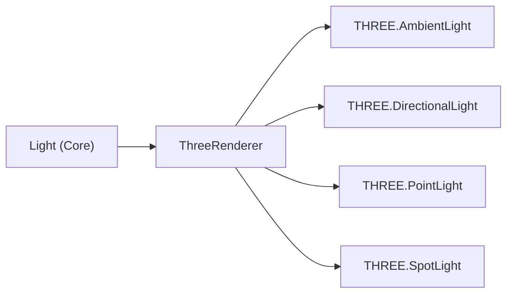

# Tutorial 18: Iluminación 3D — Ambient, Directional, Point y Spot 🟡

> **Nivel:** Intermedio  
> **Tiempo estimado:** 20 minutos  
> **Qué aprenderás:** Agregar luces al scene graph de Oroya usando el componente `Light`. Dominar los 4 tipos de luz: Ambient, Directional, Point y Spot, incluyendo sombras y configuración avanzada.

---

## Sistema de iluminación de Oroya

El sistema de luces es **agnóstico** — se define en `@joroya/core` y el renderer Three.js las convierte automáticamente a luces WebGL:



| Tipo | Analogía | Dirección | Posición importa |
|------|----------|-----------|-----------------|
| **Ambient** | Luz de un día nublado | Todas | No |
| **Directional** | El sol | Paralela | No (sí la rotación) |
| **Point** | Un foco/bombilla | Radial | Sí |
| **Spot** | Una linterna | Cónica | Sí |

---

## Paso 1: Setup de la escena

```typescript
import {
  Scene, Node, Camera, CameraType,
  createBox, createSphere, Material,
  Light, LightType,
} from '@joroya/core';
import { ThreeRenderer } from '@joroya/renderer-three';

const scene = new Scene();

// Cámara
const cam = new Node('camera');
cam.addComponent(new Camera({
  type: CameraType.Perspective,
  fov: 60,
  aspect: window.innerWidth / window.innerHeight,
  near: 0.1,
  far: 100,
}));
cam.transform.position = { x: 0, y: 4, z: 8 };
scene.add(cam);

// Suelo para recibir sombras
const ground = new Node('ground');
ground.addComponent(createBox(20, 0.1, 20));
ground.addComponent(new Material({ color: { r: 0.3, g: 0.3, b: 0.35 } }));
ground.transform.position.y = -1;
scene.add(ground);

// Esfera central
const sphere = new Node('sphere');
sphere.addComponent(createSphere(1, 32, 32));
sphere.addComponent(new Material({ color: { r: 0.9, g: 0.2, b: 0.3 } }));
sphere.transform.position.y = 0.5;
scene.add(sphere);
```

---

## Paso 2: Ambient Light — Iluminación base

La luz ambient ilumina **todo uniformemente** — no tiene dirección ni posición. Sirve como iluminación base para que nada quede completamente negro:

```typescript
const ambientNode = new Node('ambient-light');
ambientNode.addComponent(new Light({
  type: LightType.Ambient,
  color: { r: 0.4, g: 0.4, b: 0.5 },
  intensity: 0.5,
}));
scene.add(ambientNode);
```

### Propiedades

| Propiedad | Tipo | Default | Descripción |
|-----------|------|---------|-------------|
| `color` | `{ r, g, b }` | Blanco | Color de la luz (RGB 0-1) |
| `intensity` | `number` | 1 | Brillo de la luz |

> **Tip:** Usa una intensidad baja (0.3-0.5) y un color ligeramente azulado para simular iluminación ambiental realista.

---

## Paso 3: Directional Light — Luz del sol

Emite rayos paralelos en una dirección, como el sol. Ideal para iluminación principal de escenas exteriores:

```typescript
const sunNode = new Node('sun');
sunNode.addComponent(new Light({
  type: LightType.Directional,
  color: { r: 1.0, g: 0.95, b: 0.8 },
  intensity: 1.2,
  castShadow: true,
  target: { x: 0, y: 0, z: 0 }, // Apunta al origen
}));
// La posición del nodo determina la dirección de la luz
sunNode.transform.position = { x: 5, y: 8, z: 3 };
scene.add(sunNode);
```

### Propiedades

| Propiedad | Tipo | Default | Descripción |
|-----------|------|---------|-------------|
| `color` | `{ r, g, b }` | Blanco | Color de la luz |
| `intensity` | `number` | 1 | Brillo |
| `castShadow` | `boolean` | `false` | ¿Genera sombras? |
| `target` | `{ x, y, z }` | Origen | Punto al que apunta |

### ¿Cómo funciona la dirección?

La dirección se calcula como: `posición del nodo → target`. Si el sol está en `(5, 8, 3)` y apunta al `(0, 0, 0)`, los rayos van de arriba-derecha hacia abajo-izquierda.

---

## Paso 4: Point Light — Bombilla / Foco

Emite luz en **todas las direcciones** desde un punto. Simula bombillas, velas, fogatas:

```typescript
const bulbNode = new Node('point-light');
bulbNode.addComponent(new Light({
  type: LightType.Point,
  color: { r: 1.0, g: 0.8, b: 0.3 }, // Tono cálido
  intensity: 2.0,
  distance: 15,     // Alcance máximo
  decay: 2,         // Caída físicamente correcta
  castShadow: true,
}));
bulbNode.transform.position = { x: -2, y: 3, z: 1 };
scene.add(bulbNode);

// Indicador visual de dónde está la luz
const bulbVisual = new Node('bulb-visual');
bulbVisual.addComponent(createSphere(0.1, 16, 16));
bulbVisual.addComponent(new Material({
  color: { r: 1, g: 0.8, b: 0.3 },
  emissive: { r: 1, g: 0.8, b: 0.3 },
}));
bulbNode.add(bulbVisual); // Hijo del nodo de la luz
```

### Propiedades

| Propiedad | Tipo | Default | Descripción |
|-----------|------|---------|-------------|
| `color` | `{ r, g, b }` | Blanco | Color |
| `intensity` | `number` | 1 | Brillo |
| `distance` | `number` | 0 (infinito) | Alcance máximo |
| `decay` | `number` | 2 | Velocidad de atenuación |
| `castShadow` | `boolean` | `false` | ¿Sombras? |

### ¿Qué hace `decay`?

- `decay: 0` → Intensidad constante (no realista)
- `decay: 1` → Atenuación lineal
- `decay: 2` → Atenuación cuadrática (**físicamente correcta**)

---

## Paso 5: Spot Light — Linterna / Foco de teatro

Emite luz en forma de **cono** desde un punto hacia un target. Perfecto para efectos dramáticos:

```typescript
const spotNode = new Node('spot-light');
spotNode.addComponent(new Light({
  type: LightType.Spot,
  color: { r: 0.5, g: 0.8, b: 1.0 },
  intensity: 3.0,
  distance: 20,
  angle: Math.PI / 6,    // 30° de apertura del cono
  penumbra: 0.3,         // 30% de borde suave
  decay: 2,
  castShadow: true,
  target: { x: 0, y: 0, z: 0 },
}));
spotNode.transform.position = { x: 3, y: 6, z: 2 };
scene.add(spotNode);
```

### Propiedades exclusivas del Spot

| Propiedad | Tipo | Default | Descripción |
|-----------|------|---------|-------------|
| `angle` | `number` | π/3 (~60°) | Ángulo de apertura del cono (radianes) |
| `penumbra` | `number` | 0 | Porcentaje de borde suave (0 = borde duro, 1 = todo difuso) |

### Visualización del cono

```
        💡 Spot position
       / | \
      /  |  \      ← angle define la apertura
     /   |   \
    / ···|··· \    ← penumbra define el borde suave
   /  ···|···  \
  /____.target____\
```

---

## Paso 6: Combinando luces

Una escena realista usa **múltiples luces** combinadas:

```typescript
// Luz ambient (base, para que nada quede negro)
const ambient = new Node('ambient');
ambient.addComponent(new Light({
  type: LightType.Ambient,
  color: { r: 0.15, g: 0.15, b: 0.25 },
  intensity: 1.0,
}));
scene.add(ambient);

// Luz directional (sol, iluminación principal)
const sun = new Node('sun');
sun.addComponent(new Light({
  type: LightType.Directional,
  color: { r: 1.0, g: 0.95, b: 0.8 },
  intensity: 1.0,
  castShadow: true,
}));
sun.transform.position = { x: 5, y: 10, z: 5 };
scene.add(sun);

// Luz point (acento cálido)
const warmAccent = new Node('warm');
warmAccent.addComponent(new Light({
  type: LightType.Point,
  color: { r: 1.0, g: 0.6, b: 0.2 },
  intensity: 1.5,
  distance: 10,
}));
warmAccent.transform.position = { x: -3, y: 2, z: 0 };
scene.add(warmAccent);

// Luz spot (efecto dramático)
const spotlight = new Node('spot');
spotlight.addComponent(new Light({
  type: LightType.Spot,
  color: { r: 0.4, g: 0.7, b: 1.0 },
  intensity: 2.0,
  angle: Math.PI / 8,
  penumbra: 0.5,
  target: { x: 0, y: 0, z: 0 },
}));
spotlight.transform.position = { x: 3, y: 5, z: 3 };
scene.add(spotlight);
```

---

## Paso 7: Animar luces

Las luces son nodos normales del scene graph — puedes animar su posición, intensidad o color:

```typescript
const renderer = new ThreeRenderer({
  canvas: document.getElementById('canvas') as HTMLCanvasElement,
  width: window.innerWidth,
  height: window.innerHeight,
});
renderer.mount(scene);

let time = 0;

function animate() {
  time += 0.02;

  // Orbitar la point light alrededor del centro
  bulbNode.transform.position = {
    x: Math.cos(time) * 4,
    y: 3 + Math.sin(time * 2) * 0.5,
    z: Math.sin(time) * 4,
  };
  bulbNode.transform.updateLocalMatrix();

  renderer.render();
  requestAnimationFrame(animate);
}
animate();
```

---

## Código completo

```typescript
import {
  Scene, Node, Camera, CameraType,
  createBox, createSphere, Material,
  Light, LightType,
} from '@joroya/core';
import { ThreeRenderer } from '@joroya/renderer-three';

const scene = new Scene();

// Cámara
const cam = new Node('camera');
cam.addComponent(new Camera({
  type: CameraType.Perspective,
  fov: 60,
  aspect: window.innerWidth / window.innerHeight,
  near: 0.1,
  far: 100,
}));
cam.transform.position = { x: 0, y: 4, z: 8 };
scene.add(cam);

// Suelo
const ground = new Node('ground');
ground.addComponent(createBox(20, 0.1, 20));
ground.addComponent(new Material({ color: { r: 0.3, g: 0.3, b: 0.35 } }));
ground.transform.position.y = -1;
scene.add(ground);

// Esfera central
const sphere = new Node('sphere');
sphere.addComponent(createSphere(1, 32, 32));
sphere.addComponent(new Material({ color: { r: 0.9, g: 0.2, b: 0.3 } }));
sphere.transform.position.y = 0.5;
scene.add(sphere);

// Cubos decorativos
for (let i = 0; i < 4; i++) {
  const angle = (i / 4) * Math.PI * 2;
  const box = new Node(`box-${i}`);
  box.addComponent(createBox(0.8, 0.8, 0.8));
  box.addComponent(new Material({
    color: { r: 0.4 + i * 0.15, g: 0.5, b: 0.8 - i * 0.1 },
  }));
  box.transform.position = {
    x: Math.cos(angle) * 3,
    y: 0,
    z: Math.sin(angle) * 3,
  };
  scene.add(box);
}

// Ambient
const ambient = new Node('ambient');
ambient.addComponent(new Light({
  type: LightType.Ambient,
  intensity: 0.4,
  color: { r: 0.2, g: 0.2, b: 0.3 },
}));
scene.add(ambient);

// Directional (sol)
const sun = new Node('sun');
sun.addComponent(new Light({
  type: LightType.Directional,
  intensity: 1.0,
  color: { r: 1.0, g: 0.95, b: 0.8 },
  castShadow: true,
}));
sun.transform.position = { x: 5, y: 8, z: 3 };
scene.add(sun);

// Point (cálida)
const point = new Node('point');
point.addComponent(new Light({
  type: LightType.Point,
  intensity: 2.0,
  color: { r: 1.0, g: 0.6, b: 0.2 },
  distance: 12,
  decay: 2,
}));
point.transform.position = { x: -3, y: 3, z: 0 };
scene.add(point);

// Spot
const spot = new Node('spot');
spot.addComponent(new Light({
  type: LightType.Spot,
  intensity: 3.0,
  color: { r: 0.4, g: 0.7, b: 1.0 },
  angle: Math.PI / 6,
  penumbra: 0.4,
  target: { x: 0, y: 0, z: 0 },
}));
spot.transform.position = { x: 3, y: 6, z: 2 };
scene.add(spot);

// Renderer
const renderer = new ThreeRenderer({
  canvas: document.getElementById('canvas') as HTMLCanvasElement,
  width: window.innerWidth,
  height: window.innerHeight,
});
renderer.mount(scene);

let time = 0;
function animate() {
  time += 0.02;

  // Orbitar la point light
  point.transform.position = {
    x: Math.cos(time) * 4,
    y: 3 + Math.sin(time * 2) * 0.5,
    z: Math.sin(time) * 4,
  };
  point.transform.updateLocalMatrix();

  renderer.render();
  requestAnimationFrame(animate);
}
animate();
```

---

## Siguiente tutorial

➡️ [Tutorial 19: Animaciones suaves con Cubic Spline](./19-cubic-spline.md) — interpolación avanzada para movimientos naturales.
